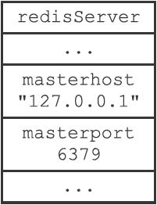
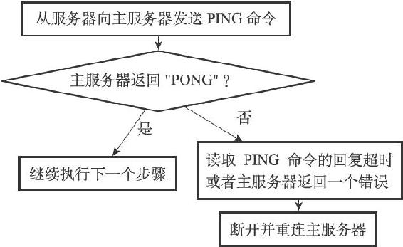
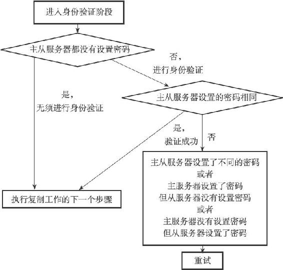
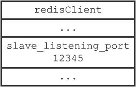
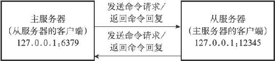

15.6 复制的实现

通过向从服务器发送SLAVEOF命令，我们可以让一个从服务器去复制一个主服务器：

---

>  
> SLAVEOF <master\_ip> <master\_port>  

---

本节将以从服务器127.0.0.1:12345接收到命令：

---

>  
> SLAVEOF 127.0.0.1 6379  

---

为例，展示Redis2.8或以上版本的复制功能的详细实现步骤。

15.6.1 步骤1：设置主服务器的地址和端口

当客户端向从服务器发送以下命令时：

---

>  
> 127.0.0.1:12345> SLAVEOF 127.0.0.1 6379  
> OK  

---

从服务器首先要做的就是将客户端给定的主服务器IP地址127.0.0.1以及端口6379保存到服务器状态的masterhost属性和masterport属性里面：

---

>  
> struct redisServer {  
> // ...  
> //   
> 主服务器的地址  
> char \*masterhost;  
> //   
> 主服务器的端口  
> int masterport;  
> // ...  
> };  

---

图15-13展示了SLAVEOF命令执行之后，从服务器的服务器状态。

图15-13 从服务器的服务器状态

SLAVEOF命令是一个异步命令，在完成masterhost属性和masterport属性的设置工作之后，从服务器将向发送SLAVEOF命令的客户端返回OK，表示复制指令已经被接收，而实际的复制工作将在OK返回之后才真正开始执行。

15.6.2 步骤2：建立套接字连接

在SLAVEOF命令执行之后，从服务器将根据命令所设置的IP地址和端口，创建连向主服务器的套接字连接，如图15-14所示。

图15-14 从服务器创建连向主服务器的套接字

如果从服务器创建的套接字能成功连接（connect）到主服务器，那么从服务器将为这个套接字关联一个专门用于处理复制工作的文件事件处理器，这个处理器将负责执行后续的复制工作，比如接收RDB文件，以及接收主服务器传播来的写命令，诸如此类。

而主服务器在接受（accept）从服务器的套接字连接之后，将为该套接字创建相应的客户端状态，并将从服务器看作是一个连接到主服务器的客户端来对待，这时从服务器将同时具有服务器（server）和客户端（client）两个身份：从服务器可以向主服务器发送命令请求，而主服务器则会向从服务器返回命令回复，如图15-15所示。

图15-15 主从服务器之间的关系

因为复制工作接下来的几个步骤都会以从服务器向主服务器发送命令请求的形式来进行，所以理解“从服务器是主服务器的客户端”这一点非常重要。

15.6.3 步骤3：发送PING命令

从服务器成为主服务器的客户端之后，做的第一件事就是向主服务器发送一个PING命令，如图15-16所示。

图15-16 从服务器向主服务器发送PING

这个PING命令有两个作用：

·虽然主从服务器成功建立起了套接字连接，但双方并未使用该套接字进行过任何通信，通过发送PING命令可以检查套接字的读写状态是否正常。

·因为复制工作接下来的几个步骤都必须在主服务器可以正常处理命令请求的状态下才能进行，通过发送PING命令可以检查主服务器能否正常处理命令请求。

从服务器在发送PING命令之后将遇到以下三种情况的其中一种：

·如果主服务器向从服务器返回了一个命令回复，但从服务器却不能在规定的时限（timeout）内读取出命令回复的内容，那么表示主从服务器之间的网络连接状态不佳，不能继续执行复制工作的后续步骤。当出现这种情况时，从服务器断开并重新创建连向主服务器的套接字。

·如果主服务器向从服务器返回一个错误，那么表示主服务器暂时没办法处理从服务器的命令请求，不能继续执行复制工作的后续步骤。当出现这种情况时，从服务器断开并重新创建连向主服务器的套接字。比如说，如果主服务器正在处理一个超时运行的脚本，那么当从服务器向主服务器发送PING命令时，从服务器将收到主服务器返回的BUSY Redisis busy running a script.You can only call SCRIPT KILL or SHUTDOWN NOSAVE.错误。

·如果从服务器读取到"PONG"回复，那么表示主从服务器之间的网络连接状态正常，并且主服务器可以正常处理从服务器（客户端）发送的命令请求，在这种情况下，从服务器可以继续执行复制工作的下个步骤。

流程图15-17总结了从服务器在发送PING命令时可能遇到的情况，以及各个情况的处理方式。

图15-17 从服务器在发送PING命令时可能遇上的情况

15.6.4 步骤4：身份验证

从服务器在收到主服务器返回的"PONG"回复之后，下一步要做的就是决定是否进行身份验证：

·如果从服务器设置了masterauth选项，那么进行身份验证。

·如果从服务器没有设置masterauth选项，那么不进行身份验证。

在需要进行身份验证的情况下，从服务器将向主服务器发送一条AUTH命令，命令的参数为从服务器masterauth选项的值。

举个例子，如果从服务器masterauth选项的值为10086，那么从服务器将向主服务器发送命令AUTH 10086，如图15-18所示。

图15-18 从服务器向主服务器验证身份

从服务器在身份验证阶段可能遇到的情况有以下几种：

·如果主服务器没有设置requirepass选项，并且从服务器也没有设置masterauth选项，那么主服务器将继续执行从服务器发送的命令，复制工作可以继续进行。

·如果从服务器通过AUTH命令发送的密码和主服务器requirepass选项所设置的密码相同，那么主服务器将继续执行从服务器发送的命令，复制工作可以继续进行。与此相反，如果主从服务器设置的密码不相同，那么主服务器将返回一个invalid password错误。

·如果主服务器设置了requirepass选项，但从服务器却没有设置masterauth选项，那么主服务器将返回一个NOAUTH错误。另一方面，如果主服务器没有设置requirepass选项，但从服务器却设置了masterauth选项，那么主服务器将返回一个no password is set错误。

所有错误情况都会令从服务器中止目前的复制工作，并从创建套接字开始重新执行复制，直到身份验证通过，或者从服务器放弃执行复制为止。

流程图15-19总结了从服务器在身份验证阶段可能遇到的情况，以及各个情况的处理方式。

图15-19 从服务器在身份验证阶段可能遇上的情况

15.6.5 步骤5：发送端口信息

在身份验证步骤之后，从服务器将执行命令REPLCONF listening-port <port-number>，向主服务器发送从服务器的监听端口号。

例如在我们的例子中，从服务器的监听端口为12345，那么从服务器将向主服务器发送命令REPLCONF listening-port 12345，如图15-20所示。

图15-20 从服务器向主服务器发送监听端口

主服务器在接收到这个命令之后，会将端口号记录在从服务器所对应的客户端状态的slave\_listening\_port属性中：

---

>  
> typedef struct redisClient {  
> // ...  
> //   
> 从服务器的监听端口号  
> int slave\_listening\_port;  
> // ...  
> } redisClient;  

---

图15-21展示了客户端状态设置slave\_listening\_port属性之后的样子。

图15-21 用客户端状态记录从服务器的监听端口

slave\_listening\_port属性目前唯一的作用就是在主服务器执行INFO replication命令时打印出从服务器的端口号。

以下是客户端向例子中的主服务器发送INFO replication命令时得到的回复，其中slave0行的port域显示的就是从服务器所对应客户端状态的slave\_listening\_port属性的值：

---

>  
> 127.0.0.1:6379> INFO replication  
> \# Replication  
> role:master  
> connected\_slaves:1  
> slave0:ip=127.0.0.1,port=12345,status=online,offset=1289,lag=1  
> master\_repl\_offset:1289  
> repl\_backlog\_active:1  
> repl\_backlog\_size:1048576  
> repl\_backlog\_first\_byte\_offset:2  
> repl\_backlog\_histlen:1288  

---

15.6.6 步骤6：同步

在这一步，从服务器将向主服务器发送PSYNC命令，执行同步操作，并将自己的数据库更新至主服务器数据库当前所处的状态。

值得一提的是，在同步操作执行之前，只有从服务器是主服务器的客户端，但是在执行同步操作之后，主服务器也会成为从服务器的客户端：

·如果PSYNC命令执行的是完整重同步操作，那么主服务器需要成为从服务器的客户端，才能将保存在缓冲区里面的写命令发送给从服务器执行。

·如果PSYNC命令执行的是部分重同步操作，那么主服务器需要成为从服务器的客户端，才能向从服务器发送保存在复制积压缓冲区里面的写命令。

因此，在同步操作执行之后，主从服务器双方都是对方的客户端，它们可以互相向对方发送命令请求，或者互相向对方返回命令回复，如图15-22所示。

正因为主服务器成为了从服务器的客户端，所以主服务器才可以通过发送写命令来改变从服务器的数据库状态，不仅同步操作需要用到这一点，这也是主服务器对从服务器执行命令传播操作的基础。

图15-22 主从服务器之间互为客户端

15.6.7 步骤7：命令传播

当完成了同步之后，主从服务器就会进入命令传播阶段，这时主服务器只要一直将自己执行的写命令发送给从服务器，而从服务器只要一直接收并执行主服务器发来的写命令，就可以保证主从服务器一直保持一致了。

以上就是Redis 2.8或以上版本的复制功能的实现步骤。
