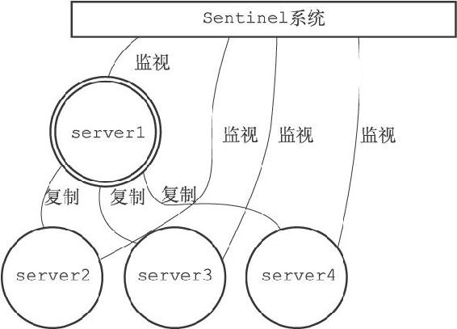
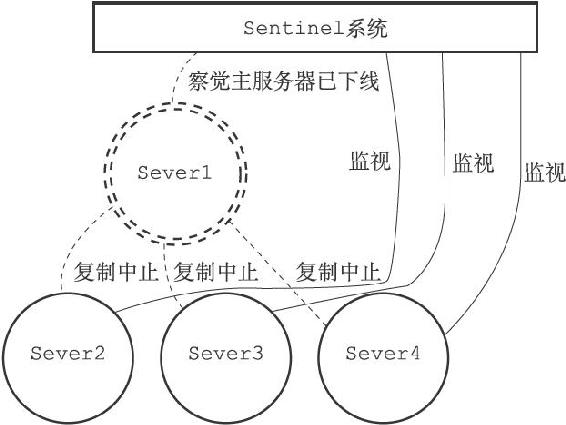
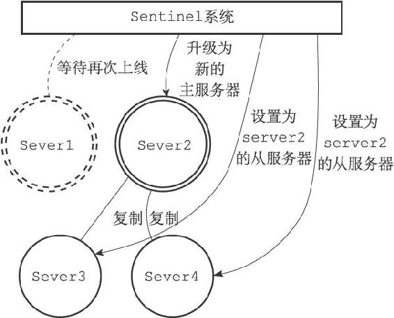
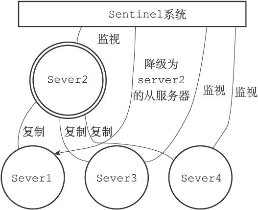

第16章 Sentinel

Sentinel（哨岗、哨兵）是Redis的高可用性（high availability）解决方案：由一个或多个Sentinel实例（instance）组成的Sentinel系统（system）可以监视任意多个主服务器，以及这些主服务器属下的所有从服务器，并在被监视的主服务器进入下线状态时，自动将下线主服务器属下的某个从服务器升级为新的主服务器，然后由新的主服务器代替已下线的主服务器继续处理命令请求。

图16-1 服务器与Sentinel系统

图16-1展示了一个Sentinel系统监视服务器的例子，其中：

·用双环图案表示的是当前的主服务器server1。

·用单环图案表示的是主服务器的三个从服务器server2、server3以及server4。

·server2、server3、server4三个从服务器正在复制主服务器server1，而Sentinel系统则在监视所有四个服务器。

假设这时，主服务器server1进入下线状态，那么从服务器server2、server3、server4对主服务器的复制操作将被中止，并且Sentinel系统会察觉到server1已下线，如图16-2所示（下线的服务器用虚线表示）。

图16-2 主服务器下线

当server1的下线时长超过用户设定的下线时长上限时，Sentinel系统就会对server1执行故障转移操作：

·首先，Sentinel系统会挑选server1属下的其中一个从服务器，并将这个被选中的从服务器升级为新的主服务器。

·之后，Sentinel系统会向server1属下的所有从服务器发送新的复制指令，让它们成为新的主服务器的从服务器，当所有从服务器都开始复制新的主服务器时，故障转移操作执行完毕。

·另外，Sentinel还会继续监视已下线的server1，并在它重新上线时，将它设置为新的主服务器的从服务器。

举个例子，图16-3展示了Sentinel系统将server2升级为新的主服务器，并让服务器server3和server4成为server2的从服务器的过程。

之后，如果server1重新上线的话，它将被Sentinel系统降级为server2的从服务器，如图16-4所示。

图16-3 故障转移

图16-4 原来的主服务器被降级为从服务器

本章首先会对Sentinel的初始化过程进行介绍，并说明Sentinel和一般Redis服务器的区别。

在此之后，本章将对Sentinel监视服务器的方法和原理进行介绍，说明Sentinel是如何判断一个服务器是否在线的。

最后，本章将介绍Sentinel系统对主服务器执行故障转移的整个过程。
