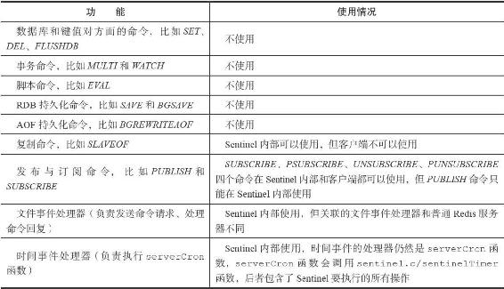
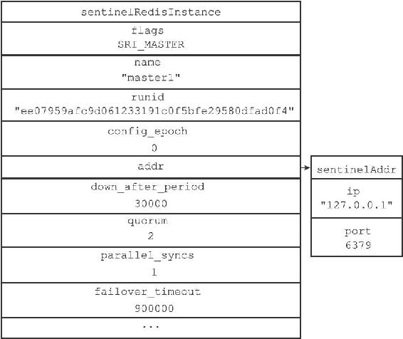
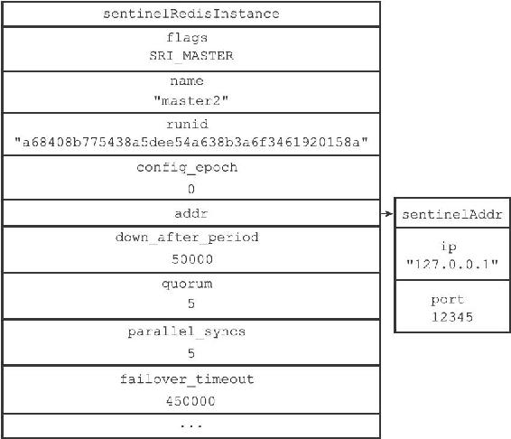
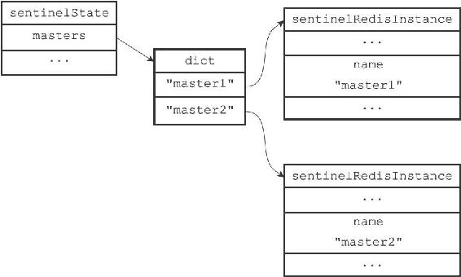
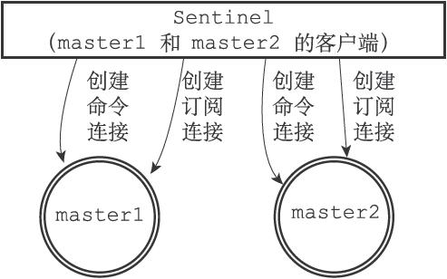

16.1 启动并初始化Sentinel

启动一个Sentinel可以使用命令：

---

>  
> $ redis-sentinel /path/to/your/sentinel.conf  

---

或者命令：

---

>  
> $ redis-server /path/to/your/sentinel.conf --sentinel  

---

这两个命令的效果完全相同。

当一个Sentinel启动时，它需要执行以下步骤：

1）初始化服务器。

2）将普通Redis服务器使用的代码替换成Sentinel专用代码。

3）初始化Sentinel状态。

4）根据给定的配置文件，初始化Sentinel的监视主服务器列表。

5）创建连向主服务器的网络连接。

本节接下来的内容将分别对这些步骤进行介绍。

16.1.1 初始化服务器

首先，因为Sentinel本质上只是一个运行在特殊模式下的Redis服务器，所以启动Sentinel的第一步，就是初始化一个普通的Redis服务器，具体的步骤和第14章介绍的类似。

不过，因为Sentinel执行的工作和普通Redis服务器执行的工作不同，所以Sentinel的初始化过程和普通Redis服务器的初始化过程并不完全相同。

例如，普通服务器在初始化时会通过载入RDB文件或者AOF文件来还原数据库状态，但是因为Sentinel并不使用数据库，所以初始化Sentinel时就不会载入RDB文件或者AOF文件。

表16-1展示了Redis服务器在Sentinel模式下运行时，服务器各个主要功能的使用情况。

表16-1 Sentinel模式下Redis服务器主要功能的使用情况

16.1.2 使用Sentinel专用代码

启动Sentinel的第二个步骤就是将一部分普通Redis服务器使用的代码替换成Sentinel专用代码。比如说，普通Redis服务器使用redis.h/REDIS\_SERVERPORT常量的值作为服务器端口：

---

>  
> #define REDIS\_SERVERPORT 6379  

---

而Sentinel则使用sentinel.c/REDIS\_SENTINEL\_PORT常量的值作为服务器端口：

---

>  
> #define REDIS\_SENTINEL\_PORT 26379  

---

除此之外，普通Redis服务器使用redis.c/redisCommandTable作为服务器的命令表：

---

>  
> struct redisCommand redisCommandTable\[\] = {  
> {"get",getCommand,2,"r",0,NULL,1,1,1,0,0},  
> {"set",setCommand,-3,"wm",0,noPreloadGetKeys,1,1,1,0,0},  
> {"setnx",setnxCommand,3,"wm",0,noPreloadGetKeys,1,1,1,0,0},  
> // ...  
> {"script",scriptCommand,-2,"ras",0,NULL,0,0,0,0,0},  
> {"time",timeCommand,1,"rR",0,NULL,0,0,0,0,0},  
> {"bitop",bitopCommand,-4,"wm",0,NULL,2,-1,1,0,0},  
> {"bitcount",bitcountCommand,-2,"r",0,NULL,1,1,1,0,0}  
> }  

---

而Sentinel则使用sentinel.c/sentinelcmds作为服务器的命令表，并且其中的INFO命令会使用Sentinel模式下的专用实现sentinel.c/sentinelInfoCommand函数，而不是普通Redis服务器使用的实现redis.c/infoCommand函数：

---

>  
> struct redisCommand sentinelcmds\[\] = {  
> {"ping",pingCommand,1,"",0,NULL,0,0,0,0,0},  
> {"sentinel",sentinelCommand,-2,"",0,NULL,0,0,0,0,0},  
> {"subscribe",subscribeCommand,-2,"",0,NULL,0,0,0,0,0},  
> {"unsubscribe",unsubscribeCommand,-1,"",0,NULL,0,0,0,0,0},  
> {"psubscribe",psubscribeCommand,-2,"",0,NULL,0,0,0,0,0},  
> {"punsubscribe",punsubscribeCommand,-1,"",0,NULL,0,0,0,0,0},  
> {"info",sentinelInfoCommand,-1,"",0,NULL,0,0,0,0,0}  
> };  

---

sentinelcmds命令表也解释了为什么在Sentinel模式下，Redis服务器不能执行诸如SET、DBSIZE、EVAL等等这些命令，因为服务器根本没有在命令表中载入这些命令。PING、SENTINEL、INFO、SUBSCRIBE、UNSUBSCRIBE、PSUBSCRIBE和PUNSUBSCRIBE这七个命令就是客户端可以对Sentinel执行的全部命令了。

16.1.3 初始化Sentinel状态

在应用了Sentinel的专用代码之后，接下来，服务器会初始化一个sentinel.c/sentinelState结构（后面简称“Sentinel状态”），这个结构保存了服务器中所有和Sentinel功能有关的状态（服务器的一般状态仍然由redis.h/redisServer结构保存）：

---

>  
> struct sentinelState {  
> //   
> 当前纪元，用于实现故障转移  
> uint64\_t current\_epoch;  
> //   
> 保存了所有被这个sentinel  
> 监视的主服务器  
> //   
> 字典的键是主服务器的名字  
> //   
> 字典的值则是一个指向sentinelRedisInstance  
> 结构的指针  
> dict \*masters;  
> //   
> 是否进入了TILT  
> 模式？  
> int tilt;  
> //   
> 目前正在执行的脚本的数量  
> int running\_scripts;  
> //   
> 进入TILT  
> 模式的时间  
> mstime\_t tilt\_start\_time;  
> //   
> 最后一次执行时间处理器的时间  
> mstime\_t previous\_time;  
> //   
> 一个FIFO  
> 队列，包含了所有需要执行的用户脚本  
> list \*scripts\_queue;  
> } sentinel;  

---

16.1.4 初始化Sentinel状态的masters属性

Sentinel状态中的masters字典记录了所有被Sentinel监视的主服务器的相关信息，其中：

·字典的键是被监视主服务器的名字。

·而字典的值则是被监视主服务器对应的sentinel.c/sentinelRedisInstance结构。

每个sentinelRedisInstance结构（后面简称“实例结构”）代表一个被Sentinel监视的Redis服务器实例（instance），这个实例可以是主服务器、从服务器，或者另外一个Sentinel。

实例结构包含的属性非常多，以下代码展示了实例结构在表示主服务器时使用的其中一部分属性，本章接下来将逐步对实例结构中的各个属性进行介绍：

---

>  
> typedef struct sentinelRedisInstance {  
> //   
> 标识值，记录了实例的类型，以及该实例的当前状态  
> int flags;  
> //   
> 实例的名字  
> //   
> 主服务器的名字由用户在配置文件中设置  
> //   
> 从服务器以及Sentinel  
> 的名字由Sentinel  
> 自动设置  
> //   
> 格式为ip:port  
> ，例如"127.0.0.1:26379"  
> char \*name;  
> //   
> 实例的运行ID  
> char \*runid;  
> //   
> 配置纪元，用于实现故障转移  
> uint64\_t config\_epoch;  
> //   
> 实例的地址  
> sentinelAddr \*addr;  
> // SENTINEL down-after-milliseconds  
> 选项设定的值  
> //   
> 实例无响应多少毫秒之后才会被判断为主观下线（subjectively down  
> ）  
> mstime\_t down\_after\_period;  
> // SENTINEL monitor <master-name> <IP> <port> <quorum>  
> 选项中的quorum  
> 参数  
> //   
> 判断这个实例为客观下线（objectively down  
> ）所需的支持投票数量  
> int quorum;  
> // SENTINEL parallel-syncs <master-name> <number>  
> 选项的值  
> //   
> 在执行故障转移操作时，可以同时对新的主服务器进行同步的从服务器数量  
> int parallel\_syncs;  
> // SENTINEL failover-timeout <master-name> <ms>  
> 选项的值  
> //   
> 刷新故障迁移状态的最大时限  
> mstime\_t failover\_timeout;  
> // ...  
> } sentinelRedisInstance;  

---

sentinelRedisInstance.addr属性是一个指向sentinel.c/sentinelAddr结构的指针，这个结构保存着实例的IP地址和端口号：

---

>  
> typedef struct sentinelAddr {  
> char \*ip;  
> int port;  
> } sentinelAddr;  

---

对Sentinel状态的初始化将引发对masters字典的初始化，而masters字典的初始化是根据被载入的Sentinel配置文件来进行的。

举个例子，如果用户在启动Sentinel时，指定了包含以下内容的配置文件：

---

>  
> #####################  
> \# master1 configure #  
> #####################  
> sentinel monitor master1 127.0.0.1 6379 2  
> sentinel down-after-milliseconds master1 30000  
> sentinel parallel-syncs master1 1  
> sentinel failover-timeout master1 900000  
> #####################  
> \# master2 configure #  
> #####################  
> sentinel monitor master2 127.0.0.1 12345 5  
> sentinel down-after-milliseconds master2 50000  
> sentinel parallel-syncs master2 5  
> sentinel failover-timeout master2 450000  

---

那么Sentinel将为主服务器master1创建如图16-5所示的实例结构，并为主服务器master2创建如图16-6所示的实例结构，而这两个实例结构又会被保存到Sentinel状态的masters字典中，如图16-7所示。

图16-5 master1的实例结构

图16-6 master2的实例结构

图16-7 Sentinel状态以及masters字典

16.1.5 创建连向主服务器的网络连接

初始化Sentinel的最后一步是创建连向被监视主服务器的网络连接，Sentinel将成为主服务器的客户端，它可以向主服务器发送命令，并从命令回复中获取相关的信息。

对于每个被Sentinel监视的主服务器来说，Sentinel会创建两个连向主服务器的异步网络连接：

·一个是命令连接，这个连接专门用于向主服务器发送命令，并接收命令回复。

·另一个是订阅连接，这个连接专门用于订阅主服务器的\_\_sentinel\_\_:hello频道。

> 为什么有两个连接？

> 在Redis目前的发布与订阅功能中，被发送的信息都不会保存在Redis服务器里面，如果在信息发送时，想要接收信息的客户端不在线或者断线，那么这个客户端就会丢失这条信息。因此，为了不丢失\_\_sentinel\_\_:hello频道的任何信息，Sentinel必须专门用一个订阅连接来接收该频道的信息。

> 另一方面，除了订阅频道之外，Sentinel还必须向主服务器发送命令，以此来与主服务器进行通信，所以Sentinel还必须向主服务器创建命令连接。

> 因为Sentinel需要与多个实例创建多个网络连接，所以Sentinel使用的是异步连接。

图16-8展示了一个Sentinel向被它监视的两个主服务器master1和master2创建命令连接和订阅连接的例子。

接下来的一节将介绍Sentinel是如何通过命令连接和订阅连接来与被监视主服务器进行通信的。

图16-8 Sentinel向主服务器创建网络连接
