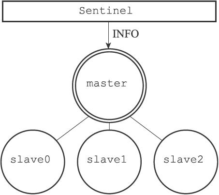
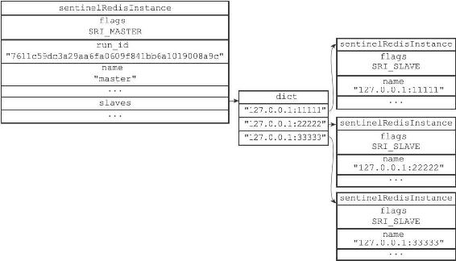

16.2 获取主服务器信息

Sentinel默认会以每十秒一次的频率，通过命令连接向被监视的主服务器发送INFO命令，并通过分析INFO命令的回复来获取主服务器的当前信息。

图16-9 Sentinel向带有三个从服务器的主服务器发送INFO命令

举个例子，假设如图16-9所示，主服务器master有三个从服务器slave0、slave1和slave2，并且一个Sentinel正在连接主服务器，那么Sentinel将持续地向主服务器发送INFO命令，并获得类似于以下内容的回复：

---

>  
> \# Server  
> ...  
> run\_id:7611c59dc3a29aa6fa0609f841bb6a1019008a9c  
> ...  
> \# Replication  
> role:master  
> ...  
> slave0:ip=127.0.0.1,port=11111,state=online,offset=43,lag=0  
> slave1:ip=127.0.0.1,port=22222,state=online,offset=43,lag=0  
> slave2:ip=127.0.0.1,port=33333,state=online,offset=43,lag=0  
> ...  
> \# Other sections  
> ...  

---

通过分析主服务器返回的INFO命令回复，Sentinel可以获取以下两方面的信息：

·一方面是关于主服务器本身的信息，包括run\_id域记录的服务器运行ID，以及role域记录的服务器角色；

·另一方面是关于主服务器属下所有从服务器的信息，每个从服务器都由一个"slave"字符串开头的行记录，每行的ip=域记录了从服务器的IP地址，而port=域则记录了从服务器的端口号。根据这些IP地址和端口号，Sentinel无须用户提供从服务器的地址信息，就可以自动发现从服务器。

根据run\_id域和role域记录的信息，Sentinel将对主服务器的实例结构进行更新，例如，主服务器重启之后，它的运行ID就会和实例结构之前保存的运行ID不同，Sentinel检测到这一情况之后，就会对实例结构的运行ID进行更新。

至于主服务器返回的从服务器信息，则会被用于更新主服务器实例结构的slaves字典，这个字典记录了主服务器属下从服务器的名单：

·字典的键是由Sentinel自动设置的从服务器名字，格式为ip:port：如对于IP地址为127.0.0.1，端口号为11111的从服务器来说，Sentinel为它设置的名字就是127.0.0.1:11111。

·至于字典的值则是从服务器对应的实例结构：比如说，如果键是127.0.0.1:11111，那么这个键的值就是IP地址为127.0.0.1，端口号为11111的从服务器的实例结构。

Sentinel在分析INFO命令中包含的从服务器信息时，会检查从服务器对应的实例结构是否已经存在于slaves字典：

·如果从服务器对应的实例结构已经存在，那么Sentinel对从服务器的实例结构进行更新。

·如果从服务器对应的实例结构不存在，那么说明这个从服务器是新发现的从服务器，Sentinel会在slaves字典中为这个从服务器新创建一个实例结构。

对于我们之前列举的主服务器master和三个从服务器slave0、slave1和slave2的例子来说，Sentinel将分别为三个从服务器创建它们各自的实例结构，并将这些结构保存到主服务器实例结构的slaves字典里面，如图16-10所示。

图16-10 主服务器和它的三个从服务器

注意对比图中主服务器实例结构和从服务器实例结构之间的区别：

·主服务器实例结构的flags属性的值为SRI\_MASTER，而从服务器实例结构的flags属性的值为SRI\_SLAVE。

·主服务器实例结构的name属性的值是用户使用Sentinel配置文件设置的，而从服务器实例结构的name属性的值则是Sentinel根据从服务器的IP地址和端口号自动设置的。
