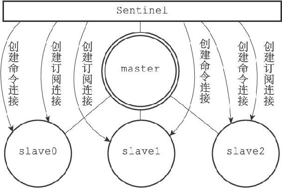
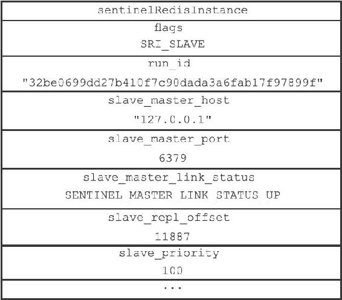

16.3 获取从服务器信息

当Sentinel发现主服务器有新的从服务器出现时，Sentinel除了会为这个新的从服务器创建相应的实例结构之外，Sentinel还会创建连接到从服务器的命令连接和订阅连接。

举个例子，对于图16-10所示的主从服务器关系来说，Sentinel将对slave0、slave1和slave2三个从服务器分别创建命令连接和订阅连接，如图16-11所示。

图16-11 Sentinel与各个从服务器建立命令连接和订阅连接

在创建命令连接之后，Sentinel在默认情况下，会以每十秒一次的频率通过命令连接向从服务器发送INFO命令，并获得类似于以下内容的回复：

---

>  
> \# Server  
> ...  
> run\_id:32be0699dd27b410f7c90dada3a6fab17f97899f  
> ...  
> \# Replication  
> role:slave  
> master\_host:127.0.0.1  
> master\_port:6379  
> master\_link\_status:up  
> slave\_repl\_offset:11887  
> slave\_priority:100  
> \# Other sections  
> ...  

---

根据INFO命令的回复，Sentinel会提取出以下信息：

·从服务器的运行ID run\_id。

·从服务器的角色role。

·主服务器的IP地址master\_host，以及主服务器的端口号master\_port。

·主从服务器的连接状态master\_link\_status。

·从服务器的优先级slave\_priority。

·从服务器的复制偏移量slave\_repl\_offset。

根据这些信息，Sentinel会对从服务器的实例结构进行更新，图16-12展示了Sentinel根据上面的INFO命令回复对从服务器的实例结构进行更新之后，实例结构的样子。

图16-12 从服务器实例结构
