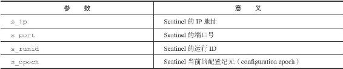
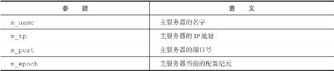

16.4 向主服务器和从服务器发送信息

在默认情况下，Sentinel会以每两秒一次的频率，通过命令连接向所有被监视的主服务器和从服务器发送以下格式的命令：

---

>  
> PUBLISH \_\_sentinel\_\_:hello "<s\_ip>,<s\_port>,<s\_runid>,<s\_epoch>,<m\_name>,<m\_ip>,<m\_port>,<m\_epoch>"  

---

这条命令向服务器的\_\_sentinel\_\_:hello频道发送了一条信息，信息的内容由多个参数组成：

·其中以s\_开头的参数记录的是Sentinel本身的信息，各个参数的意义如表16-2所示。

·而m\_开头的参数记录的则是主服务器的信息，各个参数的意义如表16-3所示。如果Sentinel正在监视的是主服务器，那么这些参数记录的就是主服务器的信息；如果Sentinel正在监视的是从服务器，那么这些参数记录的就是从服务器正在复制的主服务器的信息。

表16-2 信息中和Sentinel有关的参数

表16-3 信息中和主服务器有关的参数

以下是一条Sentinel通过PUBLISH命令向主服务器发送的信息示例：

---

>  
> "127.0.0.1,26379,e955b4c85598ef5b5f055bc7ebfd5e828dbed4fa,0,mymaster,127.0.0.1,6379,0"  

---

这个示例包含了以下信息：

·Sentinel的IP地址为127.0.0.1端口号为26379，运行ID为e955b4c85598ef5b5f055bc7ebfd5e828dbed4fa，当前的配置纪元为0。

·主服务器的名字为mymaster，IP地址为127.0.0.1，端口号为6379，当前的配置纪元为0。
