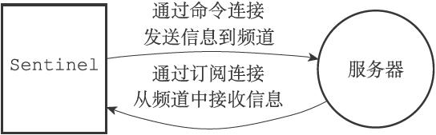
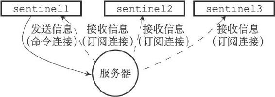
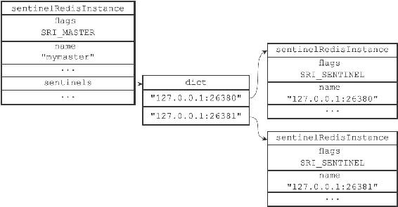
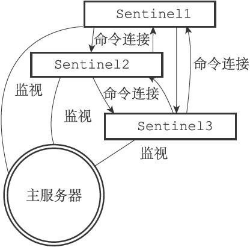

16.5 接收来自主服务器和从服务器的频道信息

当Sentinel与一个主服务器或者从服务器建立起订阅连接之后，Sentinel就会通过订阅连接，向服务器发送以下命令：

---

>  
> SUBSCRIBE \_\_sentinel\_\_:hello  

---

Sentinel对\_\_sentinel\_\_:hello频道的订阅会一直持续到Sentinel与服务器的连接断开为止。

这也就是说，对于每个与Sentinel连接的服务器，Sentinel既通过命令连接向服务器的\_\_sentinel\_\_:hello频道发送信息，又通过订阅连接从服务器的\_\_sentinel\_\_:hello频道接收信息，如图16-13所示。

图16-13 Sentinel同时向服务器发送和接收信息

对于监视同一个服务器的多个Sentinel来说，一个Sentinel发送的信息会被其他Sentinel接收到，这些信息会被用于更新其他Sentinel对发送信息Sentinel的认知，也会被用于更新其他Sentinel对被监视服务器的认知。

举个例子，假设现在有sentinel1、sentinel2、sentinel3三个Sentinel在监视同一个服务器，那么当sentinel1向服务器的\_\_sentinel\_\_:hello频道发送一条信息时，所有订阅了\_\_sentinel\_\_:hello频道的Sentinel（包括sentinel1自己在内）都会收到这条信息，如图16-14所示。

图16-14 向服务器发送信息

当一个Sentinel从\_\_sentinel\_\_:hello频道收到一条信息时，Sentinel会对这条信息进行分析，提取出信息中的Sentinel IP地址、Sentinel端口号、Sentinel运行ID等八个参数，并进行以下检查：

·如果信息中记录的Sentinel运行ID和接收信息的Sentinel的运行ID相同，那么说明这条信息是Sentinel自己发送的，Sentinel将丢弃这条信息，不做进一步处理。

·相反地，如果信息中记录的Sentinel运行ID和接收信息的Sentinel的运行ID不相同，那么说明这条信息是监视同一个服务器的其他Sentinel发来的，接收信息的Sentinel将根据信息中的各个参数，对相应主服务器的实例结构进行更新。

16.5.1 更新sentinels字典

Sentinel为主服务器创建的实例结构中的sentinels字典保存了除Sentinel本身之外，所有同样监视这个主服务器的其他Sentinel的资料：

·sentinels字典的键是其中一个Sentinel的名字，格式为ip:port，比如对于IP地址为127.0.0.1，端口号为26379的Sentinel来说，这个Sentinel在sentinels字典中的键就是"127.0.0.1:26379"。

·sentinels字典的值则是键所对应Sentinel的实例结构，比如对于键"127.0.0.1:26379"来说，这个键在sentinels字典中的值就是IP为127.0.0.1，端口号为26379的Sentinel的实例结构。

当一个Sentinel接收到其他Sentinel发来的信息时（我们称呼发送信息的Sentinel为源Sentinel，接收信息的Sentinel为目标Sentinel），目标Sentinel会从信息中分析并提取出以下两方面参数：

·与Sentinel有关的参数：源Sentinel的IP地址、端口号、运行ID和配置纪元。

·与主服务器有关的参数：源Sentinel正在监视的主服务器的名字、IP地址、端口号和配置纪元。

根据信息中提取出的主服务器参数，目标Sentinel会在自己的Sentinel状态的masters字典中查找相应的主服务器实例结构，然后根据提取出的Sentinel参数，检查主服务器实例结构的sentinels字典中，源Sentinel的实例结构是否存在：

·如果源Sentinel的实例结构已经存在，那么对源Sentinel的实例结构进行更新。

·如果源Sentinel的实例结构不存在，那么说明源Sentinel是刚刚开始监视主服务器的新Sentinel，目标Sentinel会为源Sentinel创建一个新的实例结构，并将这个结构添加到sentinels字典里面。

举个例子，假设分别有127.0.0.1:26379、127.0.0.1:26380、127.0.0.1:26381三个Sentinel正在监视主服务器127.0.0.1:6379，那么当127.0.0.1:26379这个Sentinel接收到以下信息时：

---

>  
> 1) "message"  
> 2) "\_\_sentinel\_\_:hello"  
> 3) "127.0.0.1,26379,e955b4c85598ef5b5f055bc7ebfd5e828dbed4fa,0,mymaster,127.0.0.1,6379,0"  
> 1) "message"  
> 2) "\_\_sentinel\_\_:hello"  
> 3) "127.0.0.1,26381,6241bf5cf9bfc8ecd15d6eb6cc3185edfbb24903,0,mymaster,127.0.0.1,6379,0"  
> 1) "message"  
> 2) "\_\_sentinel\_\_:hello"  
> 3) "127.0.0.1,26380,a9b22fb79ae8fad28e4ea77d20398f77f6b89377,0,mymaster,127.0.0.1,6379,0"  

---

Sentinel将执行以下动作：

·第一条信息的发送者为127.0.0.1:26379自己，这条信息会被忽略。

·第二条信息的发送者为127.0.0.1:26381，Sentinel会根据这条信息中提取出的内容，对sentinels字典中127.0.0.1:26381对应的实例结构进行更新。

·第三条信息的发送者为127.0.0.1:26380，Sentinel会根据这条信息中提取出的内容，对sentinels字典中127.0.0.1:26380所对应的实例结构进行更新。

图16-15展示了Sentinel 127.0.0.1:26379为主服务器127.0.0.1:6379创建的实例结构，以及结构中的sentinels字典。

图16-15 主服务器实例结构中的sentinels字典

和127.0.0.1:26379一样，其他两个Sentinel也会创建类似于图16-15所示的sentinels字典，区别在于字典中保存的Sentinel信息不同：

·127.0.0.1:26380创建的sentinels字典会保存127.0.0.1:26379和127.0.0.1:26381两个Sentinel的信息。

·而127.0.0.1:26381创建的sentinels字典则会保存127.0.0.1:26379和127.0.0.1:26380两个Sentinel的信息。

因为一个Sentinel可以通过分析接收到的频道信息来获知其他Sentinel的存在，并通过发送频道信息来让其他Sentinel知道自己的存在，所以用户在使用Sentinel的时候并不需要提供各个Sentinel的地址信息，监视同一个主服务器的多个Sentinel可以自动发现对方。

16.5.2 创建连向其他Sentinel的命令连接

当Sentinel通过频道信息发现一个新的Sentinel时，它不仅会为新Sentinel在sentinels字典中创建相应的实例结构，还会创建一个连向新Sentinel的命令连接，而新Sentinel也同样会创建连向这个Sentinel的命令连接，最终监视同一主服务器的多个Sentinel将形成相互连接的网络：Sentinel A有连向Sentinel B的命令连接，而Sentinel B也有连向Sentinel A的命令连接。

图16-16 各个Sentinel之间的网络连接

图16-16展示了三个监视同一主服务器的Sentinel之间是如何互相连接的。

使用命令连接相连的各个Sentinel可以通过向其他Sentinel发送命令请求来进行信息交换，本章接下来将对Sentinel实现主观下线检测和客观下线检测的原理进行介绍，这两种检测都会使用Sentinel之间的命令连接来进行通信。

> Sentinel之间不会创建订阅连接

> Sentinel在连接主服务器或者从服务器时，会同时创建命令连接和订阅连接，但是在连接其他Sentinel时，却只会创建命令连接，而不创建订阅连接。这是因为Sentinel需要通过接收主服务器或者从服务器发来的频道信息来发现未知的新Sentinel，所以才需要建立订阅连接，而相互已知的Sentinel只要使用命令连接来进行通信就足够了。
