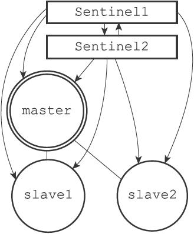
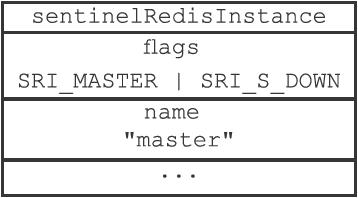

16.6 检测主观下线状态

在默认情况下，Sentinel会以每秒一次的频率向所有与它创建了命令连接的实例（包括主服务器、从服务器、其他Sentinel在内）发送PING命令，并通过实例返回的PING命令回复来判断实例是否在线。

图16-17 Sentinel向实例发送PING命令

在图16-17展示的例子中，带箭头的连线显示了Sentinel1和Sentinel2是如何向实例发送PING命令的：

·Sentinel1将向Sentinel2、主服务器master、从服务器slave1和slave2发送PING命令。

·Sentinel2将向Sentinel1、主服务器master、从服务器slave1和slave2发送PING命令。

实例对PING命令的回复可以分为以下两种情况：

·有效回复：实例返回+PONG、-LOADING、-MASTERDOWN三种回复的其中一种。

·无效回复：实例返回除+PONG、-LOADING、-MASTERDOWN三种回复之外的其他回复，或者在指定时限内没有返回任何回复。

Sentinel配置文件中的down-after-milliseconds选项指定了Sentinel判断实例进入主观下线所需的时间长度：如果一个实例在down-after-milliseconds毫秒内，连续向Sentinel返回无效回复，那么Sentinel会修改这个实例所对应的实例结构，在结构的flags属性中打开SRI\_S\_DOWN标识，以此来表示这个实例已经进入主观下线状态。

以图16-17展示的情况为例子，如果配置文件指定Sentinel1的down-after-milliseconds选项的值为50000毫秒，那么当主服务器master连续50000毫秒都向Sentinel1返回无效回复时，Sentinel1就会将master标记为主观下线，并在master所对应的实例结构的flags属性中打开SRI\_S\_DOWN标识，如图16-18所示。

图16-18 主服务器被标记为主观下线

> 主观下线时长选项的作用范围

> 用户设置的down-after-milliseconds选项的值，不仅会被Sentinel用来判断主服务器的主观下线状态，还会被用于判断主服务器属下的所有从服务器，以及所有同样监视这个主服务器的其他Sentinel的主观下线状态。举个例子，如果用户向Sentinel设置了以下配置：

---

>  
> sentinel monitor master 127.0.0.1 6379 2  
> sentinel down-after-milliseconds master 50000  

---

> 那么50000毫秒不仅会成为Sentinel判断master进入主观下线的标准，还会成为Sentinel判断master属下所有从服务器，以及所有同样监视master的其他Sentinel进入主观下线的标准。

> 多个Sentinel设置的主观下线时长可能不同

> down-after-milliseconds选项另一个需要注意的地方是，对于监视同一个主服务器的多个Sentinel来说，这些Sentinel所设置的down-after-milliseconds选项的值也可能不同，因此，当一个Sentinel将主服务器判断为主观下线时，其他Sentinel可能仍然会认为主服务器处于在线状态。举个例子，如果Sentinel1载入了以下配置：

---

>  
> sentinel monitor master 127.0.0.1 6379 2  
> sentinel down-after-milliseconds master 50000  

---

> 而Sentinel2则载入了以下配置：

---

>  
> sentinel monitor master 127.0.0.1 6379 2  
> sentinel down-after-milliseconds master 10000  

---

> 那么当master的断线时长超过10000毫秒之后，Sentinel2会将master判断为主观下线，而Sentinel1却认为master仍然在线。只有当master的断线时长超过50000毫秒之后，Sentinel1和Sentinel2才会都认为master进入了主观下线状态。
