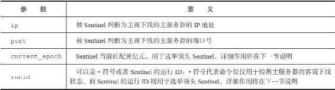
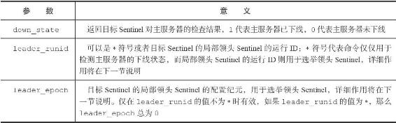
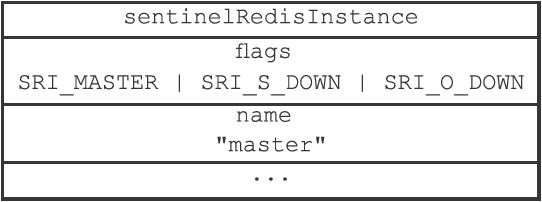

16.7 检查客观下线状态

当Sentinel将一个主服务器判断为主观下线之后，为了确认这个主服务器是否真的下线了，它会向同样监视这一主服务器的其他Sentinel进行询问，看它们是否也认为主服务器已经进入了下线状态（可以是主观下线或者客观下线）。当Sentinel从其他Sentinel那里接收到足够数量的已下线判断之后，Sentinel就会将从服务器判定为客观下线，并对主服务器执行故障转移操作。

16.7.1 发送SENTINEL is-master-down-by-addr命令

Sentinel使用：

---

>  
> SENTINEL is-master-down-by-addr <ip> <port> <current\_epoch> <runid>  

---

命令询问其他Sentinel是否同意主服务器已下线，命令中的各个参数的意义如表16-4所示。

表16-4 SENTINEL is-master-down-by-addr命令各个参数的意义

举个例子，如果被Sentinel判断为主观下线的主服务器的IP为127.0.0.1，端口号为6379，并且Sentinel当前的配置纪元为0，那么Sentinel将向其他Sentinel发送以下命令：

---

>  
> SENTINEL is-master-down-by-addr 127.0.0.1 6379 0 \*  

---

16.7.2 接收SENTINEL is-master-down-by-addr命令

当一个Sentinel（目标Sentinel）接收到另一个Sentinel（源Sentinel）发来的SENTINEL is-master-down-by命令时，目标Sentinel会分析并取出命令请求中包含的各个参数，并根据其中的主服务器IP和端口号，检查主服务器是否已下线，然后向源Sentinel返回一条包含三个参数的Multi Bulk回复作为SENTINEL is-master-down-by命令的回复：

---

>  
> 1) <down\_state>  
> 2) <leader\_runid>  
> 3) <leader\_epoch>  

---

表16-5分别记录了这三个参数的意义。

表16-5 SENTINEL is-master-down-by-addr回复的意义

举个例子，如果一个Sentinel返回以下回复作为SENTINEL is-master-down-by-addr命令的回复：

---

>  
> 1) 1  
> 2) \*  
> 3) 0  

---

那么说明Sentinel也同意主服务器已下线。

16.7.3 接收SENTINEL is-master-down-by-addr命令的回复

根据其他Sentinel发回的SENTINEL is-master-down-by-addr命令回复，Sentinel将统计其他Sentinel同意主服务器已下线的数量，当这一数量达到配置指定的判断客观下线所需的数量时，Sentinel会将主服务器实例结构flags属性的SRI\_O\_DOWN标识打开，表示主服务器已经进入客观下线状态，如图16-19所示。

图16-19 主服务器被标记为客观下线

> 客观下线状态的判断条件

> 当认为主服务器已经进入下线状态的Sentinel的数量，超过Sentinel配置中设置的quorum参数的值，那么该Sentinel就会认为主服务器已经进入客观下线状态。比如说，如果Sentinel在启动时载入了以下配置：

---

>  
> sentinel monitor master 127.0.0.1 6379 2  

---

> 那么包括当前Sentinel在内，只要总共有两个Sentinel认为主服务器已经进入下线状态，那么当前Sentinel就将主服务器判断为客观下线。又比如说，如果Sentinel在启动时载入了以下配置：

---

>  
> sentinel monitor master 127.0.0.1 6379 5  

---

> 那么包括当前Sentinel在内，总共要有五个Sentinel都认为主服务器已经下线，当前Sentinel才会将主服务器判断为客观下线。

> 不同Sentinel判断客观下线的条件可能不同

> 对于监视同一个主服务器的多个Sentinel来说，它们将主服务器标判断为客观下线的条件可能也不同：当一个Sentinel将主服务器判断为客观下线时，其他Sentinel可能并不是那么认为的。比如说，对于监视同一个主服务器的五个Sentinel来说，如果Sentinel1在启动时载入了以下配置：

---

>  
> sentinel monitor master 127.0.0.1 6379 2  

---

> 那么当五个Sentinel中有两个Sentinel认为主服务器已经下线时，Sentinel1就会将主服务器标判断为客观下线。

> 而对于载入了以下配置的Sentinel2来说：

---

>  
> sentinel monitor master 127.0.0.1 6379 5  

---

> 仅有两个Sentinel认为主服务器已下线，并不会令Sentinel2将主服务器判断为客观下线。
