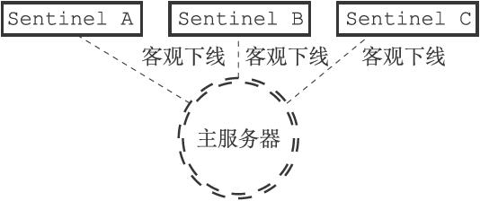
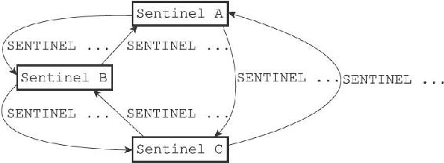

16.8 选举领头Sentinel

当一个主服务器被判断为客观下线时，监视这个下线主服务器的各个Sentinel会进行协商，选举出一个领头Sentinel，并由领头Sentinel对下线主服务器执行故障转移操作。

以下是Redis选举领头Sentinel的规则和方法：

·所有在线的Sentinel都有被选为领头Sentinel的资格，换句话说，监视同一个主服务器的多个在线Sentinel中的任意一个都有可能成为领头Sentinel。

·每次进行领头Sentinel选举之后，不论选举是否成功，所有Sentinel的配置纪元（configuration epoch）的值都会自增一次。配置纪元实际上就是一个计数器，并没有什么特别的。

·在一个配置纪元里面，所有Sentinel都有一次将某个Sentinel设置为局部领头Sentinel的机会，并且局部领头一旦设置，在这个配置纪元里面就不能再更改。

·每个发现主服务器进入客观下线的Sentinel都会要求其他Sentinel将自己设置为局部领头Sentinel。

·当一个Sentinel（源Sentinel）向另一个Sentinel（目标Sentinel）发送SENTINEL is-master-down-by-addr命令，并且命令中的runid参数不是\*符号而是源Sentinel的运行ID时，这表示源Sentinel要求目标Sentinel将前者设置为后者的局部领头Sentinel。

·Sentinel设置局部领头Sentinel的规则是先到先得：最先向目标Sentinel发送设置要求的源Sentinel将成为目标Sentinel的局部领头Sentinel，而之后接收到的所有设置要求都会被目标Sentinel拒绝。

·目标Sentinel在接收到SENTINEL is-master-down-by-addr命令之后，将向源Sentinel返回一条命令回复，回复中的leader\_runid参数和leader\_epoch参数分别记录了目标Sentinel的局部领头Sentinel的运行ID和配置纪元。

·源Sentinel在接收到目标Sentinel返回的命令回复之后，会检查回复中leader\_epoch参数的值和自己的配置纪元是否相同，如果相同的话，那么源Sentinel继续取出回复中的leader\_runid参数，如果leader\_runid参数的值和源Sentinel的运行ID一致，那么表示目标Sentinel将源Sentinel设置成了局部领头Sentinel。

·如果有某个Sentinel被半数以上的Sentinel设置成了局部领头Sentinel，那么这个Sentinel成为领头Sentinel。举个例子，在一个由10个Sentinel组成的Sentinel系统里面，只要有大于等于10/2+1=6个Sentinel将某个Sentinel设置为局部领头Sentinel，那么被设置的那个Sentinel就会成为领头Sentinel。

·因为领头Sentinel的产生需要半数以上Sentinel的支持，并且每个Sentinel在每个配置纪元里面只能设置一次局部领头Sentinel，所以在一个配置纪元里面，只会出现一个领头Sentinel。

·如果在给定时限内，没有一个Sentinel被选举为领头Sentinel，那么各个Sentinel将在一段时间之后再次进行选举，直到选出领头Sentinel为止。

为了熟悉以上规则，让我们来看一个选举领头Sentinel的过程。

假设现在有三个Sentinel正在监视同一个主服务器，并且这三个Sentinel之前已经通过SENTINEL is-master-down-by-addr命令确认主服务器进入了客观下线状态，如图16-20所示。

图16-20 三个Sentinel都发现主服务器已经进入了客观下线状态

那么为了选出领头Sentinel，三个Sentinel将再次向其他Sentinel发送SENTINEL is-master-down-by-addr命令，如图16-21所示。

图16-21 Sentinel再次向其他Sentinel发送命令

和检测客观下线状态时发送的SENTINEL is-master-down-by-addr命令不同，Sentinel这次发送的命令会带有Sentinel自己的运行ID，例如：

---

>  
> SENTINEL is-master-down-by-addr 127.0.0.1 6379 0 e955b4c85598ef5b5f055bc7ebfd5e828dbed4fa  

---

如果接收到这个命令的Sentinel还没有设置局部领头Sentinel的话，它就会将运行ID为e955b4c85598ef5b5f055bc7ebfd5e828dbed4fa的Sentinel设置为自己的局部领头Sentinel，并返回类似以下的命令回复：

---

>  
> 1) 1  
> 2) e955b4c85598ef5b5f055bc7ebfd5e828dbed4fa  
> 3) 0  

---

然后接收到命令回复的Sentinel就可以根据这一回复，统计出有多少个Sentinel将自己设置成了局部领头Sentinel。

根据命令请求发送的先后顺序不同，可能会有某个Sentinel的SENTINEL is-master-down-by-addr命令比起其他Sentinel发送的相同命令都更快到达，并最终胜出领头Sentinel的选举，然后这个领头Sentinel就可以开始对主服务器执行故障转移操作了。
