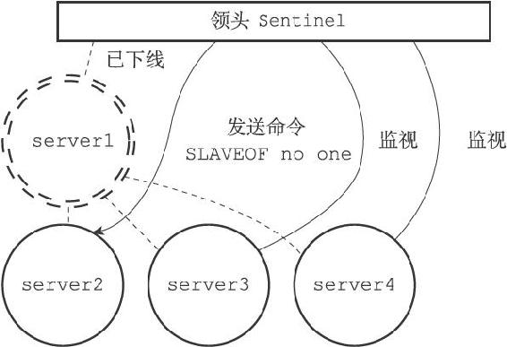
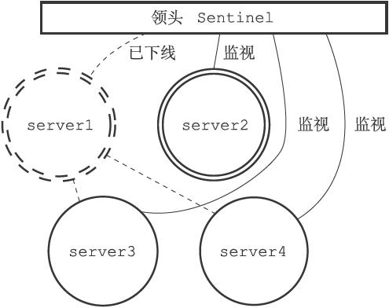
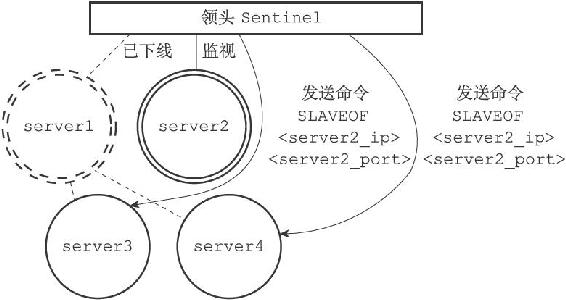
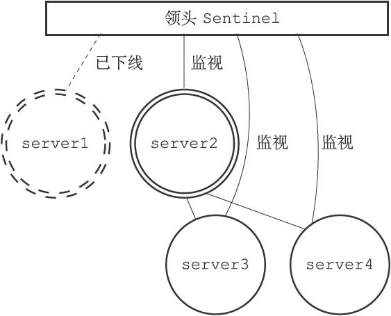
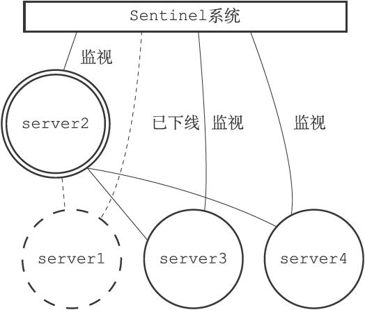
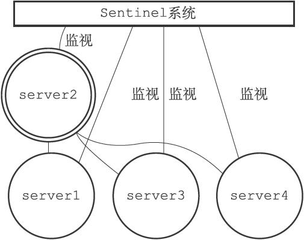

16.9 故障转移

在选举产生出领头Sentinel之后，领头Sentinel将对已下线的主服务器执行故障转移操作，该操作包含以下三个步骤：

1）在已下线主服务器属下的所有从服务器里面，挑选出一个从服务器，并将其转换为主服务器。

2）让已下线主服务器属下的所有从服务器改为复制新的主服务器。

3）将已下线主服务器设置为新的主服务器的从服务器，当这个旧的主服务器重新上线时，它就会成为新的主服务器的从服务器。

16.9.1 选出新的主服务器

故障转移操作第一步要做的就是在已下线主服务器属下的所有从服务器中，挑选出一个状态良好、数据完整的从服务器，然后向这个从服务器发送SLAVEOF no one命令，将这个从服务器转换为主服务器。

> 新的主服务器是怎样挑选出来的

> 领头Sentinel会将已下线主服务器的所有从服务器保存到一个列表里面，然后按照以下规则，一项一项地对列表进行过滤：

> 1）删除列表中所有处于下线或者断线状态的从服务器，这可以保证列表中剩余的从服务器都是正常在线的。

> 2）删除列表中所有最近五秒内没有回复过领头Sentinel的INFO命令的从服务器，这可以保证列表中剩余的从服务器都是最近成功进行过通信的。

> 3）删除所有与已下线主服务器连接断开超过down-after-milliseconds\*10毫秒的从服务器：down-after-milliseconds选项指定了判断主服务器下线所需的时间，而删除断开时长超过down-after-milliseconds\*10毫秒的从服务器，则可以保证列表中剩余的从服务器都没有过早地与主服务器断开连接，换句话说，列表中剩余的从服务器保存的数据都是比较新的。

> 之后，领头Sentinel将根据从服务器的优先级，对列表中剩余的从服务器进行排序，并选出其中优先级最高的从服务器。

> 如果有多个具有相同最高优先级的从服务器，那么领头Sentinel将按照从服务器的复制偏移量，对具有相同最高优先级的所有从服务器进行排序，并选出其中偏移量最大的从服务器（复制偏移量最大的从服务器就是保存着最新数据的从服务器）。

> 最后，如果有多个优先级最高、复制偏移量最大的从服务器，那么领头Sentinel将按照运行ID对这些从服务器进行排序，并选出其中运行ID最小的从服务器。

图16-22展示了在一次故障转移操作中，领头Sentinel向被选中的从服务器server2发送SLAVEOF no one命令的情形。

图16-22 将server2升级为主服务器

在发送SLAVEOF no one命令之后，领头Sentinel会以每秒一次的频率（平时是每十秒一次），向被升级的从服务器发送INFO命令，并观察命令回复中的角色（role）信息，当被升级服务器的role从原来的slave变为master时，领头Sentinel就知道被选中的从服务器已经顺利升级为主服务器了。

例如，在图16-22展示的例子中，领头Sentinel会一直向server2发送INFO命令，当server2返回的命令回复从：

---

>  
> \# Replication  
> role:slave  
> ...  
> \# Other sections  
> ...  

---

变为：

---

>  
> \# Replication  
> role:master  
> ...  
> \# Other sections  
> ...  

---

的时候，领头Sentinel就知道server2已经成功升级为主服务器了。

图16-23 server2成功升级为主服务器

图16-23展示了server2升级成功之后，各个服务器和领头Sentinel的样子。

16.9.2 修改从服务器的复制目标

当新的主服务器出现之后，领头Sentinel下一步要做的就是，让已下线主服务器属下的所有从服务器去复制新的主服务器，这一动作可以通过向从服务器发送SLAVEOF命令来实现。

图16-24展示了在故障转移操作中，领头Sentinel向已下线主服务器server1的两个从服务器server3和server4发送SLAVEOF命令，让它们复制新的主服务器server2的例子。

图16-24 让从服务器复制新的主服务器

图16-25展示了server3和server4成为server2的从服务器之后，各个服务器以及领头Sentinel的样子。

图16-25 server3和server4成为server2的从服务器

16.9.3 将旧的主服务器变为从服务器

故障转移操作最后要做的是，将已下线的主服务器设置为新的主服务器的从服务器。比如说，图16-26就展示了被领头Sentinel设置为从服务器之后，服务器server1的样子。

因为旧的主服务器已经下线，所以这种设置是保存在server1对应的实例结构里面的，当server1重新上线时，Sentinel就会向它发送SLAVEOF命令，让它成为server2的从服务器。

例如，图16-27就展示了server1重新上线并成为server2的从服务器的例子。

图16-26 server1被设置为新主服务器的从服务器

图16-27 server1重新上线并成为server2的从服务器
