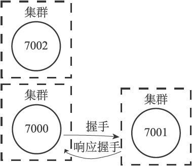
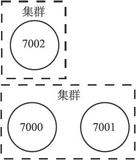
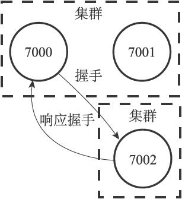
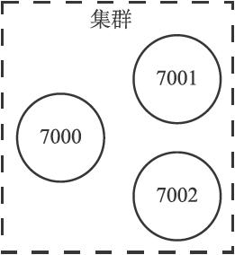
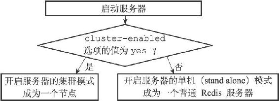
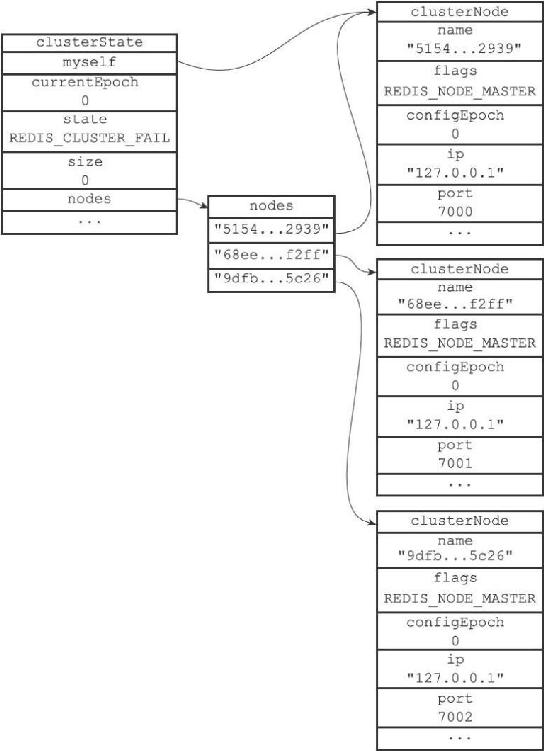
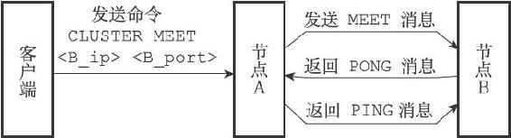

17.1 节点

一个Redis集群通常由多个节点（node）组成，在刚开始的时候，每个节点都是相互独立的，它们都处于一个只包含自己的集群当中，要组建一个真正可工作的集群，我们必须将各个独立的节点连接起来，构成一个包含多个节点的集群。

连接各个节点的工作可以使用CLUSTER MEET命令来完成，该命令的格式如下：

---

>  
> CLUSTER MEET <ip> <port>  

---

向一个节点node发送CLUSTER MEET命令，可以让node节点与ip和port所指定的节点进行握手（handshake），当握手成功时，node节点就会将ip和port所指定的节点添加到node节点当前所在的集群中。

举个例子，假设现在有三个独立的节点127.0.0.1:7000、127.0.0.1:7001、127.0.0.1:7002（下文省略IP地址，直接使用端口号来区分各个节点），我们首先使用客户端连上节点7000，通过发送CLUSTER NODE命令可以看到，集群目前只包含7000自己一个节点：

---

>  
> $ redis-cli -c -p 7000  
> 127.0.0.1:7000> CLUSTER NODES  
> 51549e625cfda318ad27423a31e7476fe3cd2939 :0 myself,master - 0 0 0 connected  

---

通过向节点7000发送以下命令，我们可以将节点7001添加到节点7000所在的集群里面：

---

>  
> 127.0.0.1:7000> CLUSTER MEET 127.0.0.1 7001  
> OK  
> 127.0.0.1:7000> CLUSTER NODES  
> 68eef66df23420a5862208ef5b1a7005b806f2ff 127.0.0.1:7001 master - 0 1388204746210 0 connected  
> 51549e625cfda318ad27423a31e7476fe3cd2939 :0 myself,master - 0 0 0 connected  

---

继续向节点7000发送以下命令，我们可以将节点7002也添加到节点7000和节点7001所在的集群里面：

---

>  
> 127.0.0.1:7000> CLUSTER MEET 127.0.0.1 7002  
> OK  
> 127.0.0.1:7000> CLUSTER NODES  
> 68eef66df23420a5862208ef5b1a7005b806f2ff 127.0.0.1:7001 master - 0 1388204848376 0 connected  
> 9dfb4c4e016e627d9769e4c9bb0d4fa208e65c26 127.0.0.1:7002 master - 0 1388204847977 0 connected  
> 51549e625cfda318ad27423a31e7476fe3cd2939 :0 myself,master - 0 0 0 connected  

---

现在，这个集群里面包含了7000、7001和7002三个节点，图17-1至17-5展示了这三个节点进行握手的整个过程。

图17-1 三个独立的节点

图17-2 节点7000和7001进行握手

图17-3 握手成功的7000与7001处于同一个集群

图17-4 节点7000与节点7002进行握手

图17-5 握手成功的三个节点处于同一个集群

本节接下来的内容将介绍启动节点的方法、与集群有关的数据结构，以及CLUSTER MEET命令的实现原理。

17.1.1 启动节点

一个节点就是一个运行在集群模式下的Redis服务器，Redis服务器在启动时会根据cluster-enabled配置选项是否为yes来决定是否开启服务器的集群模式，如图17-6所示。

图17-6 服务器判断是否开启集群模式的过程

节点（运行在集群模式下的Redis服务器）会继续使用所有在单机模式中使用的服务器组件，比如说：

·节点会继续使用文件事件处理器来处理命令请求和返回命令回复。

·节点会继续使用时间事件处理器来执行serverCron函数，而serverCron函数又会调用集群模式特有的clusterCron函数。clusterCron函数负责执行在集群模式下需要执行的常规操作，例如向集群中的其他节点发送Gossip消息，检查节点是否断线，或者检查是否需要对下线节点进行自动故障转移等。

·节点会继续使用数据库来保存键值对数据，键值对依然会是各种不同类型的对象。

·节点会继续使用RDB持久化模块和AOF持久化模块来执行持久化工作。

·节点会继续使用发布与订阅模块来执行PUBLISH、SUBSCRIBE等命令。

·节点会继续使用复制模块来进行节点的复制工作。

·节点会继续使用Lua脚本环境来执行客户端输入的Lua脚本。

除此之外，节点会继续使用redisServer结构来保存服务器的状态，使用redisClient结构来保存客户端的状态，至于那些只有在集群模式下才会用到的数据，节点将它们保存到了cluster.h/clusterNode结构、cluster.h/clusterLink结构，以及cluster.h/clusterState结构里面，接下来的一节将对这三种数据结构进行介绍。

17.1.2 集群数据结构

clusterNode结构保存了一个节点的当前状态，比如节点的创建时间、节点的名字、节点当前的配置纪元、节点的IP地址和端口号等等。

每个节点都会使用一个clusterNode结构来记录自己的状态，并为集群中的所有其他节点（包括主节点和从节点）都创建一个相应的clusterNode结构，以此来记录其他节点的状态：

---

>  
> struct clusterNode {  
> //   
> 创建节点的时间  
> mstime\_t ctime;  
> //   
> 节点的名字，由40  
> 个十六进制字符组成  
> //   
> 例如68eef66df23420a5862208ef5b1a7005b806f2ff  
> char name\[REDIS\_CLUSTER\_NAMELEN\];  
> //   
> 节点标识  
> //   
> 使用各种不同的标识值记录节点的角色（比如主节点或者从节点），  
> //   
> 以及节点目前所处的状态（比如在线或者下线）。  
> int flags;  
> //   
> 节点当前的配置纪元，用于实现故障转移  
> uint64\_t configEpoch;  
> //   
> 节点的IP  
> 地址  
> char ip\[REDIS\_IP\_STR\_LEN\];  
> //   
> 节点的端口号  
> int port;  
> //   
> 保存连接节点所需的有关信息  
> clusterLink \*link;  
> // ...  
> };  

---

clusterNode结构的link属性是一个clusterLink结构，该结构保存了连接节点所需的有关信息，比如套接字描述符，输入缓冲区和输出缓冲区：

---

>  
> typedef struct clusterLink {  
> //   
> 连接的创建时间  
> mstime\_t ctime;  
> // TCP   
> 套接字描述符  
> int fd;  
> //   
> 输出缓冲区，保存着等待发送给其他节点的消息（message  
> ）。  
> sds sndbuf;  
> //   
> 输入缓冲区，保存着从其他节点接收到的消息。  
> sds rcvbuf;  
> //   
> 与这个连接相关联的节点，如果没有的话就为NULL   
> struct clusterNode \*node;  
> } clusterLink;  

---

> redisClient结构和clusterLink结构的相同和不同之处

> redisClient结构和clusterLink结构都有自己的套接字描述符和输入、输出缓冲区，这两个结构的区别在于，redisClient结构中的套接字和缓冲区是用于连接客户端的，而clusterLink结构中的套接字和缓冲区则是用于连接节点的。

最后，每个节点都保存着一个clusterState结构，这个结构记录了在当前节点的视角下，集群目前所处的状态，例如集群是在线还是下线，集群包含多少个节点，集群当前的配置纪元，诸如此类：

---

>  
> typedef struct clusterState {  
> //   
> 指向当前节点的指针  
> clusterNode \*myself;  
> //   
> 集群当前的配置纪元，用于实现故障转移  
> uint64\_t currentEpoch;  
> //   
> 集群当前的状态：是在线还是下线  
> int state;  
> //   
> 集群中至少处理着一个槽的节点的数量  
> int size;  
> //   
> 集群节点名单（包括myself  
> 节点）  
> //   
> 字典的键为节点的名字，字典的值为节点对应的clusterNode  
> 结构  
> dict \*nodes;  
> // ...  
> } clusterState;  

---

以前面介绍的7000、7001、7002三个节点为例，图17-7展示了节点7000创建的clusterState结构，这个结构从节点7000的角度记录了集群以及集群包含的三个节点的当前状态（为了空间考虑，图中省略了clusterNode结构的一部分属性）：

·结构的currentEpoch属性的值为0，表示集群当前的配置纪元为0。

·结构的size属性的值为0，表示集群目前没有任何节点在处理槽，因此结构的state属性的值为REDIS\_CLUSTER\_FAIL，这表示集群目前处于下线状态。

·结构的nodes字典记录了集群目前包含的三个节点，这三个节点分别由三个clusterNode结构表示，其中myself指针指向代表节点7000的clusterNode结构，而字典中的另外两个指针则分别指向代表节点7001和代表节点7002的clusterNode结构，这两个节点是节点7000已知的在集群中的其他节点。

·三个节点的clusterNode结构的flags属性都是REDIS\_NODE\_MASTER，说明三个节点都是主节点。

节点7001和节点7002也会创建类似的clusterState结构：

·不过在节点7001创建的clusterState结构中，myself指针将指向代表节点7001的clusterNode结构，而节点7000和节点7002则是集群中的其他节点。

·而在节点7002创建的clusterState结构中，myself指针将指向代表节点7002的clusterNode结构，而节点7000和节点7001则是集群中的其他节点。

图17-7 节点7000创建的clusterState结构

17.1.3 CLUSTER MEET命令的实现

通过向节点A发送CLUSTER MEET命令，客户端可以让接收命令的节点A将另一个节点B添加到节点A当前所在的集群里面：

---

>  
> CLUSTER MEET <ip> <port>  

---

收到命令的节点A将与节点B进行握手（handshake），以此来确认彼此的存在，并为将来的进一步通信打好基础：

1）节点A会为节点B创建一个clusterNode结构，并将该结构添加到自己的clusterState.nodes字典里面。

2）之后，节点A将根据CLUSTER MEET命令给定的IP地址和端口号，向节点B发送一条MEET消息（message）。

3）如果一切顺利，节点B将接收到节点A发送的MEET消息，节点B会为节点A创建一个clusterNode结构，并将该结构添加到自己的clusterState.nodes字典里面。

4）之后，节点B将向节点A返回一条PONG消息。

5）如果一切顺利，节点A将接收到节点B返回的PONG消息，通过这条PONG消息节点A可以知道节点B已经成功地接收到了自己发送的MEET消息。

6）之后，节点A将向节点B返回一条PING消息。

7）如果一切顺利，节点B将接收到节点A返回的PING消息，通过这条PING消息节点B可以知道节点A已经成功地接收到了自己返回的PONG消息，握手完成。

图17-8展示了以上步骤描述的握手过程。

图17-8 节点的握手过程

之后，节点A会将节点B的信息通过Gossip协议传播给集群中的其他节点，让其他节点也与节点B进行握手，最终，经过一段时间之后，节点B会被集群中的所有节点认识。
