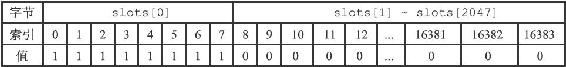
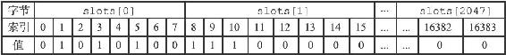
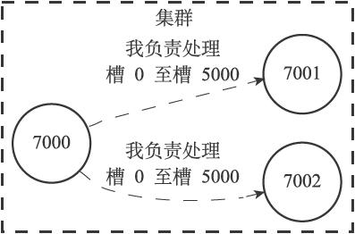
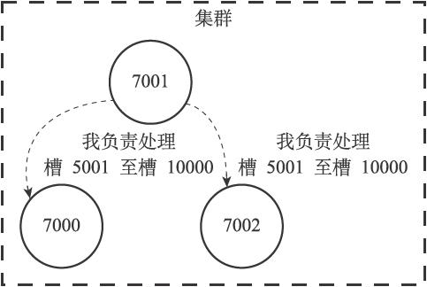
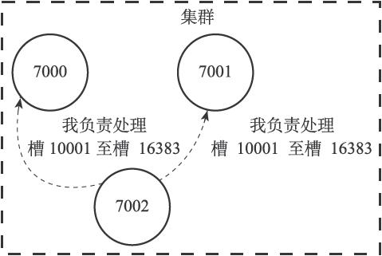
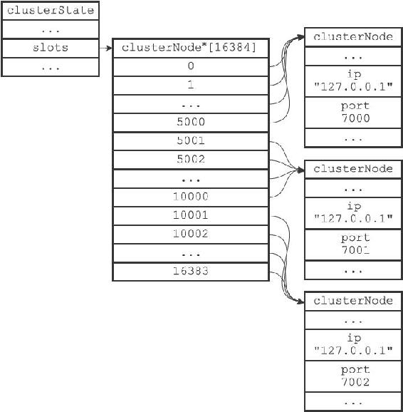
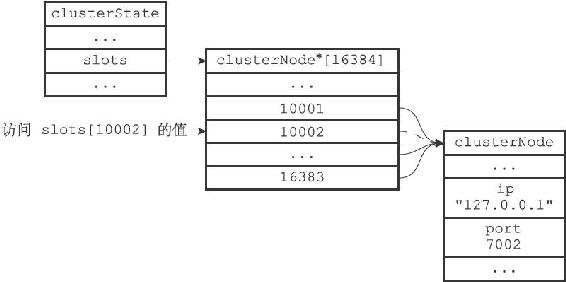
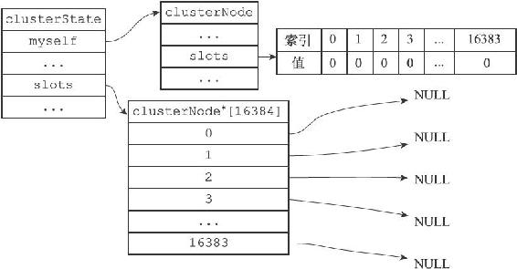
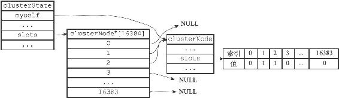

17.2 槽指派

Redis集群通过分片的方式来保存数据库中的键值对：集群的整个数据库被分为16384个槽（slot），数据库中的每个键都属于这16384个槽的其中一个，集群中的每个节点可以处理0个或最多16384个槽。

当数据库中的16384个槽都有节点在处理时，集群处于上线状态（ok）；相反地，如果数据库中有任何一个槽没有得到处理，那么集群处于下线状态（fail）。

在上一节，我们使用CLUSTER MEET命令将7000、7001、7002三个节点连接到了同一个集群里面，不过这个集群目前仍然处于下线状态，因为集群中的三个节点都没有在处理任何槽：

---

>  
> 127.0.0.1:7000> CLUSTER INFO  
> cluster\_state:fail  
> cluster\_slots\_assigned:0  
> cluster\_slots\_ok:0  
> cluster\_slots\_pfail:0  
> cluster\_slots\_fail:0  
> cluster\_known\_nodes:3  
> cluster\_size:0  
> cluster\_current\_epoch:0  
> cluster\_stats\_messages\_sent:110  
> cluster\_stats\_messages\_received:28  

---

通过向节点发送CLUSTER ADDSLOTS命令，我们可以将一个或多个槽指派（assign）给节点负责：

---

>  
> CLUSTER ADDSLOTS <slot> \[slot ...\]  

---

举个例子，执行以下命令可以将槽0至槽5000指派给节点7000负责：

---

>  
> 127.0.0.1:7000> CLUSTER ADDSLOTS 0 1 2 3 4 ... 5000  
> OK  
> 127.0.0.1:7000> CLUSTER NODES  
> 9dfb4c4e016e627d9769e4c9bb0d4fa208e65c26 127.0.0.1:7002 master - 0 1388316664849 0 connected  
> 68eef66df23420a5862208ef5b1a7005b806f2ff 127.0.0.1:7001 master - 0 1388316665850 0 connected  
> 51549e625cfda318ad27423a31e7476fe3cd2939 :0 myself,master - 0 0 0 connected 0-5000  

---

为了让7000、7001、7002三个节点所在的集群进入上线状态，我们继续执行以下命令，将槽5001至槽10000指派给节点7001负责：

---

>  
> 127.0.0.1:7001> CLUSTER ADDSLOTS 5001 5002 5003 5004 ... 10000  
> OK  

---

然后将槽10001至槽16383指派给7002负责：

---

>  
> 127.0.0.1:7002> CLUSTER ADDSLOTS 10001 10002 10003 10004 ... 16383  
> OK  

---

当以上三个CLUSTER ADDSLOTS命令都执行完毕之后，数据库中的16384个槽都已经被指派给了相应的节点，集群进入上线状态：

---

>  
> 127.0.0.1:7000> CLUSTER INFO  
> cluster\_state:ok  
> cluster\_slots\_assigned:16384  
> cluster\_slots\_ok:16384  
> cluster\_slots\_pfail:0  
> cluster\_slots\_fail:0  
> cluster\_known\_nodes:3  
> cluster\_size:3  
> cluster\_current\_epoch:0  
> cluster\_stats\_messages\_sent:2699  
> cluster\_stats\_messages\_received:2617  
> 127.0.0.1:7000> CLUSTER NODES  
> 9dfb4c4e016e627d9769e4c9bb0d4fa208e65c26 127.0.0.1:7002 master - 0 1388317426165 0 connected 10001-16383  
> 68eef66df23420a5862208ef5b1a7005b806f2ff 127.0.0.1:7001 master - 0 1388317427167 0 connected 5001-10000  
> 51549e625cfda318ad27423a31e7476fe3cd2939 :0 myself,master - 0 0 0 connected 0-5000  

---

本节接下来的内容将首先介绍节点保存槽指派信息的方法，以及节点之间传播槽指派信息的方法，之后再介绍CLUSTER ADDSLOTS命令的实现。

17.2.1 记录节点的槽指派信息

clusterNode结构的slots属性和numslot属性记录了节点负责处理哪些槽：

---

>  
> struct clusterNode {  
> // ...  
> unsigned char slots\[16384/8\];  
> int numslots;  
> // ...  
> };  

---

slots属性是一个二进制位数组（bit array），这个数组的长度为16384/8=2048个字节，共包含16384个二进制位。

Redis以0为起始索引，16383为终止索引，对slots数组中的16384个二进制位进行编号，并根据索引i上的二进制位的值来判断节点是否负责处理槽i：

·如果slots数组在索引i上的二进制位的值为1，那么表示节点负责处理槽i。

·如果slots数组在索引i上的二进制位的值为0，那么表示节点不负责处理槽i。

图17-9展示了一个slots数组示例：这个数组索引0至索引7上的二进制位的值都为1，其余所有二进制位的值都为0，这表示节点负责处理槽0至槽7。

图17-9 一个slots数组示例

图17-10展示了另一个slots数组示例：这个数组索引1、3、5、8、9、10上的二进制位的值都为1，而其余所有二进制位的值都为0，这表示节点负责处理槽1、3、5、8、9、10。

图17-10 另一个slots数组示例

因为取出和设置slots数组中的任意一个二进制位的值的复杂度仅为O（1），所以对于一个给定节点的slots数组来说，程序检查节点是否负责处理某个槽，又或者将某个槽指派给节点负责，这两个动作的复杂度都是O（1）。

至于numslots属性则记录节点负责处理的槽的数量，也即是slots数组中值为1的二进制位的数量。

比如说，对于图17-9所示的slots数组来说，节点处理的槽数量为8，而对于图17-10所示的slots数组来说，节点处理的槽数量为6。

17.2.2 传播节点的槽指派信息

一个节点除了会将自己负责处理的槽记录在clusterNode结构的slots属性和numslots属性之外，它还会将自己的slots数组通过消息发送给集群中的其他节点，以此来告知其他节点自己目前负责处理哪些槽。

举个例子，对于前面展示的包含7000、7001、7002三个节点的集群来说：

·节点7000会通过消息向节点7001和节点7002发送自己的slots数组，以此来告知这两个节点，自己负责处理槽0至槽5000，如图17-11所示。

·节点7001会通过消息向节点7000和节点7002发送自己的slots数组，以此来告知这两个节点，自己负责处理槽5001至槽10000，如图17-12所示。

·节点7002会通过消息向节点7000和节点7001发送自己的slots数组，以此来告知这两个节点，自己负责处理槽10001至槽16383，如图17-13所示。

图17-11 7000告知7001和7002自己负责处理的槽

图17-12 7001告知7000和7002自己负责处理的槽

图17-13 7002告知7000和7001自己负责处理的槽

当节点A通过消息从节点B那里接收到节点B的slots数组时，节点A会在自己的clusterState.nodes字典中查找节点B对应的clusterNode结构，并对结构中的slots数组进行保存或者更新。

因为集群中的每个节点都会将自己的slots数组通过消息发送给集群中的其他节点，并且每个接收到slots数组的节点都会将数组保存到相应节点的clusterNode结构里面，因此，集群中的每个节点都会知道数据库中的16384个槽分别被指派给了集群中的哪些节点。

17.2.3 记录集群所有槽的指派信息

clusterState结构中的slots数组记录了集群中所有16384个槽的指派信息：

---

>  
> typedef struct clusterState {  
> // ...  
> clusterNode \*slots\[16384\];  
> // ...  
> } clusterState;  

---

slots数组包含16384个项，每个数组项都是一个指向clusterNode结构的指针：

·如果slots\[i\]指针指向NULL，那么表示槽i尚未指派给任何节点。

·如果slots\[i\]指针指向一个clusterNode结构，那么表示槽i已经指派给了clusterNode结构所代表的节点。

举个例子，对于7000、7001、7002三个节点来说，它们的clusterState结构的slots数组将会是图17-14所示的样子：

·数组项slots\[0\]至slots\[5000\]的指针都指向代表节点7000的clusterNode结构，表示槽0至5000都指派给了节点7000。

·数组项slots\[5001\]至slots\[10000\]的指针都指向代表节点7001的clusterNode结构，表示槽5001至10000都指派给了节点7001。

·数组项slots\[10001\]至slots\[16383\]的指针都指向代表节点7002的clusterNode结构，表示槽10001至16383都指派给了节点7002。

如果只将槽指派信息保存在各个节点的clusterNode.slots数组里，会出现一些无法高效地解决的问题，而clusterState.slots数组的存在解决了这些问题：

·如果节点只使用clusterNode.slots数组来记录槽的指派信息，那么为了知道槽i是否已经被指派，或者槽i被指派给了哪个节点，程序需要遍历clusterState.nodes字典中的所有clusterNode结构，检查这些结构的slots数组，直到找到负责处理槽i的节点为止，这个过程的复杂度为O（N），其中N为clusterState.nodes字典保存的clusterNode结构的数量。

图17-14 clusterState结构的slots数组

·而通过将所有槽的指派信息保存在clusterState.slots数组里面，程序要检查槽i是否已经被指派，又或者取得负责处理槽i的节点，只需要访问clusterState.slots\[i\]的值即可，这个操作的复杂度仅为O（1）。

举个例子，对于图17-14所示的slots数组来说，如果程序需要知道槽10002被指派给了哪个节点，那么只要访问数组项slots\[10002\]，就可以马上知道槽10002被指派给了节点7002，如图17-15所示。

图17-15 访问slots\[10002\]的值

要说明的一点是，虽然clusterState.slots数组记录了集群中所有槽的指派信息，但使用clusterNode结构的slots数组来记录单个节点的槽指派信息仍然是有必要的：

·因为当程序需要将某个节点的槽指派信息通过消息发送给其他节点时，程序只需要将相应节点的clusterNode.slots数组整个发送出去就可以了。

·另一方面，如果Redis不使用clusterNode.slots数组，而单独使用clusterState.slots数组的话，那么每次要将节点A的槽指派信息传播给其他节点时，程序必须先遍历整个clusterState.slots数组，记录节点A负责处理哪些槽，然后才能发送节点A的槽指派信息，这比直接发送clusterNode.slots数组要麻烦和低效得多。

clusterState.slots数组记录了集群中所有槽的指派信息，而clusterNode.slots数组只记录了clusterNode结构所代表的节点的槽指派信息，这是两个slots数组的关键区别所在。

17.2.4 CLUSTER ADDSLOTS命令的实现

CLUSTER ADDSLOTS命令接受一个或多个槽作为参数，并将所有输入的槽指派给接收该命令的节点负责：

---

>  
> CLUSTER ADDSLOTS <slot> \[slot ...\]  

---

CLUSTER ADDSLOTS命令的实现可以用以下伪代码来表示：

---

>  
> def CLUSTER\_ADDSLOTS(\*all\_input\_slots):  
> \#   
> 遍历所有输入槽，检查它们是否都是未指派槽  
> for i in all\_input\_slots:  
> \#   
> 如果有哪怕一个槽已经被指派给了某个节点  
> \#   
> 那么向客户端返回错误，并终止命令执行  
> if clusterState.slots\[i\] != NULL:  
> reply\_error()  
> return  
> \#   
> 如果所有输入槽都是未指派槽  
> \#   
> 那么再次遍历所有输入槽，将这些槽指派给当前节点  
> for i in all\_input\_slots:  
> \#   
> 设置clusterState  
> 结构的slots  
> 数组  
> \#   
> 将slots\[i\]  
> 的指针指向代表当前节点的clusterNode  
> 结构  
> clusterState.slots\[i\] = clusterState.myself  
> \#   
> 访问代表当前节点的clusterNode  
> 结构的slots  
> 数组  
> \#   
> 将数组在索引i  
> 上的二进制位设置为1  
> setSlotBit(clusterState.myself.slots, i)  

---

举个例子，图17-16展示了一个节点的clusterState结构，clusterState.slots数组中的所有指针都指向NULL，并且clusterNode.slots数组中的所有二进制位的值都是0，这说明当前节点没有被指派任何槽，并且集群中的所有槽都是未指派的。

图17-16 节点的clusterState结构

当客户端对17-16所示的节点执行命令：

---

>  
> CLUSTER ADDSLOTS 1 2  

---

将槽1和槽2指派给节点之后，节点的clusterState结构将被更新成图17-17所示的样子：

·clusterState.slots数组在索引1和索引2上的指针指向了代表当前节点的clusterNode结构。

·并且clusterNode.slots数组在索引1和索引2上的位被设置成了1。

图17-17 执行CLUSTER ADDSLOTS命令之后的clusterState结构

最后，在CLUSTER ADDSLOTS命令执行完毕之后，节点会通过发送消息告知集群中的其他节点，自己目前正在负责处理哪些槽。
