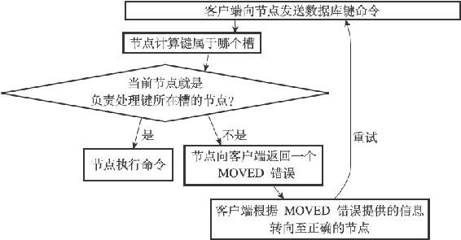
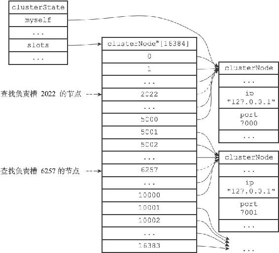
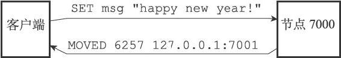
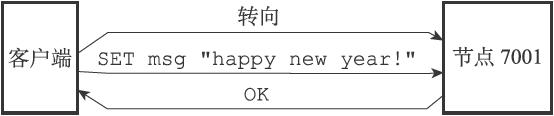
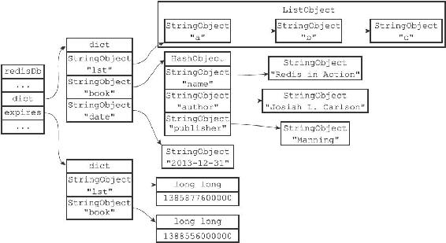
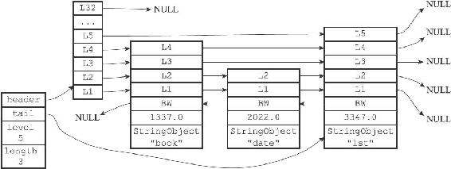

17.3 在集群中执行命令

在对数据库中的16384个槽都进行了指派之后，集群就会进入上线状态，这时客户端就可以向集群中的节点发送数据命令了。

当客户端向节点发送与数据库键有关的命令时，接收命令的节点会计算出命令要处理的数据库键属于哪个槽，并检查这个槽是否指派给了自己：

·如果键所在的槽正好就指派给了当前节点，那么节点直接执行这个命令。

·如果键所在的槽并没有指派给当前节点，那么节点会向客户端返回一个MOVED错误，指引客户端转向（redirect）至正确的节点，并再次发送之前想要执行的命令。

图17-18展示了这两种情况的判断流程。

图17-18 判断客户端是否需要转向的流程

举个例子，如果我们在之前提到的，由7000、7001、7002三个节点组成的集群中，用客户端连上节点7000，并发送以下命令，那么命令会直接被节点7000执行：

---

>  
> 127.0.0.1:7000> SET date "2013-12-31"  
> OK  

---

因为键date所在的槽2022正是由节点7000负责处理的。

但是，如果我们执行以下命令，那么客户端会先被转向至节点7001，然后再执行命令：

---

>  
> 127.0.0.1:7000> SET msg "happy new year!"  
> \-> Redirected to slot \[6257\] located at 127.0.0.1:7001  
> OK  
> 127.0.0.1:7001> GET msg  
> "happy new year!"  

---

这是因为键msg所在的槽6257是由节点7001负责处理的，而不是由最初接收命令的节点7000负责处理：

·当客户端第一次向节点7000发送SET命令的时候，节点7000会向客户端返回MOVED错误，指引客户端转向至节点7001。

·当客户端转向到节点7001之后，客户端重新向节点7001发送SET命令，这个命令会被节点7001成功执行。

本节接下来的内容将介绍计算键所属槽的方法，节点判断某个槽是否由自己负责的方法，以及MOVED错误的实现方法，最后，本节还会介绍节点和单机Redis服务器保存键值对数据的相同和不同之处。

17.3.1 计算键属于哪个槽

节点使用以下算法来计算给定键key属于哪个槽：

---

>  
> def slot\_number(key):  
> return CRC16(key) & 16383  

---

其中CRC16（key）语句用于计算键key的CRC-16校验和，而&16383语句则用于计算出一个介于0至16383之间的整数作为键key的槽号。

使用CLUSTER KEYSLOT<key>命令可以查看一个给定键属于哪个槽：

---

>  
> 127.0.0.1:7000> CLUSTER KEYSLOT "date"  
> (integer) 2022  
> 127.0.0.1:7000> CLUSTER KEYSLOT "msg"  
> (integer) 6257  
> 127.0.0.1:7000> CLUSTER KEYSLOT "name"  
> (integer) 5798  
> 127.0.0.1:7000> CLUSTER KEYSLOT "fruits"  
> (integer) 14943  

---

CLUSTER KEYSLOT命令就是通过调用上面给出的槽分配算法来实现的，以下是该命令的伪代码实现：

---

>  
> def CLUSTER\_KEYSLOT(key):  
> \#   
> 计算槽号  
> slot = slot\_number(key)  
> \#   
> 将槽号返回给客户端  
> reply\_client(slot)  

---

17.3.2 判断槽是否由当前节点负责处理

当节点计算出键所属的槽i之后，节点就会检查自己在clusterState.slots数组中的项i，判断键所在的槽是否由自己负责：

1）如果clusterState.slots\[i\]等于clusterState.myself，那么说明槽i由当前节点负责，节点可以执行客户端发送的命令。

2）如果clusterState.slots\[i\]不等于clusterState.myself，那么说明槽i并非由当前节点负责，节点会根据clusterState.slots\[i\]指向的clusterNode结构所记录的节点IP和端口号，向客户端返回MOVED错误，指引客户端转向至正在处理槽i的节点。

举个例子，假设图17-19为节点7000的clusterState结构：

·当客户端向节点7000发送命令SET date"2013-12-31"的时候，节点首先计算出键date属于槽2022，然后检查得出clusterState.slots\[2022\]等于clusterState.myself，这说明槽2022正是由节点7000负责，于是节点7000直接执行这个SET命令，并将结果返回给发送命令的客户端。

·当客户端向节点7000发送命令SET msg"happy new year！"的时候，节点首先计算出键msg属于槽6257，然后检查clusterState.slots\[6257\]是否等于clusterState.myself，结果发现两者并不相等：这说明槽6257并非由节点7000负责处理，于是节点7000访问clusterState.slots\[6257\]所指向的clusterNode结构，并根据结构中记录的IP地址127.0.0.1和端口号7001，向客户端返回错误MOVED 6257 127.0.0.1:7001，指引节点转向至正在负责处理槽6257的节点7001。

图17-19 节点7000的clusterState结构

17.3.3 MOVED错误

当节点发现键所在的槽并非由自己负责处理的时候，节点就会向客户端返回一个MOVED错误，指引客户端转向至正在负责槽的节点。

MOVED错误的格式为：

---

>  
> MOVED <slot> <ip>:<port>  

---

其中slot为键所在的槽，而ip和port则是负责处理槽slot的节点的IP地址和端口号。例如错误：

---

>  
> MOVED 10086 127.0.0.1:7002  

---

表示槽10086正由IP地址为127.0.0.1，端口号为7002的节点负责。

又例如错误：

---

>  
> MOVED 789 127.0.0.1:7000  

---

表示槽789正由IP地址为127.0.0.1，端口号为7000的节点负责。

当客户端接收到节点返回的MOVED错误时，客户端会根据MOVED错误中提供的IP地址和端口号，转向至负责处理槽slot的节点，并向该节点重新发送之前想要执行的命令。以前面的客户端从节点7000转向至7001的情况作为例子：

---

>  
> 127.0.0.1:7000> SET msg "happy new year!"  
> \-> Redirected to slot \[6257\] located at 127.0.0.1:7001  
> OK  
> 127.0.0.1:7001>  

---

图17-20展示了客户端向节点7000发送SET命令，并获得MOVED错误的过程。

图17-20 节点7000向客户端返回MOVED错误

而图17-21则展示了客户端根据MOVED错误，转向至节点7001，并重新发送SET命令的过程。

图17-21 客户端根据MOVED错误的指示转向至节点7001

一个集群客户端通常会与集群中的多个节点创建套接字连接，而所谓的节点转向实际上就是换一个套接字来发送命令。

如果客户端尚未与想要转向的节点创建套接字连接，那么客户端会先根据MOVED错误提供的IP地址和端口号来连接节点，然后再进行转向。

> 被隐藏的MOVED错误

> 集群模式的redis-cli客户端在接收到MOVED错误时，并不会打印出MOVED错误，而是根据MOVED错误自动进行节点转向，并打印出转向信息，所以我们是看不见节点返回的MOVED错误的：

---

>  
> $ redis-cli -c -p 7000 #   
> 集群模式  
> 127.0.0.1:7000> SET msg "happy new year!"  
> \-> Redirected to slot \[6257\] located at 127.0.0.1:7001  
> OK  
> 127.0.0.1:7001>  

---

> 但是，如果我们使用单机（stand alone）模式的redis-cli客户端，再次向节点7000发送相同的命令，那么MOVED错误就会被客户端打印出来：

---

>  
> $ redis-cli -p 7000 #   
> 单机模式  
> 127.0.0.1:7000> SET msg "happy new year!"  
> (error) MOVED 6257 127.0.0.1:7001  
> 127.0.0.1:7000>  

---

> 这是因为单机模式的redis-cli客户端不清楚MOVED错误的作用，所以它只会直接将MOVED错误直接打印出来，而不会进行自动转向。

17.3.4 节点数据库的实现

集群节点保存键值对以及键值对过期时间的方式，与第9章里面介绍的单机Redis服务器保存键值对以及键值对过期时间的方式完全相同。

节点和单机服务器在数据库方面的一个区别是，节点只能使用0号数据库，而单机Redis服务器则没有这一限制。

举个例子，图17-22展示了节点7000的数据库状态，数据库中包含列表键"lst"，哈希键"book"，以及字符串键"date"，其中键"lst"和键"book"带有过期时间。

另外，除了将键值对保存在数据库里面之外，节点还会用clusterState结构中的slots\_to\_keys跳跃表来保存槽和键之间的关系：

---

>  
> typedef struct clusterState {  
> // ...  
> zskiplist \*slots\_to\_keys;  
> // ...  
> } clusterState;  

---

图17-22 节点7000的数据库

slots\_to\_keys跳跃表每个节点的分值（score）都是一个槽号，而每个节点的成员（member）都是一个数据库键：

·每当节点往数据库中添加一个新的键值对时，节点就会将这个键以及键的槽号关联到slots\_to\_keys跳跃表。

·当节点删除数据库中的某个键值对时，节点就会在slots\_to\_keys跳跃表解除被删除键与槽号的关联。

举个例子，对于图17-22所示的数据库，节点7000将创建类似图17-23所示的slots\_to\_keys跳跃表：

·键"book"所在跳跃表节点的分值为1337.0，这表示键"book"所在的槽为1337。

·键"date"所在跳跃表节点的分值为2022.0，这表示键"date"所在的槽为2022。

·键"lst"所在跳跃表节点的分值为3347.0，这表示键"lst"所在的槽为3347。

通过在slots\_to\_keys跳跃表中记录各个数据库键所属的槽，节点可以很方便地对属于某个或某些槽的所有数据库键进行批量操作，例如命令CLUSTER GETKEYSINSLOT<slot><count>命令可以返回最多count个属于槽slot的数据库键，而这个命令就是通过遍历slots\_to\_keys跳跃表来实现的。

图17-23 节点7000的slots\_to\_keys跳跃表
