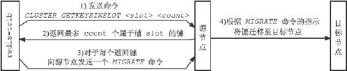
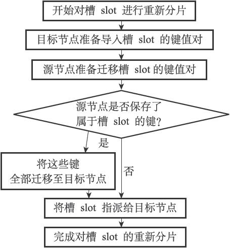

17.4 重新分片

Redis集群的重新分片操作可以将任意数量已经指派给某个节点（源节点）的槽改为指派给另一个节点（目标节点），并且相关槽所属的键值对也会从源节点被移动到目标节点。

重新分片操作可以在线（online）进行，在重新分片的过程中，集群不需要下线，并且源节点和目标节点都可以继续处理命令请求。

举个例子，对于之前提到的，包含7000、7001、7002三个节点的集群来说，我们可以向这个集群添加一个IP为127.0.0.1，端口号为7003的节点（后面简称节点7003）：

---

>  
> $ redis-cli -c -p 7000  
> 127.0.0.1:7000> CLUSTER MEET 127.0.0.1 7003  
> OK  
> 127.0.0.1:7000> cluster nodes  
> 51549e625cfda318ad27423a31e7476fe3cd2939 :0 myself,master - 0 0 0 connected 0-5000  
> 68eef66df23420a5862208ef5b1a7005b806f2ff 127.0.0.1:7001 master - 0 1388635782831 0 connected 5001-10000  
> 9dfb4c4e016e627d9769e4c9bb0d4fa208e65c26 127.0.0.1:7002 master - 0 1388635782831 0 connected 10001-16383  
> 04579925484ce537d3410d7ce97bd2e260c459a2 127.0.0.1:7003 master - 0 1388635782330 0 connected  

---

然后通过重新分片操作，将原本指派给节点7002的槽15001至16383改为指派给节点7003。

以下是重新分片操作执行之后，节点的槽分配状态：

---

>  
> 127.0.0.1:7000> cluster nodes  
> 51549e625cfda318ad27423a31e7476fe3cd2939 :0 myself,master -0 0 0 connected 0-5000  
> 68eef66df23420a5862208ef5b1a7005b806f2ff 127.0.0.1:7001 master -0 1388635782831 0 connected 5001-10000  
> 9dfb4c4e016e627d9769e4c9bb0d4fa208e65c26 127.0.0.1:7002 master -0 1388635782831 0 connected 10001-15000  
> 04579925484ce537d3410d7ce97bd2e260c459a2 127.0.0.1:7003 master -0 1388635782330 0 connected 15001-16383  

---

重新分片的实现原理

Redis集群的重新分片操作是由Redis的集群管理软件redis-trib负责执行的，Redis提供了进行重新分片所需的所有命令，而redis-trib则通过向源节点和目标节点发送命令来进行重新分片操作。

redis-trib对集群的单个槽slot进行重新分片的步骤如下：

1）redis-trib对目标节点发送CLUSTER SETSLOT<slot>IMPORTING<source\_id>命令，让目标节点准备好从源节点导入（import）属于槽slot的键值对。

2）redis-trib对源节点发送CLUSTER SETSLOT<slot>MIGRATING<target\_id>命令，让源节点准备好将属于槽slot的键值对迁移（migrate）至目标节点。

3）redis-trib向源节点发送CLUSTER GETKEYSINSLOT<slot><count>命令，获得最多count个属于槽slot的键值对的键名（key name）。

4）对于步骤3获得的每个键名，redis-trib都向源节点发送一个MIGRATE<target\_ip><target\_port><key\_name>0<timeout>命令，将被选中的键原子地从源节点迁移至目标节点。

5）重复执行步骤3和步骤4，直到源节点保存的所有属于槽slot的键值对都被迁移至目标节点为止。每次迁移键的过程如图17-24所示。

6）redis-trib向集群中的任意一个节点发送CLUSTER SETSLOT<slot>NODE<target\_id>命令，将槽slot指派给目标节点，这一指派信息会通过消息发送至整个集群，最终集群中的所有节点都会知道槽slot已经指派给了目标节点。

图17-24 迁移键的过程

图17-25展示了对槽slot进行重新分片的整个过程。

如果重新分片涉及多个槽，那么redis-trib将对每个给定的槽分别执行上面给出的步骤。

图17-25 对槽slot进行重新分片的过程
