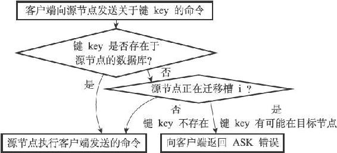
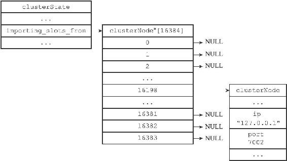
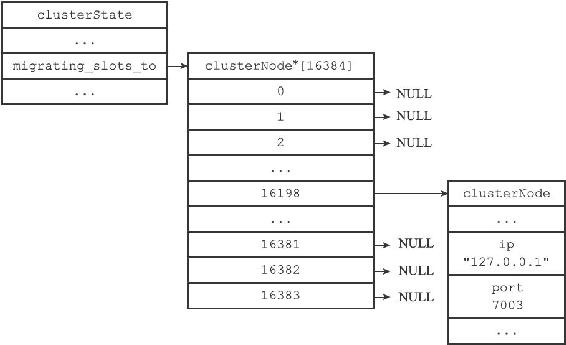
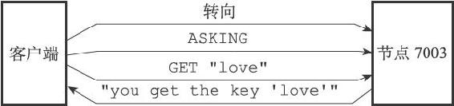
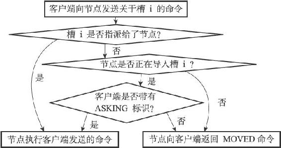

17.5 ASK错误

在进行重新分片期间，源节点向目标节点迁移一个槽的过程中，可能会出现这样一种情况：属于被迁移槽的一部分键值对保存在源节点里面，而另一部分键值对则保存在目标节点里面。

当客户端向源节点发送一个与数据库键有关的命令，并且命令要处理的数据库键恰好就属于正在被迁移的槽时：

·源节点会先在自己的数据库里面查找指定的键，如果找到的话，就直接执行客户端发送的命令。

·相反地，如果源节点没能在自己的数据库里面找到指定的键，那么这个键有可能已经被迁移到了目标节点，源节点将向客户端返回一个ASK错误，指引客户端转向正在导入槽的目标节点，并再次发送之前想要执行的命令。

图17-26展示了源节点判断是否需要向客户端发送ASK错误的整个过程。

图17-26 判断是否发送ASK错误的过程

举个例子，假设节点7002正在向节点7003迁移槽16198，这个槽包含"is"和"love"两个键，其中键"is"还留在节点7002，而键"love"已经被迁移到了节点7003。

如果我们向节点7002发送关于键"is"的命令，那么这个命令会直接被节点7002执行：

---

>  
> 127.0.0.1:7002> GET "is"  
> "you get the key 'is'"  

---

而如果我们向节点7002发送关于键"love"的命令，那么客户端会先被转向至节点7003，然后再次执行命令：

---

>  
> 127.0.0.1:7002> GET "love"  
> \-> Redirected to slot \[16198\] located at 127.0.0.1:7003  
> "you get the key 'love'"  
> 127.0.0.1:7003>  

---

> 被隐藏的ASK错误

> 和接到MOVED错误时的情况类似，集群模式的redis-cli在接到ASK错误时也不会打印错误，而是自动根据错误提供的IP地址和端口进行转向动作。如果想看到节点发送的ASK错误的话，可以使用单机模式的redis-cli客户端：

---

>  
> $ redis-cli -p 7002  
> 127.0.0.1:7002> GET "love"  
> (error) ASK 16198 127.0.0.1:7003  

---

注意

在写这篇文章的时候，集群模式的redis-cli并未支持ASK自动转向，上面展示的ASK自动转向行为实际上是根据MOVED自动转向行为虚构出来的。因此，当集群模式的redis-cli真正支持ASK自动转向时，它的行为和上面展示的行为可能会有所不同。

本节将对ASK错误的实现原理进行说明，并对比ASK错误和MOVED错误的区别。

17.5.1 CLUSTER SETSLOT IMPORTING命令的实现

clusterState结构的importing\_slots\_from数组记录了当前节点正在从其他节点导入的槽：

---

>  
> typedef struct clusterState {  
> // ...  
> clusterNode \*importing\_slots\_from\[16384\];  
> // ...  
> } clusterState;  

---

如果importing\_slots\_from\[i\]的值不为NULL，而是指向一个clusterNode结构，那么表示当前节点正在从clusterNode所代表的节点导入槽i。

在对集群进行重新分片的时候，向目标节点发送命令：

---

>  
> CLUSTER SETSLOT <i> IMPORTING <source\_id>  

---

可以将目标节点clusterState.importing\_slots\_from\[i\]的值设置为source\_id所代表节点的clusterNode结构。

举个例子，如果客户端向节点7003发送以下命令：

---

>  
> \# 9dfb...   
> 是节点7002   
> 的ID   
> 127.0.0.1:7003> CLUSTER SETSLOT 16198 IMPORTING 9dfb4c4e016e627d9769e4c9bb0d4fa208e65c26  
> OK  

---

那么节点7003的clusterState.importing\_slots\_from数组将变成图17-27所示的样子。

图17-27 节点7003的importing\_slots\_from数组

17.5.2 CLUSTER SETSLOT MIGRATING命令的实现

clusterState结构的migrating\_slots\_to数组记录了当前节点正在迁移至其他节点的槽：

---

>  
> typedef struct clusterState {  
> // ...  
> clusterNode \*migrating\_slots\_to\[16384\];  
> // ...  
> } clusterState;  

---

如果migrating\_slots\_to\[i\]的值不为NULL，而是指向一个clusterNode结构，那么表示当前节点正在将槽i迁移至clusterNode所代表的节点。

在对集群进行重新分片的时候，向源节点发送命令：

---

>  
> CLUSTER SETSLOT <i> MIGRATING <target\_id>  

---

可以将源节点clusterState.migrating\_slots\_to\[i\]的值设置为target\_id所代表节点的clusterNode结构。

举个例子，如果客户端向节点7002发送以下命令：

---

>  
> \# 0457...   
> 是节点7003   
> 的ID   
> 127.0.0.1:7002> CLUSTER SETSLOT 16198 MIGRATING 04579925484ce537d3410d7ce97bd2e260c459a2  
> OK  

---

那么节点7002的clusterState.migrating\_slots\_to数组将变成图17-28所示的样子。

图17-28 节点7002的migrating\_slots\_to数组

17.5.3 ASK错误

如果节点收到一个关于键key的命令请求，并且键key所属的槽i正好就指派给了这个节点，那么节点会尝试在自己的数据库里查找键key，如果找到了的话，节点就直接执行客户端发送的命令。

与此相反，如果节点没有在自己的数据库里找到键key，那么节点会检查自己的clusterState.migrating\_slots\_to\[i\]，看键key所属的槽i是否正在进行迁移，如果槽i的确在进行迁移的话，那么节点会向客户端发送一个ASK错误，引导客户端到正在导入槽i的节点去查找键key。

举个例子，假设在节点7002向节点7003迁移槽16198期间，有一个客户端向节点7002发送命令：

---

>  
> GET   
> “love  
> ”  

---

因为键"love"正好属于槽16198，所以节点7002会首先在自己的数据库中查找键"love"，但并没有找到，通过检查自己的clusterState.migrating\_slots\_to\[16198\]，节点7002发现自己正在将槽16198迁移至节点7003，于是它向客户端返回错误：

---

>  
> ASK 16198 127.0.0.1:7003  

---

这个错误表示客户端可以尝试到IP为127.0.0.1，端口号为7003的节点去执行和槽16198有关的操作，如图17-29所示。

图17-29 客户端接收到节点7002返回的ASK错误

接到ASK错误的客户端会根据错误提供的IP地址和端口号，转向至正在导入槽的目标节点，然后首先向目标节点发送一个ASKING命令，之后再重新发送原本想要执行的命令。

以前面的例子来说，当客户端接收到节点7002返回的以下错误时：

---

>  
> ASK 16198 127.0.0.1:7003  

---

客户端会转向至节点7003，首先发送命令：

---

>  
> ASKING  

---

然后再次发送命令：

---

>  
> GET "love"  

---

并获得回复：

---

>  
> "you get the key 'love'"  

---

整个过程如图17-30所示。

图17-30 客户端转向至节点7003

17.5.4 ASKING命令

ASKING命令唯一要做的就是打开发送该命令的客户端的REDIS\_ASKING标识，以下是该命令的伪代码实现：

---

>  
> def ASKING():  
> \#   
> 打开标识  
> client.flags |= REDIS\_ASKING  
> \#   
> 向客户端返回OK   
> 回复  
> reply("OK")  

---

在一般情况下，如果客户端向节点发送一个关于槽i的命令，而槽i又没有指派给这个节点的话，那么节点将向客户端返回一个MOVED错误；但是，如果节点的clusterState.importing\_slots\_from\[i\]显示节点正在导入槽i，并且发送命令的客户端带有REDIS\_ASKING标识，那么节点将破例执行这个关于槽i的命令一次，图17-31展示了这个判断过程。

图17-31 节点判断是否执行客户端命令的过程

当客户端接收到ASK错误并转向至正在导入槽的节点时，客户端会先向节点发送一个ASKING命令，然后才重新发送想要执行的命令，这是因为如果客户端不发送ASKING命令，而直接发送想要执行的命令的话，那么客户端发送的命令将被节点拒绝执行，并返回MOVED错误。

举个例子，我们可以使用普通模式的redis-cli客户端，向正在导入槽16198的节点7003发送以下命令：

---

>  
> $ ./redis-cli -p 7003  
> 127.0.0.1:7003> GET "love"  
> (error) MOVED 16198 127.0.0.1:7002  

---

虽然节点7003正在导入槽16198，但槽16198目前仍然是指派给了节点7002，所以节点7003会向客户端返回MOVED错误，指引客户端转向至节点7002。

但是，如果我们在发送GET命令之前，先向节点发送一个ASKING命令，那么这个GET命令就会被节点7003执行：

---

>  
> 127.0.0.1:7003> ASKING  
> OK  
> 127.0.0.1:7003> GET "love"  
> "you get the key 'love'"  

---

另外要注意的是，客户端的REDIS\_ASKING标识是一个一次性标识，当节点执行了一个带有REDIS\_ASKING标识的客户端发送的命令之后，客户端的REDIS\_ASKING标识就会被移除。

举个例子，如果我们在成功执行GET命令之后，再次向节点7003发送GET命令，那么第二次发送的GET命令将执行失败，因为这时客户端的REDIS\_ASKING标识已经被移除：

---

>  
> 127.0.0.1:7003> ASKING #  
> 打开REDIS\_ASKING  
> 标识  
> OK  
> 127.0.0.1:7003> GET "love" #  
> 移除REDIS\_ASKING  
> 标识  
> "you get the key 'love'"  
> 127.0.0.1:7003> GET "love" # REDIS\_ASKING  
> 标识未打开，执行失败  
> (error) MOVED 16198 127.0.0.1:7002  

---

17.5.5 ASK错误和MOVED错误的区别

ASK错误和MOVED错误都会导致客户端转向，它们的区别在于：

·MOVED错误代表槽的负责权已经从一个节点转移到了另一个节点：在客户端收到关于槽i的MOVED错误之后，客户端每次遇到关于槽i的命令请求时，都可以直接将命令请求发送至MOVED错误所指向的节点，因为该节点就是目前负责槽i的节点。

·与此相反，ASK错误只是两个节点在迁移槽的过程中使用的一种临时措施：在客户端收到关于槽i的ASK错误之后，客户端只会在接下来的一次命令请求中将关于槽i的命令请求发送至ASK错误所指示的节点，但这种转向不会对客户端今后发送关于槽i的命令请求产生任何影响，客户端仍然会将关于槽i的命令请求发送至目前负责处理槽i的节点，除非ASK错误再次出现。
