17.6 复制与故障转移

Redis集群中的节点分为主节点（master）和从节点（slave），其中主节点用于处理槽，而从节点则用于复制某个主节点，并在被复制的主节点下线时，代替下线主节点继续处理命令请求。

举个例子，对于包含7000、7001、7002、7003四个主节点的集群来说，我们可以将7004、7005两个节点添加到集群里面，并将这两个节点设定为节点7000的从节点，如图17-32所示（图中以双圆形表示主节点，单圆形表示从节点）。

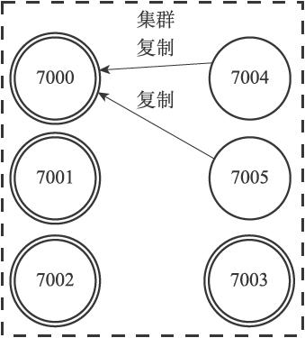

图17-32 设置节点7004和节点7005成为节点7000的从节点

表17-1记录了集群各个节点的当前状态，以及它们正在做的工作。

表17-1 集群各个节点的当前状态

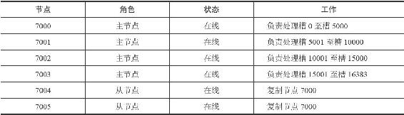

如果这时，节点7000进入下线状态，那么集群中仍在正常运作的几个主节点将在节点7000的两个从节点——节点7004和节点7005中选出一个节点作为新的主节点，这个新的主节点将接管原来节点7000负责处理的槽，并继续处理客户端发送的命令请求。

例如，如果节点7004被选中为新的主节点，那么节点7004将接管原来由节点7000负责处理的槽0至槽5000，节点7005也会从原来的复制节点7000，改为复制节点7004，如图17-33所示（图中用虚线包围的节点为已下线节点）。

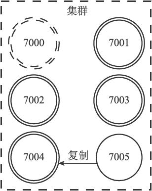

图17-33 节点7004成为新的主节点

表17-2记录了在对节点7000进行故障转移之后，集群各个节点的当前状态，以及它们正在做的工作。

表17-2 集群各个节点的当前状态

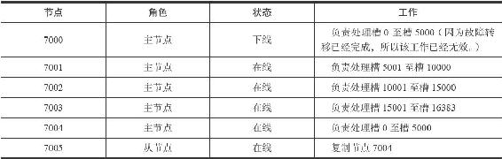

如果在故障转移完成之后，下线的节点7000重新上线，那么它将成为节点7004的从节点，如图17-34所示。

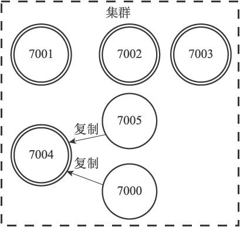

图17-34 重新上线的节点7000成为节点7004的从节点

表17-3展示了节点7000复制节点7004之后，集群中各个节点的状态。

表17-3 集群各个节点的当前状态

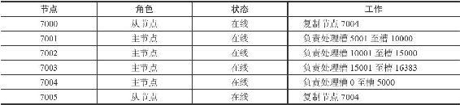

本节接下来的内容将介绍节点的复制方法，检测节点是否下线的方法，以及对下线主节点进行故障转移的方法。

17.6.1 设置从节点

向一个节点发送命令：

---

>  
> CLUSTER REPLICATE <node\_id>  

---

可以让接收命令的节点成为node\_id所指定节点的从节点，并开始对主节点进行复制：

·接收到该命令的节点首先会在自己的clusterState.nodes字典中找到node\_id所对应节点的clusterNode结构，并将自己的clusterState.myself.slaveof指针指向这个结构，以此来记录这个节点正在复制的主节点：

---

>  
> struct clusterNode {  
> // ...  
> //   
> 如果这是一个从节点，那么指向主节点  
> struct clusterNode \*slaveof;  
> // ...  
> };  

---

·然后节点会修改自己在clusterState.myself.flags中的属性，关闭原本的REDIS\_NODE\_MASTER标识，打开REDIS\_NODE\_SLAVE标识，表示这个节点已经由原来的主节点变成了从节点。

·最后，节点会调用复制代码，并根据clusterState.myself.slaveof指向的clusterNode结构所保存的IP地址和端口号，对主节点进行复制。因为节点的复制功能和单机Redis服务器的复制功能使用了相同的代码，所以让从节点复制主节点相当于向从节点发送命令SLAVEOF。

图17-35展示了节点7004在复制节点7000时的clusterState结构：

·clusterState.myself.flags属性的值为REDIS\_NODE\_SLAVE，表示节点7004是一个从节点。

·clusterState.myself.slaveof指针指向代表节点7000的结构，表示节点7004正在复制的主节点为节点7000。

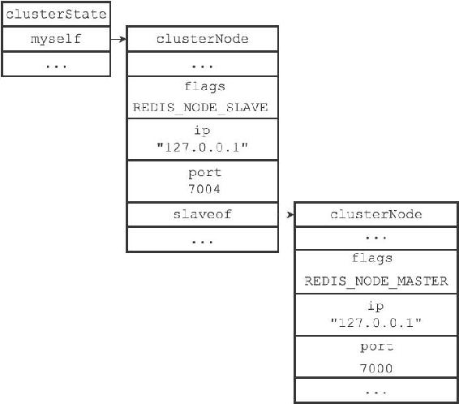

图17-35 节点7004的clusterState结构

一个节点成为从节点，并开始复制某个主节点这一信息会通过消息发送给集群中的其他节点，最终集群中的所有节点都会知道某个从节点正在复制某个主节点。

集群中的所有节点都会在代表主节点的clusterNode结构的slaves属性和numslaves属性中记录正在复制这个主节点的从节点名单：

---

>  
> struct clusterNode {  
> // ...  
> //   
> 正在复制这个主节点的从节点数量  
> int numslaves;  
> //   
> 一个数组  
> //   
> 每个数组项指向一个正在复制这个主节点的从节点的clusterNode  
> 结构  
> struct clusterNode \*\*slaves;  
> // ...  
> };  

---

举个例子，图17-36记录了节点7004和节点7005成为节点7000的从节点之后，集群中的各个节点为节点7000创建的clusterNode结构的样子：

·代表节点7000的clusterNode结构的numslaves属性的值为2，这说明有两个从节点正在复制节点7000。

·代表节点7000的clusterNode结构的slaves数组的两个项分别指向代表节点7004和代表节点7005的clusterNode结构，这说明节点7000的两个从节点分别是节点7004和节点7005。

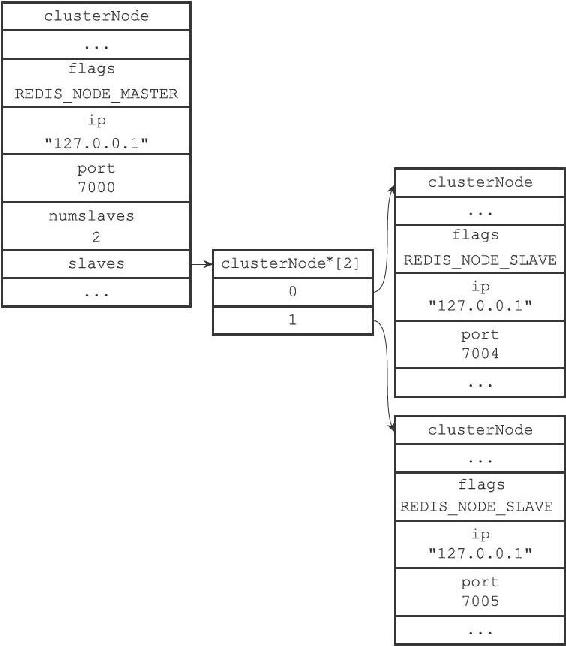

图17-36 集群中的各个节点为节点7000创建的clusterNode结构

17.6.2 故障检测

集群中的每个节点都会定期地向集群中的其他节点发送PING消息，以此来检测对方是否在线，如果接收PING消息的节点没有在规定的时间内，向发送PING消息的节点返回PONG消息，那么发送PING消息的节点就会将接收PING消息的节点标记为疑似下线（probable fail，PFAIL）。

举个例子，如果节点7001向节点7000发送了一条PING消息，但是节点7000没有在规定的时间内，向节点7001返回一条PONG消息，那么节点7001就会在自己的clusterState.nodes字典中找到节点7000所对应的clusterNode结构，并在结构的flags属性中打开REDIS\_NODE\_PFAIL标识，以此表示节点7000进入了疑似下线状态，如图17-37所示。

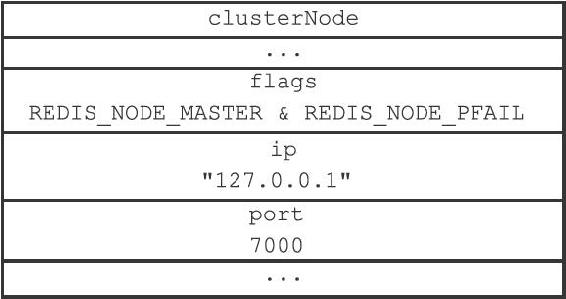

图17-37 代表节点7000的clusterNode结构

集群中的各个节点会通过互相发送消息的方式来交换集群中各个节点的状态信息，例如某个节点是处于在线状态、疑似下线状态（PFAIL），还是已下线状态（FAIL）。

当一个主节点A通过消息得知主节点B认为主节点C进入了疑似下线状态时，主节点A会在自己的clusterState.nodes字典中找到主节点C所对应的clusterNode结构，并将主节点B的下线报告（failure report）添加到clusterNode结构的fail\_reports链表里面：

---

>  
> struct clusterNode {  
> // ...  
> //   
> 一个链表，记录了所有其他节点对该节点的下线报告  
> list \*fail\_reports;  
> // ...  
> };  

---

每个下线报告由一个clusterNodeFailReport结构表示：

---

>  
> struct clusterNodeFailReport {  
> //   
> 报告目标节点已经下线的节点  
> struct clusterNode \*node;  
> //   
> 最后一次从node  
> 节点收到下线报告的时间  
> //   
> 程序使用这个时间戳来检查下线报告是否过期  
> //   
> （与当前时间相差太久的下线报告会被删除）  
> mstime\_t time;  
> } typedef clusterNodeFailReport;  

---

举个例子，如果主节点7001在收到主节点7002、主节点7003发送的消息后得知，主节点7002和主节点7003都认为主节点7000进入了疑似下线状态，那么主节点7001将为主节点7000创建图17-38所示的下线报告。

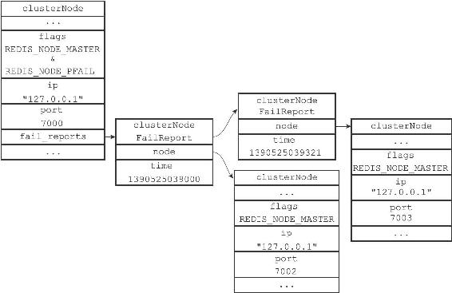

图17-38 节点7000的下线报告

如果在一个集群里面，半数以上负责处理槽的主节点都将某个主节点x报告为疑似下线，那么这个主节点x将被标记为已下线（FAIL），将主节点x标记为已下线的节点会向集群广播一条关于主节点x的FAIL消息，所有收到这条FAIL消息的节点都会立即将主节点x标记为已下线。

举个例子，对于图17-38所示的下线报告来说，主节点7002和主节点7003都认为主节点7000进入了下线状态，并且主节点7001也认为主节点7000进入了疑似下线状态（代表主节点7000的结构打开了REDIS\_NODE\_PFAIL标识），综合起来，在集群四个负责处理槽的主节点里面，有三个都将主节点7000标记为下线，数量已经超过了半数，所以主节点7001会将主节点7000标记为已下线，并向集群广播一条关于主节点7000的FAIL消息，如图17-39所示。

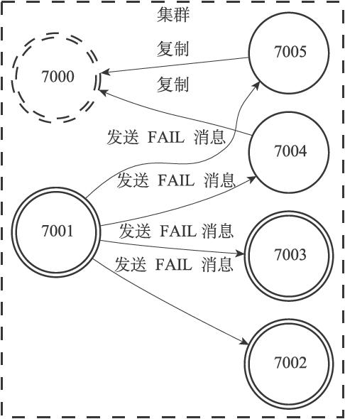

图17-39 节点7001向集群广播FAIL消息

17.6.3 故障转移

当一个从节点发现自己正在复制的主节点进入了已下线状态时，从节点将开始对下线主节点进行故障转移，以下是故障转移的执行步骤：

1）复制下线主节点的所有从节点里面，会有一个从节点被选中。

2）被选中的从节点会执行SLAVEOF no one命令，成为新的主节点。

3）新的主节点会撤销所有对已下线主节点的槽指派，并将这些槽全部指派给自己。

4）新的主节点向集群广播一条PONG消息，这条PONG消息可以让集群中的其他节点立即知道这个节点已经由从节点变成了主节点，并且这个主节点已经接管了原本由已下线节点负责处理的槽。

5）新的主节点开始接收和自己负责处理的槽有关的命令请求，故障转移完成。

17.6.4 选举新的主节点

新的主节点是通过选举产生的。

以下是集群选举新的主节点的方法：

1）集群的配置纪元是一个自增计数器，它的初始值为0。

2）当集群里的某个节点开始一次故障转移操作时，集群配置纪元的值会被增一。

3）对于每个配置纪元，集群里每个负责处理槽的主节点都有一次投票的机会，而第一个向主节点要求投票的从节点将获得主节点的投票。

4）当从节点发现自己正在复制的主节点进入已下线状态时，从节点会向集群广播一条CLUSTERMSG\_TYPE\_FAILOVER\_AUTH\_REQUEST消息，要求所有收到这条消息、并且具有投票权的主节点向这个从节点投票。

5）如果一个主节点具有投票权（它正在负责处理槽），并且这个主节点尚未投票给其他从节点，那么主节点将向要求投票的从节点返回一条CLUSTERMSG\_TYPE\_FAILOVER\_AUTH\_ACK消息，表示这个主节点支持从节点成为新的主节点。

6）每个参与选举的从节点都会接收CLUSTERMSG\_TYPE\_FAILOVER\_AUTH\_ACK消息，并根据自己收到了多少条这种消息来统计自己获得了多少主节点的支持。

7）如果集群里有N个具有投票权的主节点，那么当一个从节点收集到大于等于N/2+1张支持票时，这个从节点就会当选为新的主节点。

8）因为在每一个配置纪元里面，每个具有投票权的主节点只能投一次票，所以如果有N个主节点进行投票，那么具有大于等于N/2+1张支持票的从节点只会有一个，这确保了新的主节点只会有一个。

9）如果在一个配置纪元里面没有从节点能收集到足够多的支持票，那么集群进入一个新的配置纪元，并再次进行选举，直到选出新的主节点为止。

这个选举新主节点的方法和第16章介绍的选举领头Sentinel的方法非常相似，因为两者都是基于Raft算法的领头选举（leader election）方法来实现的。
