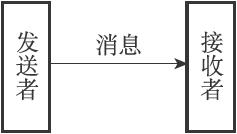
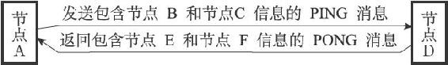
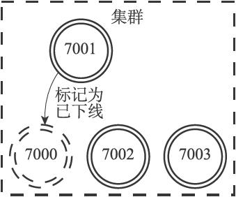
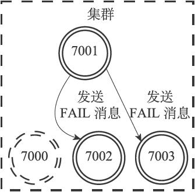
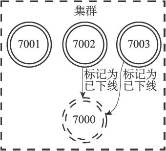
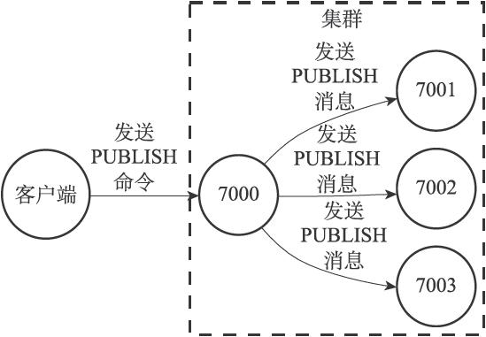
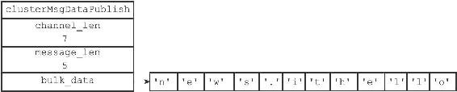

17.7 消息

集群中的各个节点通过发送和接收消息（message）来进行通信，我们称发送消息的节点为发送者（sender），接收消息的节点为接收者（receiver），如图17-40所示。

图17-40 发送者和接收者

节点发送的消息主要有以下五种：

·MEET消息：当发送者接到客户端发送的CLUSTER MEET命令时，发送者会向接收者发送MEET消息，请求接收者加入到发送者当前所处的集群里面。

·PING消息：集群里的每个节点默认每隔一秒钟就会从已知节点列表中随机选出五个节点，然后对这五个节点中最长时间没有发送过PING消息的节点发送PING消息，以此来检测被选中的节点是否在线。除此之外，如果节点A最后一次收到节点B发送的PONG消息的时间，距离当前时间已经超过了节点A的cluster-node-timeout选项设置时长的一半，那么节点A也会向节点B发送PING消息，这可以防止节点A因为长时间没有随机选中节点B作为PING消息的发送对象而导致对节点B的信息更新滞后。

·PONG消息：当接收者收到发送者发来的MEET消息或者PING消息时，为了向发送者确认这条MEET消息或者PING消息已到达，接收者会向发送者返回一条PONG消息。另外，一个节点也可以通过向集群广播自己的PONG消息来让集群中的其他节点立即刷新关于这个节点的认识，例如当一次故障转移操作成功执行之后，新的主节点会向集群广播一条PONG消息，以此来让集群中的其他节点立即知道这个节点已经变成了主节点，并且接管了已下线节点负责的槽。

·FAIL消息：当一个主节点A判断另一个主节点B已经进入FAIL状态时，节点A会向集群广播一条关于节点B的FAIL消息，所有收到这条消息的节点都会立即将节点B标记为已下线。

·PUBLISH消息：当节点接收到一个PUBLISH命令时，节点会执行这个命令，并向集群广播一条PUBLISH消息，所有接收到这条PUBLISH消息的节点都会执行相同的PUBLISH命令。

一条消息由消息头（header）和消息正文（data）组成，接下来的内容将首先介绍消息头，然后再分别介绍上面提到的五种不同类型的消息正文。

17.7.1 消息头

节点发送的所有消息都由一个消息头包裹，消息头除了包含消息正文之外，还记录了消息发送者自身的一些信息，因为这些信息也会被消息接收者用到，所以严格来讲，我们可以认为消息头本身也是消息的一部分。

每个消息头都由一个cluster.h/clusterMsg结构表示：

---

>  
> typedef struct {  
> //   
> 消息的长度（包括这个消息头的长度和消息正文的长度）  
> uint32\_t totlen;  
> //   
> 消息的类型  
> uint16\_t type;  
> //   
> 消息正文包含的节点信息数量  
> //   
> 只在发送MEET  
> 、PING  
> 、PONG  
> 这三种Gossip  
> 协议消息时使用  
> uint16\_t count;  
> //   
> 发送者所处的配置纪元  
> uint64\_t currentEpoch;  
> //   
> 如果发送者是一个主节点，那么这里记录的是发送者的配置纪元  
> //   
> 如果发送者是一个从节点，那么这里记录的是发送者正在复制的主节点的配置纪元  
> uint64\_t configEpoch;  
> //   
> 发送者的名字（ID  
> ）   
> char sender\[REDIS\_CLUSTER\_NAMELEN\];  
> //   
> 发送者目前的槽指派信息  
> unsigned char myslots\[REDIS\_CLUSTER\_SLOTS/8\];  
> //   
> 如果发送者是一个从节点，那么这里记录的是发送者正在复制的主节点的名字  
> //   
> 如果发送者是一个主节点，那么这里记录的是REDIS\_NODE\_NULL\_NAME  
> //   
> （一个40  
> 字节长，值全为0  
> 的字节数组）  
> char slaveof\[REDIS\_CLUSTER\_NAMELEN\];  
> //   
> 发送者的端口号  
> uint16\_t port;  
> //   
> 发送者的标识值  
> uint16\_t flags;  
> //   
> 发送者所处集群的状态  
> unsigned char state;  
> //   
> 消息的正文（或者说，内容）  
> union clusterMsgData data;  
> } clusterMsg;  

---

clusterMsg.data属性指向联合cluster.h/clusterMsgData，这个联合就是消息的正文：

---

>  
> union clusterMsgData {  
> // MEET  
> 、PING  
> 、PONG  
> 消息的正文  
> struct {  
> //   
> 每条MEET  
> 、PING  
> 、PONG  
> 消息都包含两个  
> // clusterMsgDataGossip  
> 结构  
> clusterMsgDataGossip gossip\[1\];  
> } ping;  
> // FAIL  
> 消息的正文  
> struct {  
> clusterMsgDataFail about;  
> } fail;  
> // PUBLISH  
> 消息的正文  
> struct {  
> clusterMsgDataPublish msg;  
> } publish;  
> //   
> 其他消息的正文...   
> };  

---

clusterMsg结构的currentEpoch、sender、myslots等属性记录了发送者自身的节点信息，接收者会根据这些信息，在自己的clusterState.nodes字典里找到发送者对应的clusterNode结构，并对结构进行更新。

举个例子，通过对比接收者为发送者记录的槽指派信息，以及发送者在消息头的myslots属性记录的槽指派信息，接收者可以知道发送者的槽指派信息是否发生了变化。

又或者说，通过对比接收者为发送者记录的标识值，以及发送者在消息头的flags属性记录的标识值，接收者可以知道发送者的状态和角色是否发生了变化，例如节点状态由原来的在线变成了下线，或者由主节点变成了从节点等等。

17.7.2 MEET、PING、PONG消息的实现

Redis集群中的各个节点通过Gossip协议来交换各自关于不同节点的状态信息，其中Gossip协议由MEET、PING、PONG三种消息实现，这三种消息的正文都由两个cluster.h/clusterMsgDataGossip结构组成：

---

>  
> union clusterMsgData {  
> // ...  
> // MEET  
> 、PING  
> 和PONG  
> 消息的正文  
> struct {  
> //   
> 每条MEET  
> 、PING  
> 、PONG  
> 消息都包含两个  
> // clusterMsgDataGossip  
> 结构  
> clusterMsgDataGossip gossip\[1\];  
> } ping;  
> //   
> 其他消息的正文...   
> };  

---

因为MEET、PING、PONG三种消息都使用相同的消息正文，所以节点通过消息头的type属性来判断一条消息是MEET消息、PING消息还是PONG消息。

每次发送MEET、PING、PONG消息时，发送者都从自己的已知节点列表中随机选出两个节点（可以是主节点或者从节点），并将这两个被选中节点的信息分别保存到两个clusterMsgDataGossip结构里面。

clusterMsgDataGossip结构记录了被选中节点的名字，发送者与被选中节点最后一次发送和接收PING消息和PONG消息的时间戳，被选中节点的IP地址和端口号，以及被选中节点的标识值：

---

>  
> typedef struct {  
> //   
> 节点的名字  
> char nodename\[REDIS\_CLUSTER\_NAMELEN\];  
> //   
> 最后一次向该节点发送PING  
> 消息的时间戳  
> uint32\_t ping\_sent;  
> //   
> 最后一次从该节点接收到PONG  
> 消息的时间戳  
> uint32\_t pong\_received;  
> //   
> 节点的IP  
> 地址  
> char ip\[16\];  
> //   
> 节点的端口号  
> uint16\_t port;  
> //   
> 节点的标识值  
> uint16\_t flags;  
> } clusterMsgDataGossip;  

---

当接收者收到MEET、PING、PONG消息时，接收者会访问消息正文中的两个clusterMsgDataGossip结构，并根据自己是否认识clusterMsgDataGossip结构中记录的被选中节点来选择进行哪种操作：

·如果被选中节点不存在于接收者的已知节点列表，那么说明接收者是第一次接触到被选中节点，接收者将根据结构中记录的IP地址和端口号等信息，与被选中节点进行握手。

·如果被选中节点已经存在于接收者的已知节点列表，那么说明接收者之前已经与被选中节点进行过接触，接收者将根据clusterMsgDataGossip结构记录的信息，对被选中节点所对应的clusterNode结构进行更新。

举个发送PING消息和返回PONG消息的例子，假设在一个包含A、B、C、D、E、F六个节点的集群里：

·节点A向节点D发送PING消息，并且消息里面包含了节点B和节点C的信息，当节点D收到这条PING消息时，它将更新自己对节点B和节点C的认识。

·之后，节点D将向节点A返回一条PONG消息，并且消息里面包含了节点E和节点F的消息，当节点A收到这条PONG消息时，它将更新自己对节点E和节点F的认识。

整个通信过程如图17-41所示。

图17-41 一个PING-PONG消息通信示例

17.7.3 FAIL消息的实现

当集群里的主节点A将主节点B标记为已下线（FAIL）时，主节点A将向集群广播一条关于主节点B的FAIL消息，所有接收到这条FAIL消息的节点都会将主节点B标记为已下线。

在集群的节点数量比较大的情况下，单纯使用Gossip协议来传播节点的已下线信息会给节点的信息更新带来一定延迟，因为Gossip协议消息通常需要一段时间才能传播至整个集群，而发送FAIL消息可以让集群里的所有节点立即知道某个主节点已下线，从而尽快判断是否需要将集群标记为下线，又或者对下线主节点进行故障转移。

FAIL消息的正文由cluster.h/clusterMsgDataFail结构表示，这个结构只包含一个nodename属性，该属性记录了已下线节点的名字：

---

>  
> typedef struct {  
> char nodename\[REDIS\_CLUSTER\_NAMELEN\];  
> } clusterMsgDataFail;  

---

因为集群里的所有节点都有一个独一无二的名字，所以FAIL消息里面只需要保存下线节点的名字，接收到消息的节点就可以根据这个名字来判断是哪个节点下线了。

举个例子，对于包含7000、7001、7002、7003四个主节点的集群来说：

·如果主节点7001发现主节点7000已下线，那么主节点7001将向主节点7002和主节点7003发送FAIL消息，其中FAIL消息中包含的节点名字为主节点7000的名字，以此来表示主节点7000已下线。

·当主节点7002和主节点7003都接收到主节点7001发送的FAIL消息时，它们也会将主节点7000标记为已下线。

·因为这时集群已经有超过一半的主节点认为主节点7000已下线，所以集群剩下的几个主节点可以判断是否需要将集群标记为下线，又或者开始对主节点7000进行故障转移。

图17-42至图17-44展示了节点发送和接收FAIL消息的整个过程。

图17-42 节点7001将节点7000标记为已下线

图17-43 节点7001向集群广播FAIL消息

图17-44 节点7002和节点7003也将节点7000标记为已下线

17.7.4 PUBLISH消息的实现

当客户端向集群中的某个节点发送命令：

---

>  
> PUBLISH <channel> <message>  

---

的时候，接收到PUBLISH命令的节点不仅会向channel频道发送消息message，它还会向集群广播一条PUBLISH消息，所有接收到这条PUBLISH消息的节点都会向channel频道发送message消息。

换句话说，向集群中的某个节点发送命令：

---

>  
> PUBLISH <channel> <message>  

---

将导致集群中的所有节点都向channel频道发送message消息。

举个例子，对于包含7000、7001、7002、7003四个节点的集群来说，如果节点7000收到了客户端发送的PUBLISH命令，那么节点7000将向7001、7002、7003三个节点发送PUBLISH消息，如图17-45所示。

图17-45 接收到PUBLISH命令的节点7000向集群广播PUBLISH消息

PUBLISH消息的正文由cluster.h/clusterMsgDataPublish结构表示：

---

>  
> typedef struct {  
> uint32\_t channel\_len;  
> uint32\_t message\_len;  
> //   
> 定义为8   
> 字节只是为了对齐其他消息结构  
> //   
> 实际的长度由保存的内容决定  
> unsigned char bulk\_data\[8\];  
> } clusterMsgDataPublish;  

---

clusterMsgDataPublish结构的bulk\_data属性是一个字节数组，这个字节数组保存了客户端通过PUBLISH命令发送给节点的channel参数和message参数，而结构的channel\_len和message\_len则分别保存了channel参数的长度和message参数的长度：

·其中bulk\_data的0字节至channel\_len-1字节保存的是channel参数。

·而bulk\_data的channel\_len字节至channel\_len+message\_len-1字节保存的则是message参数。

举个例子，如果节点收到的PUBLISH命令为：

---

>  
> PUBLISH "news.it" "hello"  

---

那么节点发送的PUBLISH消息的clusterMsgDataPublish结构将如图17-46所示：其中bulk\_data数组的前七个字节保存了channel参数的值"news.it"，而bulk\_data数组的后五个字节则保存了message参数的值"hello"。

图17-46 clusterMsgDataPublish结构示例

> 为什么不直接向节点广播PUBLISH命令

> 实际上，要让集群的所有节点都执行相同的PUBLISH命令，最简单的方法就是向所有节点广播相同的PUBLISH命令，这也是Redis在复制PUBLISH命令时所使用的方法，不过因为这种做法并不符合Redis集群的“各个节点通过发送和接收消息来进行通信”这一规则，所以节点没有采取广播PUBLISH命令的做法。
