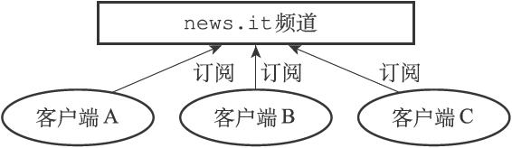
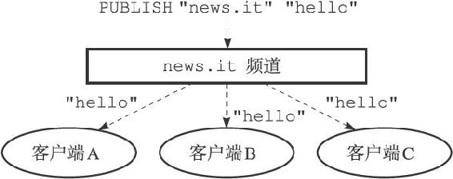
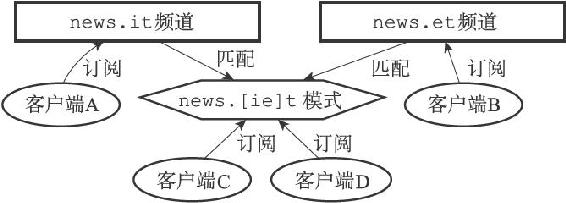
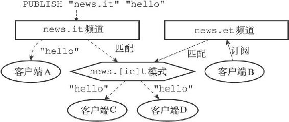
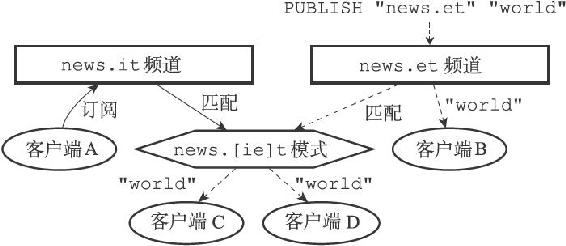

第18章 发布与订阅

Redis的发布与订阅功能由PUBLISH、SUBSCRIBE、PSUBSCRIBE等命令组成。

通过执行SUBSCRIBE命令，客户端可以订阅一个或多个频道，从而成为这些频道的订阅者（subscriber）：每当有其他客户端向被订阅的频道发送消息（message）时，频道的所有订阅者都会收到这条消息。

举个例子，假设A、B、C三个客户端都执行了命令：

---

>  
> SUBSCRIBE "news.it"  

---

那么这三个客户端就是"news.it"频道的订阅者，如图18-1所示。

图18-1 news.it频道和它的三个订阅者

如果这时某个客户端执行命令

---

>  
> PUBLISH "news.it" "hello"  

---

向"news.it"频道发送消息"hello"，那么"news.it"的三个订阅者都将收到这条消息，如图18-2所示。

图18-2 向news.it频道发送消息

除了订阅频道之外，客户端还可以通过执行PSUBSCRIBE命令订阅一个或多个模式，从而成为这些模式的订阅者：每当有其他客户端向某个频道发送消息时，消息不仅会被发送给这个频道的所有订阅者，它还会被发送给所有与这个频道相匹配的模式的订阅者。

图18-3 频道和模式的订阅状态

举个例子，假设如图18-3所示：

·客户端A正在订阅频道"news.it"。

·客户端B正在订阅频道"news.et"。

·客户端C和客户端D正在订阅与"news.it"频道和"news.et"频道相匹配的模式"news.\[ie\]t"。

如果这时某个客户端执行命令

---

>  
> PUBLISH "news.it" "hello"  

---

向"news.it"频道发送消息"hello"，那么不仅正在订阅"news.it"频道的客户端A会收到消息，客户端C和客户端D也同样会收到消息，因为这两个客户端正在订阅匹配"news.it"频道的"news.\[ie\]t"模式，如图18-4所示。

图18-4 将消息发送给频道的订阅者和匹配模式的订阅者（1）

与此类似，如果某个客户端执行命令

---

>  
> PUBLISH "news.et" "world"  

---

向"news.et"频道发送消息"world"，那么不仅正在订阅"news.et"频道的客户端B会收到消息，客户端C和客户端D也同样会收到消息，因为这两个客户端正在订阅匹配"news.et"频道的"news.\[ie\]t"模式，如图18-5所示。

图18-5 将消息发送给频道的订阅者和匹配模式的订阅者（2）

本章接下来的内容将首先介绍订阅频道的SUBSCRIBE命令和退订频道的UNSUBSCRIBE命令的实现原理，然后介绍订阅模式的PSUBSCRIBE命令和退订模式的PUNSUBSCRIBE命令的实现原理。

在介绍完以上四个命令的实现原理之后，本章会对PUBLISH命令的实现原理进行介绍，说明消息是如何发送给频道的订阅者以及模式的订阅者的。

最后，本章将对Redis 2.8新引入的PUBSUB命令的三个子命令进行介绍，并说明这三个子命令的实现原理。
