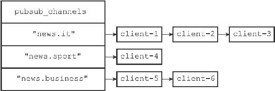
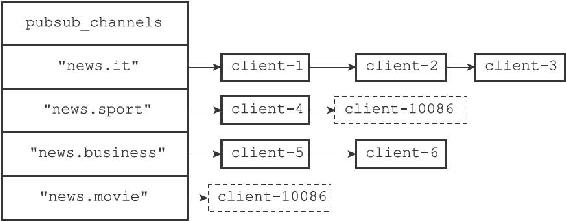
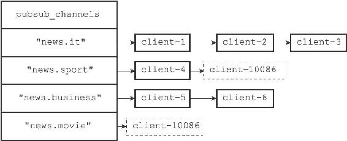
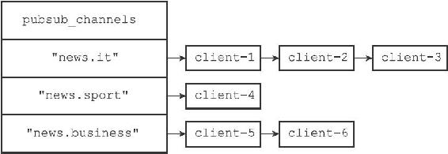

18.1 频道的订阅与退订

当一个客户端执行SUBSCRIBE命令订阅某个或某些频道的时候，这个客户端与被订阅频道之间就建立起了一种订阅关系。

Redis将所有频道的订阅关系都保存在服务器状态的pubsub\_channels字典里面，这个字典的键是某个被订阅的频道，而键的值则是一个链表，链表里面记录了所有订阅这个频道的客户端：

---

>  
> struct redisServer {  
> // ...  
> //   
> 保存所有频道的订阅关系  
> dict \*pubsub\_channels;  
> // ...  
> };  

---

比如说，图18-6就展示了一个pubsub\_channels字典示例，这个字典记录了以下信息：

·client-1、client-2、client-3三个客户端正在订阅"news.it"频道。

·客户端client-4正在订阅"news.sport"频道。

·client-5和client-6两个客户端正在订阅"news.business"频道。

图18-6 一个pubsub\_channels字典示例

18.1.1 订阅频道

每当客户端执行SUBSCRIBE命令订阅某个或某些频道的时候，服务器都会将客户端与被订阅的频道在pubsub\_channels字典中进行关联。

根据频道是否已经有其他订阅者，关联操作分为两种情况执行：

·如果频道已经有其他订阅者，那么它在pubsub\_channels字典中必然有相应的订阅者链表，程序唯一要做的就是将客户端添加到订阅者链表的末尾。

·如果频道还未有任何订阅者，那么它必然不存在于pubsub\_channels字典，程序首先要在pubsub\_channels字典中为频道创建一个键，并将这个键的值设置为空链表，然后再将客户端添加到链表，成为链表的第一个元素。

举个例子，假设服务器pubsub\_channels字典的当前状态如图18-6所示，那么当客户端client-10086执行命令

---

>  
> SUBSCRIBE "news.sport" "news.movie"  

---

之后，pubsub\_channels字典将更新至图18-7所示的状态，其中用虚线包围的是新添加的节点：

·更新后的pubsub\_channels字典新增了"news.movie"键，该键对应的链表值只包含一个client-10086节点，表示目前只有client-10086一个客户端在订阅"news.movie"频道。

·至于原本就已经有客户端在订阅的"news.sport"频道，client-10086的节点放在了频道对应链表的末尾，排在client-4节点的后面。

图18-7 执行SUBSCRIBE之后的pubsub\_channels字典

SUBSCRIBE命令的实现可以用以下伪代码来描述：

---

>  
> def subscribe(\*all\_input\_channels):  
> \#   
> 遍历输入的所有频道  
> for channel in all\_input\_channels:  
> \#   
> 如果channel  
> 不存在于pubsub\_channels  
> 字典（没有任何订阅者）  
> \#   
> 那么在字典中添加channel  
> 键，并设置它的值为空链表  
> if channel not in server.pubsub\_channels:  
> server.pubsub\_channels\[channel\] = \[\]  
> \#   
> 将订阅者添加到频道所对应的链表的末尾  
> server.pubsub\_channels\[channel\].append(client)  

---

18.1.2 退订频道

UNSUBSCRIBE命令的行为和SUBSCRIBE命令的行为正好相反，当一个客户端退订某个或某些频道的时候，服务器将从pubsub\_channels中解除客户端与被退订频道之间的关联：

·程序会根据被退订频道的名字，在pubsub\_channels字典中找到频道对应的订阅者链表，然后从订阅者链表中删除退订客户端的信息。

·如果删除退订客户端之后，频道的订阅者链表变成了空链表，那么说明这个频道已经没有任何订阅者了，程序将从pubsub\_channels字典中删除频道对应的键。

举个例子，假设pubsub\_channels的当前状态如图18-8所示，那么当客户端client-10086执行命令

---

>  
> UNSUBSCRIBE "news.sport" "news.movie"  

---

之后，图中用虚线包围的两个节点将被删除（如图18-9所示）：

·在pubsub\_channels字典更新之后，client-10086的信息已经从"news.sport"频道和"news.movie"频道的订阅者链表中被删除了。

·另外，因为删除client-10086之后，频道"news.movie"已经没有任何订阅者，因此键"news.movie"也从字典中被删除了。

图18-8 执行UNSUBSCRIBE之前的pubsub\_channels字典

图18-9 执行UNSUBSCRIBE之后的pubsub\_channels字典

UNSUBSCRIBE命令的实现可以用以下伪代码来描述：

---

>  
> def unsubscribe(\*all\_input\_channels):  
> \#   
> 遍历要退订的所有频道  
> for channel in all\_input\_channels:  
> \#   
> 在订阅者链表中删除退订的客户端  
> server.pubsub\_channels\[channel\].remove(client)  
> \#   
> 如果频道已经没有任何订阅者了（订阅者链表为空）  
> \#   
> 那么将频道从字典中删除  
> if len(server.pubsub\_channels\[channel\]) == 0:  
> server.pubsub\_channels.remove(channel)  

---
