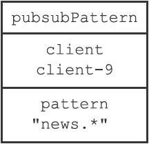
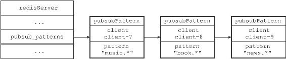
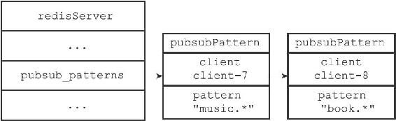
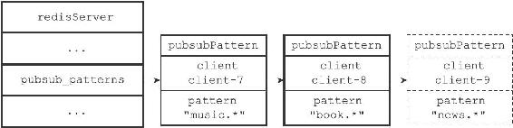
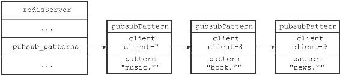
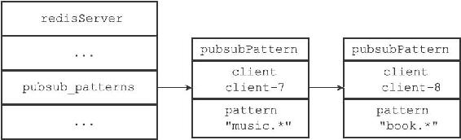

18.2 模式的订阅与退订

前面说过，服务器将所有频道的订阅关系都保存在服务器状态的pubsub\_channels属性里面，与此类似，服务器也将所有模式的订阅关系都保存在服务器状态的pubsub\_patterns属性里面：

---

>  
> struct redisServer {  
> // ...  
> //   
> 保存所有模式订阅关系  
> list \*pubsub\_patterns;  
> // ...  
> };  

---

pubsub\_patterns属性是一个链表，链表中的每个节点都包含着一个pubsub Pattern结构，这个结构的pattern属性记录了被订阅的模式，而client属性则记录了订阅模式的客户端：

---

>  
> typedef struct pubsubPattern {  
> //   
> 订阅模式的客户端  
> redisClient \*client;  
> //   
> 被订阅的模式  
> robj \*pattern;  
> } pubsubPattern;  

---

图18-10是一个pubsubPattern结构示例，它显示客户端client-9正在订阅模式"news.\*"。

图18-10 pubsubPattern结构示例

图18-11展示了一个pubsub\_patterns链表示例，这个链表记录了以下信息：

·客户端client-7正在订阅模式"music.\*"。

·客户端client-8正在订阅模式"book.\*"。

·客户端client-9正在订阅模式"news.\*"。

图18-11 pubsub\_patterns链表示例

18.2.1 订阅模式

每当客户端执行PSUBSCRIBE命令订阅某个或某些模式的时候，服务器会对每个被订阅的模式执行以下两个操作：

1）新建一个pubsubPattern结构，将结构的pattern属性设置为被订阅的模式，client属性设置为订阅模式的客户端。

2）将pubsubPattern结构添加到pubsub\_patterns链表的表尾。举个例子，假设服务器中pubsub\_patterns链表的当前状态如图18-12所示。

图18-12 执行PSUBSCRIBE命令之前的pubsub\_patterns链表

那么当客户端client-9执行命令

---

>  
> PSUBSCRIBE "news.\*"  

---

之后，pubsub\_patterns链表将更至新图18-13所示的状态，其中用虚线包围的是新添加的pubsubPattern结构。

图18-13 执行PSUBSCRIBE命令之后的pubsub\_patterns链表

PSUBSCRIBE命令的实现原理可以用以下伪代码来描述：

---

>  
> def psubscribe(\*all\_input\_patterns):  
> \#   
> 遍历输入的所有模式  
> for pattern in all\_input\_patterns:  
> \#   
> 创建新的pubsubPattern  
> 结构  
> \#   
> 记录被订阅的模式，以及订阅模式的客户端  
> pubsubPattern = create\_new\_pubsubPattern()  
> pubsubPattern.client = client  
> pubsubPattern.pattern = pattern  
> \#   
> 将新的pubsubPattern  
> 追加到pubsub\_patterns  
> 链表末尾  
> server.pubsub\_patterns.append(pubsubPattern)  

---

18.2.2 退订模式

模式的退订命令PUNSUBSCRIBE是PSUBSCRIBE命令的反操作：当一个客户端退订某个或某些模式的时候，服务器将在pubsub\_patterns链表中查找并删除那些pattern属性为被退订模式，并且client属性为执行退订命令的客户端的pubsubPattern结构。

举个例子，假设服务器pubsub\_patterns链表的当前状态如图18-14所示。

图18-14 执行PUNSUBSCRIBE命令之前的pubsub\_patterns链表

那么当客户端client-9执行命令

---

>  
> PUNSUBSCRIBE "news.\*"  

---

之后，client属性为client-9，pattern属性为"news.\*"的pubsubPattern结构将被删除，pubsub\_patterns链表将更新至图18-15所示的样子。

图18-15 执行PUNSUBSCRIBE命令之后的pubsub\_patterns链表

PUNSUBSCRIBE命令的实现原理可以用以下伪代码来描述：

---

>  
> def punsubscribe(\*all\_input\_patterns):  
> \#   
> 遍历所有要退订的模式  
> for pattern in all\_input\_patterns:  
> \#   
> 遍历pubsub\_patterns  
> 链表中的所有pubsubPattern  
> 结构  
> for pubsubPattern in server.pubsub\_patterns:  
> \#   
> 如果当前客户端和pubsubPattern  
> 记录的客户端相同  
> \#   
> 并且要退订的模式也和pubsubPattern  
> 记录的模式相同  
> if client == pubsubPattern.client and \\  
> pattern == pubsubPattern.pattern:  
> \#   
> 那么将这个pubsubPattern  
> 从链表中删除  
> server.pubsub\_patterns.remove(pubsubPattern)  

---
