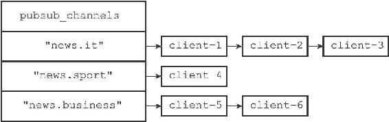
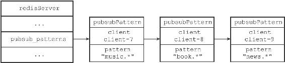

18.3 发送消息

当一个Redis客户端执行PUBLISH<channel><message>命令将消息message发送给频道channel的时候，服务器需要执行以下两个动作：

1）将消息message发送给channel频道的所有订阅者。

2）如果有一个或多个模式pattern与频道channel相匹配，那么将消息message发送给pattern模式的订阅者。

接下来的两个小节将分别介绍这两个动作的实现方式。

18.3.1 将消息发送给频道订阅者

因为服务器状态中的pubsub\_channels字典记录了所有频道的订阅关系，所以为了将消息发送给channel频道的所有订阅者，PUBLISH命令要做的就是在pubsub\_channels字典里找到频道channel的订阅者名单（一个链表），然后将消息发送给名单上的所有客户端。举个例子，假设服务器pubsub\_channels字典当前的状态如图18-16所示。

图18-16 pubsub\_channels字典

如果这时某个客户端执行命令

---

>  
> PUBLISH "news.it" "hello"  

---

那么PUBLISH命令将在pubsub\_channels字典中查找键"news.it"对应的链表值，并通过遍历链表将消息"hello"发送给"news.it"频道的三个订阅者：client-1、client-2和client-3。

PUBLISH命令将消息发送给频道订阅者的方法可以用以下伪代码来描述：

---

>  
> def channel\_publish(channel, message):  
> \#   
> 如果channel  
> 键不存在于pubsub\_channels  
> 字典中  
> \#   
> 那么说明channel  
> 频道没有任何订阅者  
> \#   
> 程序不做发送动作，直接返回  
> if channel not in server.pubsub\_channels:  
> return  
> \#   
> 运行到这里，说明channel  
> 频道至少有一个订阅者  
> \#   
> 程序遍历channel  
> 频道的订阅者链表  
> \#   
> 将消息发送给所有订阅者  
> for subscriber in server.pubsub\_channels\[channel\]:  
> send\_message(subscriber, message)  

---

18.3.2 将消息发送给模式订阅者

因为服务器状态中的pubsub\_patterns链表记录了所有模式的订阅关系，所以为了将消息发送给所有与channel频道相匹配的模式的订阅者，PUBLISH命令要做的就是遍历整个pubsub\_patterns链表，查找那些与channel频道相匹配的模式，并将消息发送给订阅了这些模式的客户端。

举个例子，假设pubsub\_patterns链表的当前状态如图18-17所示。

图18-17 pubsub\_patterns链表

如果这时某个客户端执行命令

---

>  
> PUBLISH "news.it" "hello"  

---

那么PUBLISH命令会首先将消息"hello"发送给"news.it"频道的所有订阅者，然后开始在pubsub\_patterns链表中查找是否有被订阅的模式与"news.it"频道相匹配，结果发现"news.it"频道和客户端client-9订阅的"news.\*"频道匹配，于是命令将消息"hello"发送给客户端client-9。

PUBLISH命令将消息发送给模式订阅者的方法可以用以下伪代码来描述：

---

>  
> def pattern\_publish(channel, message):  
> \#   
> 遍历所有模式订阅消息  
> for pubsubPattern in server.pubsub\_patterns:  
> \#   
> 如果频道和模式相匹配  
> if match(channel, pubsubPattern.pattern):  
> \#   
> 那么将消息发送给订阅该模式的客户端  
> send\_message(pubsubPattern.client, message)  

---

最后，PUBLISH命令的实现可以用以下伪代码来描述：

---

>  
> def publish(channel, message):  
> \#   
> 将消息发送给channel  
> 频道的所有订阅者  
> channel\_publish(channel, message)  
> \#   
> 将消息发送给所有和channel  
> 频道相匹配的模式的订阅者  
> pattern\_publish(channel, message)  

---
