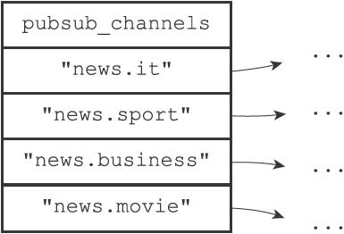
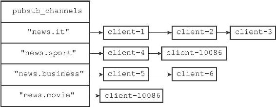
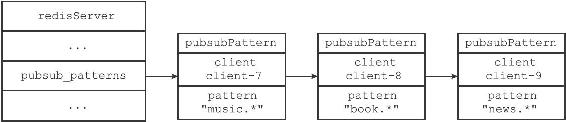
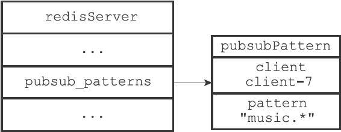

18.4 查看订阅信息

PUBSUB命令是Redis 2.8新增加的命令之一，客户端可以通过这个命令来查看频道或者模式的相关信息，比如某个频道目前有多少订阅者，又或者某个模式目前有多少订阅者，诸如此类。

以下三个小节将分别介绍PUBSUB命令的三个子命令，以及这些子命令的实现原理。

18.4.1 PUBSUB CHANNELS

PUBSUB CHANNELS\[pattern\]子命令用于返回服务器当前被订阅的频道，其中pattern参数是可选的：

·如果不给定pattern参数，那么命令返回服务器当前被订阅的所有频道。

·如果给定pattern参数，那么命令返回服务器当前被订阅的频道中那些与pattern模式相匹配的频道。

这个子命令是通过遍历服务器pubsub\_channels字典的所有键（每个键都是一个被订阅的频道），然后记录并返回所有符合条件的频道来实现的，这个过程可以用以下伪代码来描述：

---

>  
> def pubsub\_channels(pattern=None):  
> \#   
> 一个列表，用于记录所有符合条件的频道  
> channel\_list = \[\]  
> \#   
> 遍历服务器中的所有频道  
> \#   
> （也即是pubsub\_channels  
> 字典的所有键）  
> for channel in server.pubsub\_channels:  
> \#   
> 当以下两个条件的任意一个满足时，将频道添加到链表里面：  
> #1   
> ）用户没有指定pattern  
> 参数  
> #2   
> ）用户指定了pattern  
> 参数，并且channel  
> 和pattern  
> 匹配  
> if (pattern is None) or match(channel, pattern):  
> channel\_list.append(channel)  
> \#   
> 向客户端返回频道列表  
> return channel\_list  

---

举个例子，对于图18-18所示的pubsub\_channels字典来说，执行PUBSUB CHANNELS命令将返回服务器目前被订阅的四个频道：

图18-18 pubsub\_channels字典示例

---

>  
> redis> PUBSUB CHANNELS  
> 1) "news.it"  
> 2) "news.sport"  
> 3) "news.business"  
> 4) "news.movie"  

---

另一方面，执行PUBSUB CHANNELS"news.\[is\]\*"命令将返回"news.it"和"news.sport"两个频道，因为只有这两个频道和"news.\[is\]\*"模式相匹配：

---

>  
> redis> PUBSUB CHANNELS "news.\[is\]\*"  
> 1) "news.it"  
> 2) "news.sport"  

---

18.4.2 PUBSUB NUMSUB

PUBSUB NUMSUB\[channel-1 channel-2...channel-n\]子命令接受任意多个频道作为输入参数，并返回这些频道的订阅者数量。

这个子命令是通过在pubsub\_channels字典中找到频道对应的订阅者链表，然后返回订阅者链表的长度来实现的（订阅者链表的长度就是频道订阅者的数量），这个过程可以用以下伪代码来描述：

---

>  
> def pubsub\_numsub(\*all\_input\_channels):  
> \#   
> 遍历输入的所有频道  
> for channel in all\_input\_channels:  
> \#   
> 如果pubsub\_channels  
> 字典中没有channel  
> 这个键  
> \#   
> 那么说明channel  
> 频道没有任何订阅者  
> if channel not in server.pubsub\_channels:  
> \#   
> 返回频道名  
> reply\_channel\_name(channel)  
> \#   
> 订阅者数量为0   
> reply\_subscribe\_count(0)  
> \#   
> 如果pubsub\_channels  
> 字典中存在channel  
> 键  
> \#   
> 那么说明channel  
> 频道至少有一个订阅者  
> else:  
> \#   
> 返回频道名  
> reply\_channel\_name(channel)  
> \#   
> 订阅者链表的长度就是订阅者数量  
> reply\_subscribe\_count(len(server.pubsub\_channels\[channel\]))  

---

图18-19 pubsub\_channels字典

举个例子，对于图18-19所示的pubsub\_channels字典来说，对字典中的四个频道执行PUBSUB NUMSUB命令将获得以下回复：

---

>  
> redis> PUBSUB NUMSUB news.it news.sport news.business news.movie  
> 1) "news.it"  
> 2) "3"  
> 3) "news.sport"  
> 4) "2"  
> 5) "news.business"  
> 6) "2"  
> 7) "news.movie"  
> 8) "1"  

---

18.4.3 PUBSUB NUMPAT

PUBSUB NUMPAT子命令用于返回服务器当前被订阅模式的数量。

这个子命令是通过返回pubsub\_patterns链表的长度来实现的，因为这个链表的长度就是服务器被订阅模式的数量，这个过程可以用以下伪代码来描述：

---

>  
> def pubsub\_numpat():  
> \# pubsub\_patterns  
> 链表的长度就是被订阅模式的数量  
> reply\_pattern\_count(len(server.pubsub\_patterns))  

---

图18-20 pubsub\_patterns链表

举个例子，对于图18-20所示的pubsub\_patterns链表来说，执行PUBSUB NUMPAT命令将返回3：

---

>  
> redis> PUBSUB NUMPAT  
> (integer) 3  

---

图18-21 pubsub\_patterns链表

而对于图18-21所示的pubsub\_patterns链表来说，执行PUBSUB NUMPAT命令将返回1：

---

>  
> redis> PUBSUB NUMPAT  
> (integer) 1  

---
