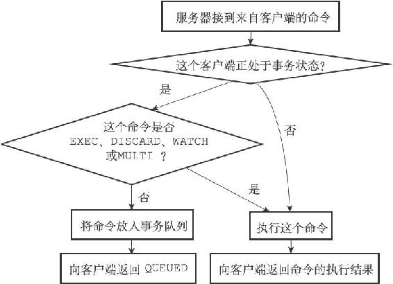
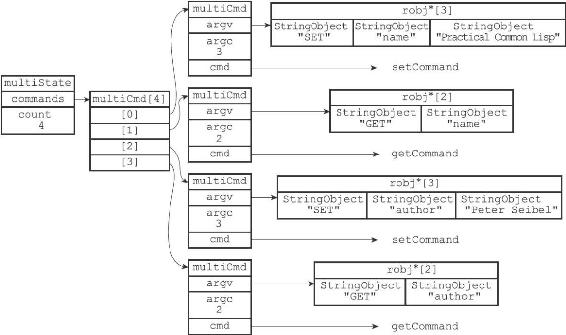

19.1 事务的实现

一个事务从开始到结束通常会经历以下三个阶段：

1）事务开始。

2）命令入队。

3）事务执行。

本节接下来的内容将对这三个阶段进行介绍，说明一个事务从开始到结束的整个过程。

19.1.1 事务开始

MULTI命令的执行标志着事务的开始：

---

>  
> redis> MULTI  
> OK  

---

MULTI命令可以将执行该命令的客户端从非事务状态切换至事务状态，这一切换是通过在客户端状态的flags属性中打开REDIS\_MULTI标识来完成的，MULTI命令的实现可以用以下伪代码来表示：

---

>  
> def MULTI():  
> \#   
> 打开事务标识  
> client.flags |= REDIS\_MULTI  
> \#   
> 返回OK  
> 回复  
> replyOK()  

---

19.1.2 命令入队

当一个客户端处于非事务状态时，这个客户端发送的命令会立即被服务器执行：

---

>  
> redis> SET "name" "Practical Common Lisp"  
> OK  
> redis> GET "name"  
> "Practical Common Lisp"  
> redis> SET "author" "Peter Seibel"  
> OK  
> redis> GET "author"  
> "Peter Seibel"  

---

与此不同的是，当一个客户端切换到事务状态之后，服务器会根据这个客户端发来的不同命令执行不同的操作：

·如果客户端发送的命令为EXEC、DISCARD、WATCH、MULTI四个命令的其中一个，那么服务器立即执行这个命令。

·与此相反，如果客户端发送的命令是EXEC、DISCARD、WATCH、MULTI四个命令以外的其他命令，那么服务器并不立即执行这个命令，而是将这个命令放入一个事务队列里面，然后向客户端返回QUEUED回复。

服务器判断命令是该入队还是该立即执行的过程可以用流程图19-1来描述。

图19-1 服务器判断命令是该入队还是该执行的过程

19.1.3 事务队列

每个Redis客户端都有自己的事务状态，这个事务状态保存在客户端状态的mstate属性里面：

---

>  
> typedef struct redisClient {  
> // ...  
> //   
> 事务状态  
> multiState mstate; /\* MULTI/EXEC state \*/  
> // ...  
> } redisClient;  

---

事务状态包含一个事务队列，以及一个已入队命令的计数器（也可以说是事务队列的长度）：

---

>  
> typedef struct multiState {  
> //   
> 事务队列，FIFO  
> 顺序  
> multiCmd \*commands;  
> //   
> 已入队命令计数  
> int count;   
> } multiState;  

---

事务队列是一个multiCmd类型的数组，数组中的每个multiCmd结构都保存了一个已入队命令的相关信息，包括指向命令实现函数的指针、命令的参数，以及参数的数量：

---

>  
> typedef struct multiCmd {   
> //   
> 参数  
> robj \*\*argv;  
> //   
> 参数数量  
> int argc;  
> //   
> 命令指针  
> struct redisCommand \*cmd;  
> } multiCmd;  

---

事务队列以先进先出（FIFO）的方式保存入队的命令，较先入队的命令会被放到数组的前面，而较后入队的命令则会被放到数组的后面。

举个例子，如果客户端执行以下命令：

---

>  
> redis> MULTI  
> OK  
> redis> SET "name" "Practical Common Lisp"  
> QUEUED  
> redis> GET "name"  
> QUEUED  
> redis> SET "author" "Peter Seibel"  
> QUEUED  
> redis> GET "author"  
> QUEUED  

---

那么服务器将为客户端创建图19-2所示的事务状态：

·最先入队的SET命令被放在了事务队列的索引0位置上。

·第二入队的GET命令被放在了事务队列的索引1位置上。

·第三入队的另一个SET命令被放在了事务队列的索引2位置上。

·最后入队的另一个GET命令被放在了事务队列的索引3位置上。

图19-2 事务状态

19.1.4 执行事务

当一个处于事务状态的客户端向服务器发送EXEC命令时，这个EXEC命令将立即被服务器执行。服务器会遍历这个客户端的事务队列，执行队列中保存的所有命令，最后将执行命令所得的结果全部返回给客户端。

举个例子，对于图19-2所示的事务队列来说，服务器首先会执行命令：

---

>  
> SET "name" "Practical Common Lisp"  

---

接着执行命令：

---

>  
> GET "name"  

---

之后执行命令：

---

>  
> SET "author" "Peter Seibel"  

---

再之后执行命令：

---

>  
> GET "author"  

---

最后，服务器会将执行这四个命令所得的回复返回给客户端：

---

>  
> redis> EXEC  
> 1) OK  
> 2) "Practical Common Lisp"  
> 3) OK  
> 4) "Peter Seibel"  

---

EXEC命令的实现原理可以用以下伪代码来描述：

---

>  
> def EXEC():  
> \#   
> 创建空白的回复队列  
> reply\_queue = \[\]  
> \#   
> 遍历事务队列中的每个项  
> \#   
> 读取命令的参数，参数的个数，以及要执行的命令  
> for argv, argc, cmd in client.mstate.commands:  
> \#   
> 执行命令，并取得命令的返回值  
> reply = execute\_command(cmd, argv, argc)  
> \#   
> 将返回值追加到回复队列末尾  
> reply\_queue.append(reply)  
> \#   
> 移除REDIS\_MULTI  
> 标识，让客户端回到非事务状态  
> client.flags & = \~REDIS\_MULTI  
> \#   
> 清空客户端的事务状态，包括：  
> #1   
> ）清零入队命令计数器  
> #2   
> ）释放事务队列  
> client.mstate.count = 0  
> release\_transaction\_queue(client.mstate.commands)  
> \#   
> 将事务的执行结果返回给客户端  
> send\_reply\_to\_client(client, reply\_queue)  

---
