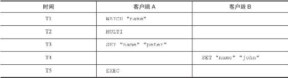
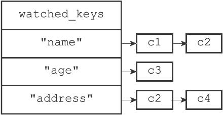
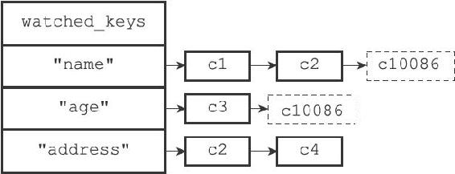
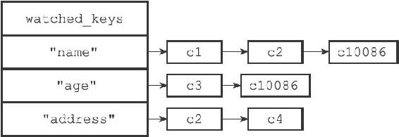
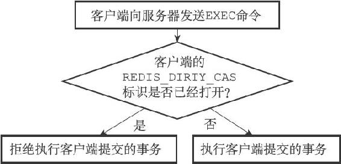
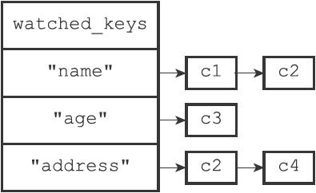
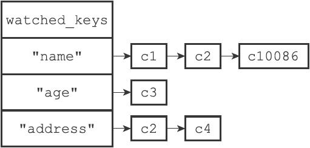

19.2 WATCH命令的实现

WATCH命令是一个乐观锁（optimistic locking），它可以在EXEC命令执行之前，监视任意数量的数据库键，并在EXEC命令执行时，检查被监视的键是否至少有一个已经被修改过了，如果是的话，服务器将拒绝执行事务，并向客户端返回代表事务执行失败的空回复。

以下是一个事务执行失败的例子：

---

>  
> redis> WATCH "name"  
> OK  
> redis> MULTI  
> OK  
> redis> SET "name" "peter"  
> QUEUED  
> redis> EXEC  
> (nil)  

---

表19-1展示了上面的例子是如何失败的。

表19-1 两个客户端执行命令的过程

在时间T4，客户端B修改了"name"键的值，当客户端A在T5执行EXEC命令时，服务器会发现WATCH监视的键"name"已经被修改，因此服务器拒绝执行客户端A的事务，并向客户端A返回空回复。

本节接下来的内容将介绍WATCH命令的实现原理，说明事务系统是如何监视某个键，并在键被修改的情况下，确保事务的安全性的。

19.2.1 使用WATCH命令监视数据库键

每个Redis数据库都保存着一个watched\_keys字典，这个字典的键是某个被WATCH命令监视的数据库键，而字典的值则是一个链表，链表中记录了所有监视相应数据库键的客户端：

---

>  
> typedef struct redisDb {  
> // ...  
> //   
> 正在被WATCH  
> 命令监视的键  
> dict \*watched\_keys;  
> // ...  
> } redisDb;  

---

通过watched\_keys字典，服务器可以清楚地知道哪些数据库键正在被监视，以及哪些客户端正在监视这些数据库键。

图19-3是一个watched\_keys字典的示例，从这个watched\_keys字典中可以看出：

·客户端c1和c2正在监视键"name"。

·客户端c3正在监视键"age"。

·客户端c2和c4正在监视键"address"。

通过执行WATCH命令，客户端可以在watched\_keys字典中与被监视的键进行关联。举个例子，如果当前客户端为c10086，那么客户端执行以下WATCH命令之后：

---

>  
> redis> WATCH "name" "age"  
> OK  

---

图19-3展示的watched\_keys字典将被更新至图19-4所示的状态，其中用虚线包围的两个c10086节点就是由刚刚执行的WATCH命令添加到字典中的。

图19-3 一个watched\_keys字典

图19-4 执行WATCH命令之后的watched\_keys字典

19.2.2 监视机制的触发

所有对数据库进行修改的命令，比如SET、LPUSH、SADD、ZREM、DEL、FLUSHDB等等，在执行之后都会调用multi.c/touchWatchKey函数对watched\_keys字典进行检查，查看是否有客户端正在监视刚刚被命令修改过的数据库键，如果有的话，那么touchWatchKey函数会将监视被修改键的客户端的REDIS\_DIRTY\_CAS标识打开，表示该客户端的事务安全性已经被破坏。

touchWatchKey函数的定义可以用以下伪代码来描述：

---

>  
> def touchWatchKey(db, key):  
> \#   
> 如果键key  
> 存在于数据库的watched\_keys  
> 字典中  
> \#   
> 那么说明至少有一个客户端在监视这个key  
> if key in db.watched\_keys:  
> \#   
> 遍历所有监视键key  
> 的客户端  
> for client in db.watched\_keys\[key\]:  
> \#   
> 打开标识  
> client.flags |= REDIS\_DIRTY\_CAS  

---

举个例子，对于图19-5所示的watched\_keys字典来说：

·如果键"name"被修改，那么c1、c2、c10086三个客户端的REDIS\_DIRTY\_CAS标识将被打开。

·如果键"age"被修改，那么c3和c10086两个客户端的REDIS\_DIRTY\_CAS标识将被打开。

·如果键"address"被修改，那么c2和c4两个客户端的REDIS\_DIRTY\_CAS标识将被打开。

图19-5 watched\_keys字典

19.2.3 判断事务是否安全

当服务器接收到一个客户端发来的EXEC命令时，服务器会根据这个客户端是否打开了REDIS\_DIRTY\_CAS标识来决定是否执行事务：

·如果客户端的REDIS\_DIRTY\_CAS标识已经被打开，那么说明客户端所监视的键当中，至少有一个键已经被修改过了，在这种情况下，客户端提交的事务已经不再安全，所以服务器会拒绝执行客户端提交的事务。

·如果客户端的REDIS\_DIRTY\_CAS标识没有被打开，那么说明客户端监视的所有键都没有被修改过（或者客户端没有监视任何键），事务仍然是安全的，服务器将执行客户端提交的这个事务。

这个判断是否执行事务的过程可以用流程图19-6来描述。

图19-6 服务器判断是否执行事务的过程

举个例子，对于图19-5所示的watched\_keys字典来说，如果某个客户端对"name"键进行了修改（比如执行SET"name""john"），那么c1、c2、c10086三个客户端的REDIS\_DIRTY\_CAS标识将被打开。当这三个客户端向服务器发送EXEC命令的时候，服务器会拒绝执行它们提交的事务，以此来保证事务的安全性。

19.2.4 一个完整的WATCH事务执行过程

为了进一步熟悉WATCH命令的运作方式，让我们来看一个带有WATCH的事务从开始到失败的整个过程。

假设当前客户端为c10086，而数据库watched\_keys字典的当前状态如图19-7所示，那么当c10086执行以下WATCH命令之后：

---

>  
> c10086> WATCH "name"  
> OK  

---

watched\_keys字典将更新至图19-8所示的状态。

图19-7 执行WATCH命令之前的watched\_keys字典

图19-8 执行WATCH命令之后的watched\_keys字典

接下来，客户端c10086继续向服务器发送MULTI命令，并将一个SET命令放入事务队列：

---

>  
> c10086> MULTI  
> OK  
> c10086> SET "name" "peter"  
> QUEUED  

---

就在这时，另一个客户端c999向服务器发送了一条SET命令，将"name"键的值设置成了"john"：

---

>  
> c999> SET "name" "john"  
> OK  

---

c999执行的这个SET命令会导致正在监视"name"的所有客户端的REDIS\_DIRTY\_CAS标识被打开，其中包括客户端c10086。

之后，当c10086向服务器发送EXEC命令时候，因为c10086的REDIS\_DIRTY\_CAS标志已经被打开，所以服务器将拒绝执行它提交的事务：

---

>  
> c10086> EXEC  
> (nil)  

---
