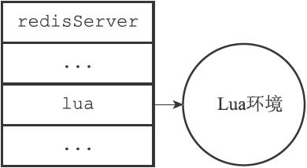

20.1 创建并修改Lua环境

为了在Redis服务器中执行Lua脚本，Redis在服务器内嵌了一个Lua环境（environ-ment），并对这个Lua环境进行了一系列修改，从而确保这个Lua环境可以满足Redis服务器的需要。

Redis服务器创建并修改Lua环境的整个过程由以下步骤组成：

1）创建一个基础的Lua环境，之后的所有修改都是针对这个环境进行的。

2）载入多个函数库到Lua环境里面，让Lua脚本可以使用这些函数库来进行数据操作。

3）创建全局表格redis，这个表格包含了对Redis进行操作的函数，比如用于在Lua脚本中执行Redis命令的redis.call函数。

4）使用Redis自制的随机函数来替换Lua原有的带有副作用的随机函数，从而避免在脚本中引入副作用。

5）创建排序辅助函数，Lua环境使用这个辅佐函数来对一部分Redis命令的结果进行排序，从而消除这些命令的不确定性。

6）创建redis.pcall函数的错误报告辅助函数，这个函数可以提供更详细的出错信息。

7）对Lua环境中的全局环境进行保护，防止用户在执行Lua脚本的过程中，将额外的全局变量添加到Lua环境中。

8）将完成修改的Lua环境保存到服务器状态的lua属性中，等待执行服务器传来的Lua脚本。接下来的各个小节将分别介绍这些步骤。

20.1.1 创建Lua环境

在最开始的这一步，服务器首先调用Lua的C API函数lua\_open，创建一个新的Lua环境。

因为lua\_open函数创建的只是一个基本的Lua环境，为了让这个Lua环境可以满足Redis的操作要求，接下来服务器将对这个Lua环境进行一系列修改。

20.1.2 载入函数库

Redis修改Lua环境的第一步，就是将以下函数库载入到Lua环境里面：

·基础库（base library）：这个库包含Lua的核心（core）函数，比如assert、error、pairs、tostring、pcall等。另外，为了防止用户从外部文件中引入不安全的代码，库中的loadfile函数会被删除。

·表格库（table library）：这个库包含用于处理表格的通用函数，比如table.concat、table.insert、table.remove、table.sort等。

·字符串库（string library）：这个库包含用于处理字符串的通用函数，比如用于对字符串进行查找的string.find函数，对字符串进行格式化的string.format函数，查看字符串长度的string.len函数，对字符串进行翻转的string.reverse函数等。

·数学库（math library）：这个库是标准C语言数学库的接口，它包括计算绝对值的math.abs函数，返回多个数中的最大值和最小值的math.max函数和math.min函数，计算二次方根的math.sqrt函数，计算对数的math.log函数等。

·调试库（debug library）：这个库提供了对程序进行调试所需的函数，比如对程序设置钩子和取得钩子的debug.sethook函数和debug.gethook函数，返回给定函数相关信息的debug.getinfo函数，为对象设置元数据的debug.setmetatable函数，获取对象元数据的debug.getmetatable函数等。

·Lua CJSON库（http://www.kyne.com.au/\~mark/software/lua-cjson.php）：这个库用于处理UTF-8编码的JSON格式，其中cjson.decode函数将一个JSON格式的字符串转换为一个Lua值，而cjson.encode函数将一个Lua值序列化为JSON格式的字符串。

·Struct库（http://www.inf.puc-rio.br/\~roberto/struct/）：这个库用于在Lua值和C结构（struct）之间进行转换，函数struct.pack将多个Lua值打包成一个类结构（struct-like）字符串，而函数struct.unpack则从一个类结构字符串中解包出多个Lua值。

·Lua cmsgpack库（https://github.com/antirez/lua-cmsgpack）：这个库用于处理MessagePack格式的数据，其中cmsgpack.pack函数将Lua值转换为MessagePack数据，而cmsgpack.unpack函数则将MessagePack数据转换为Lua值。

通过使用这些功能强大的函数库，Lua脚本可以直接对执行Redis命令获得的数据进行复杂的操作。

20.1.3 创建redis全局表格

在这一步，服务器将在Lua环境中创建一个redis表格（table），并将它设为全局变量。这个redis表格包含以下函数：

·用于执行Redis命令的redis.call和redis.pcall函数。

·用于记录Redis日志（log）的redis.log函数，以及相应的日志级别（level）常量：redis.LOG\_DEBUG，redis.LOG\_VERBOSE，redis.LOG\_NOTICE，以及redis.LOG\_WARNING。

·用于计算SHA1校验和的redis.sha1hex函数。

·用于返回错误信息的redis.error\_reply函数和redis.status\_reply函数。

在这些函数里面，最常用也最重要的要数redis.call函数和redis.pcall函数，通过这两个函数，用户可以直接在Lua脚本中执行Redis命令：

---

>  
> redis> EVAL "return redis.call('PING')" 0  
> PONG  

---

20.1.4 使用Redis自制的随机函数来替换Lua原有的随机函数

为了保证相同的脚本可以在不同的机器上产生相同的结果，Redis要求所有传入服务器的Lua脚本，以及Lua环境中的所有函数，都必须是无副作用（side effect）的纯函数（pure function）。

但是，在之前载入Lua环境的math函数库中，用于生成随机数的math.random函数和math.randomseed函数都是带有副作用的，它们不符合Redis对Lua环境的无副作用要求。

因为这个原因，Redis使用自制的函数替换了math库中原有的math.random函数和math.randomseed函数，替换之后的两个函数有以下特征：

·对于相同的seed来说，math.random总产生相同的随机数序列，这个函数是一个纯函数。

·除非在脚本中使用math.randomseed显式地修改seed，否则每次运行脚本时，Lua环境都使用固定的math.randomseed（0）语句来初始化seed。

例如，使用以下脚本，我们可以打印seed值为0时，math.random对于输入10至1所产生的随机序列：

---

>  
> \--random-with-default-seed.lua  
> local i = 10  
> local seq = {}  
> while (i > 0) do  
> seq\[i\] = math.random(i)  
> i = i-1  
> end  
> return seq  

---

无论执行这个脚本多少次，产生的值都是相同的：

---

>  
> $ redis-cli --eval random-with-default-seed.lua  
> 1) (integer) 1  
> 2) (integer) 2  
> 3) (integer) 2  
> 4) (integer) 3  
> 5) (integer) 4  
> 6) (integer) 4  
> 7) (integer) 7  
> 8) (integer) 1  
> 9) (integer) 7  
> 10) (integer) 2  

---

但是，如果我们在另一个脚本里面，调用math.randomseed将seed修改为10086：

---

>  
> \--random-with-new-seed.lua  
> math.randomseed(10086) --change seed  
> local i = 10  
> local seq = {}  
> while (i > 0) do  
> seq\[i\] = math.random(i)  
> i = i-1  
> end  
> return seq  

---

那么这个脚本生成的随机数序列将和使用默认seed值0时生成的随机序列不同：

---

>  
> $ redis-cli --eval random-with-new-seed.lua  
> 1) (integer) 1  
> 2) (integer) 1  
> 3) (integer) 2  
> 4) (integer) 1  
> 5) (integer) 1  
> 6) (integer) 3  
> 7) (integer) 1  
> 8) (integer) 1  
> 9) (integer) 3  
> 10) (integer) 1  

---

20.1.5 创建排序辅助函数

上一个小节说到，为了防止带有副作用的函数令脚本产生不一致的数据，Redis对math库的math.random函数和math.randomseed函数进行了替换。

对于Lua脚本来说，另一个可能产生不一致数据的地方是那些带有不确定性质的命令。比如对于一个集合键来说，因为集合元素的排列是无序的，所以即使两个集合的元素完全相同，它们的输出结果也可能并不相同。

考虑下面这个集合例子：

---

>  
> redis> SADD fruit apple banana cherry  
> (integer) 3  
> redis> SMEMBERS fruit  
> 1) "cherry"  
> 2) "banana"  
> 3) "apple"  
> redis> SADD another-fruit cherry banana apple  
> (integer) 3  
> redis> SMEMBERS another-fruit  
> 1) "apple"  
> 2) "banana"  
> 3) "cherry"  

---

这个例子中的fruit集合和another-fruit集合包含的元素是完全相同的，只是因为集合添加元素的顺序不同，SMEMBERS命令的输出就产生了不同的结果。

Redis将SMEMBERS这种在相同数据集上可能会产生不同输出的命令称为“带有不确定性的命令”，这些命令包括：

·SINTER

·SUNION

·SDIFF

·SMEMBERS

·HKEYS

·HVALS

·KEYS

为了消除这些命令带来的不确定性，服务器会为Lua环境创建一个排序辅助函数\_\_redis\_\_compare\_helper，当Lua脚本执行完一个带有不确定性的命令之后，程序会使用\_\_redis\_\_compare\_helper作为对比函数，自动调用table.sort函数对命令的返回值做一次排序，以此来保证相同的数据集总是产生相同的输出。

举个例子，如果我们在Lua脚本中对fruit集合和another-fruit集合执行SMEMBERS命令，那么两个脚本将得出相同的结果，因为脚本已经对SMEMBERS命令的输出进行过排序了：

---

>  
> redis> EVAL "return redis.call('SMEMBERS', KEYS\[1\])" 1 fruit  
> 1) "apple"  
> 2) "banana"  
> 3) "cherry"  
> redis> EVAL "return redis.call('SMEMBERS', KEYS\[1\])" 1 another-fruit  
> 1) "apple"  
> 2) "banana"  
> 3) "cherry"  

---

20.1.6 创建redis.pcall函数的错误报告辅助函数

在这一步，服务器将为Lua环境创建一个名为\_\_redis\_\_err\_\_handler的错误处理函数，当脚本调用redis.pcall函数执行Redis命令，并且被执行的命令出现错误时，\_\_redis\_\_err\_\_handler就会打印出错代码的来源和发生错误的行数，为程序的调试提供方便。

举个例子，如果客户端要求服务器执行以下Lua脚本：

---

>  
> \--  
> 第1  
> 行  
> \--  
> 第2  
> 行  
> \--  
> 第3  
> 行  
> return redis.pcall('wrong command')  

---

那么服务器将向客户端返回一个错误：

---

>  
> $ redis-cli --eval wrong-command.lua  
> (error) @user\_script: 4: Unknown Redis command called from Lua script  

---

其中@user\_script说明这是一个用户定义的函数，而之后的4则说明出错的代码位于Lua脚本的第四行。

20.1.7 保护Lua的全局环境

在这一步，服务器将对Lua环境中的全局环境进行保护，确保传入服务器的脚本不会因为忘记使用local关键字而将额外的全局变量添加到Lua环境里面。

因为全局变量保护的原因，当一个脚本试图创建一个全局变量时，服务器将报告一个错误：

---

>  
> redis> EVAL "x = 10" 0  
> (error) ERR Error running script  
> (call to f\_df1ad3745c2d2f078f0f41377a92bb6f8ac79af0):  
> @enable\_strict\_lua:7: user\_script:1:  
> Script attempted to create global variable 'x'  

---

除此之外，试图获取一个不存在的全局变量也会引发一个错误：

---

>  
> redis> EVAL "return x" 0  
> (error) ERR Error running script  
> (call to f\_03c387736bb5cc009ff35151572cee04677aa374):  
> @enable\_strict\_lua:14: user\_script:1:  
> Script attempted to access unexisting global variable 'x'  

---

不过Redis并未禁止用户修改已存在的全局变量，所以在执行Lua脚本的时候，必须非常小心，以免错误地修改了已存在的全局变量：

---

>  
> redis> EVAL "redis = 10086; return redis" 0  
> (integer) 10086  

---

20.1.8 将Lua环境保存到服务器状态的lua属性里面

经过以上的一系列修改，Redis服务器对Lua环境的修改工作到此就结束了，在最后的这一步，服务器会将Lua环境和服务器状态的lua属性关联起来，如图20-1所示。

图20-1 服务器状态中的Lua环境

因为Redis使用串行化的方式来执行Redis命令，所以在任何特定时间里，最多都只会有一个脚本能够被放进Lua环境里面运行，因此，整个Redis服务器只需要创建一个Lua环境即可。
