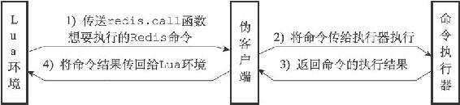
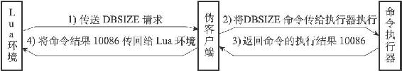
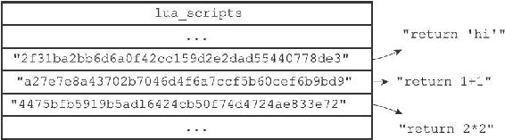

20.2 Lua环境协作组件

除了创建并修改Lua环境之外，Redis服务器还创建了两个用于与Lua环境进行协作的组件，它们分别是负责执行Lua脚本中的Redis命令的伪客户端，以及用于保存Lua脚本的lua\_scripts字典。

接下来的两个小节将分别介绍这两个组件。

20.2.1 伪客户端

因为执行Redis命令必须有相应的客户端状态，所以为了执行Lua脚本中包含的Redis命令，Redis服务器专门为Lua环境创建了一个伪客户端，并由这个伪客户端负责处理Lua脚本中包含的所有Redis命令。

Lua脚本使用redis.call函数或者redis.pcall函数执行一个Redis命令，需要完成以下步骤：

1）Lua环境将redis.call函数或者redis.pcall函数想要执行的命令传给伪客户端。

2）伪客户端将脚本想要执行的命令传给命令执行器。

3）命令执行器执行伪客户端传给它的命令，并将命令的执行结果返回给伪客户端。

4）伪客户端接收命令执行器返回的命令结果，并将这个命令结果返回给Lua环境。

5）Lua环境在接收到命令结果之后，将该结果返回给redis.call函数或者redis.pcall函数。

6）接收到结果的redis.call函数或者redis.pcall函数会将命令结果作为函数返回值返回给脚本中的调用者。

图20-2展示了Lua脚本在调用redis.call函数时，Lua环境、伪客户端、命令执行器三者之间的通信过程（调用redis.pcall函数时产生的通信过程也是一样的）。

图20-2 Lua脚本执行Redis命令时的通信步骤

举个例子，图20-3展示了Lua脚本在执行以下命令时：

---

>  
> redis> EVAL "return redis.call('DBSIZE')" 0  
> (integer) 10086  

---

Lua环境、伪客户端、命令执行器三者之间的通信过程。

图20-3 Lua脚本执行DBSIZE命令时的通信步骤

20.2.2 lua\_scripts字典

除了伪客户端之外，Redis服务器为Lua环境创建的另一个协作组件是lua\_scripts字典，这个字典的键为某个Lua脚本的SHA1校验和（checksum），而字典的值则是SHA1校验和对应的Lua脚本：

---

>  
> struct redisServer {  
> // ...  
> dict \*lua\_scripts;  
> // ...  
> };  

---

Redis服务器会将所有被EVAL命令执行过的Lua脚本，以及所有被SCRIPT LOAD命令载入过的Lua脚本都保存到lua\_scripts字典里面。

举个例子，如果客户端向服务器发送以下命令：

---

>  
> redis> SCRIPT LOAD "return 'hi'"  
> "2f31ba2bb6d6a0f42cc159d2e2dad55440778de3"  
> redis> SCRIPT LOAD "return 1+1"  
> "a27e7e8a43702b7046d4f6a7ccf5b60cef6b9bd9"  
> redis> SCRIPT LOAD "return 2\*2"  
> "4475bfb5919b5ad16424cb50f74d4724ae833e72"  

---

那么服务器的lua\_scripts字典将包含被SCRIPT LOAD命令载入的三个Lua脚本，如图20-4所示。

图20-4 lua\_scripts字典示例

lua\_scripts字典有两个作用，一个是实现SCRIPT EXISTS命令，另一个是实现脚本复制功能，本章稍后将详细说明lua\_scripts字典在这两个功能中的作用。
