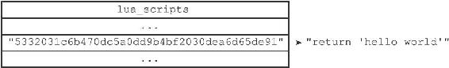

20.3 EVAL命令的实现

EVAL命令的执行过程可以分为以下三个步骤：

1）根据客户端给定的Lua脚本，在Lua环境中定义一个Lua函数。

2）将客户端给定的脚本保存到lua\_scripts字典，等待将来进一步使用。

3）执行刚刚在Lua环境中定义的函数，以此来执行客户端给定的Lua脚本。

以下三个小节将以：

---

>  
> redis> EVAL "return 'hello world'" 0  
> "hello world"  

---

命令为示例，分别介绍EVAL命令执行的三个步骤。

20.3.1 定义脚本函数

当客户端向服务器发送EVAL命令，要求执行某个Lua脚本的时候，服务器首先要做的就是在Lua环境中，为传入的脚本定义一个与这个脚本相对应的Lua函数，其中，Lua函数的名字由f\_前缀加上脚本的SHA1校验和（四十个字符长）组成，而函数的体（body）则是脚本本身。

举个例子，对于命令：

---

>  
> EVAL "return 'hello world'" 0  

---

来说，服务器将在Lua环境中定义以下函数：

---

>  
> function f\_5332031c6b470dc5a0dd9b4bf2030dea6d65de91()  
> return 'hello world'  
> end  

---

因为客户端传入的脚本为return'hello world'，而这个脚本的SHA1校验和为5332031c6b470dc5a0dd9b4bf2030dea6d65de91，所以函数的名字为f\_5332031c6b470dc5a0dd9b4bf2030dea6d65de91，而函数的体则为return'hello world'。

使用函数来保存客户端传入的脚本有以下好处：

·执行脚本的步骤非常简单，只要调用与脚本相对应的函数即可。

·通过函数的局部性来让Lua环境保持清洁，减少了垃圾回收的工作量，并且避免了使用全局变量。

·如果某个脚本所对应的函数在Lua环境中被定义过至少一次，那么只要记得这个脚本的SHA1校验和，服务器就可以在不知道脚本本身的情况下，直接通过调用Lua函数来执行脚本，这是EVALSHA命令的实现原理，稍后在介绍EVALSHA命令的实现时就会说到这一点。

20.3.2 将脚本保存到lua\_scripts字典

EVAL命令要做的第二件事是将客户端传入的脚本保存到服务器的lua\_scripts字典里面。举个例子，对于命令：

---

>  
> EVAL "return 'hello world'" 0  

---

来说，服务器将在lua\_scripts字典中新添加一个键值对，其中键为Lua脚本的SHA1校验和：

---

>  
> 5332031c6b470dc5a0dd9b4bf2030dea6d65de91  

---

而值则为Lua脚本本身：

---

>  
> return 'hello world'  

---

添加新键值对之后的lua\_scripts字典如图20-5所示。

图20-5 添加新键值对之后的lua\_scripts字典

20.3.3 执行脚本函数

在为脚本定义函数，并且将脚本保存到lua\_scripts字典之后，服务器还需要进行一些设置钩子、传入参数之类的准备动作，才能正式开始执行脚本。

整个准备和执行脚本的过程如下：

1）将EVAL命令中传入的键名（key name）参数和脚本参数分别保存到KEYS数组和ARGV数组，然后将这两个数组作为全局变量传入到Lua环境里面。

2）为Lua环境装载超时处理钩子（hook），这个钩子可以在脚本出现超时运行情况时，让客户端通过SCRIPT KILL命令停止脚本，或者通过SHUTDOWN命令直接关闭服务器。

3）执行脚本函数。

4）移除之前装载的超时钩子。

5）将执行脚本函数所得的结果保存到客户端状态的输出缓冲区里面，等待服务器将结果返回给客户端。

6）对Lua环境执行垃圾回收操作。

举个例子，对于如下命令：

---

>  
> EVAL "return 'hello world'" 0  

---

服务器将执行以下动作：

1）因为这个脚本没有给定任何键名参数或者脚本参数，所以服务器会跳过传值到KEYS数组或ARGV数组这一步。

2）为Lua环境装载超时处理钩子。

3）在Lua环境中执行f\_5332031c6b470dc5a0dd9b4bf2030dea6d65de91函数。

4）移除超时钩子。

5）将执行f\_5332031c6b470dc5a0dd9b4bf2030dea6d65de91函数所得的结果"hello world"保存到客户端状态的输出缓冲区里面。

6）对Lua环境执行垃圾回收操作。

至此，命令：

---

>  
> EVAL "return 'hello world'" 0  

---

执行算是告一段落，之后服务器只要将保存在输出缓冲区里面的执行结果返回给执行EVAL命令的客户端就可以了。
