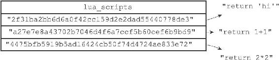
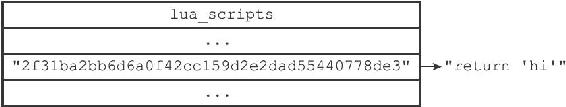
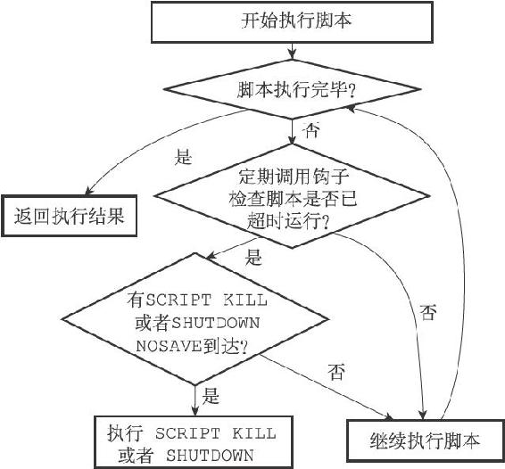

20.5 脚本管理命令的实现

除了EVAL命令和EVALSHA命令之外，Redis中与Lua脚本有关的命令还有四个，它们分别是SCRIPT FLUSH命令、SCRIPT EXISTS命令、SCRIPT LOAD命令、以及SCRIPT KILL命令。

接下来的四个小节将分别对这四个命令的实现原理进行介绍。

20.5.1 SCRIPT FLUSH

SCRIPT FLUSH命令用于清除服务器中所有和Lua脚本有关的信息，这个命令会释放并重建lua\_scripts字典，关闭现有的Lua环境并重新创建一个新的Lua环境。

以下为SCRIPT FLUSH命令的实现伪代码：

---

>  
> def SCRIPT\_FLUSH():  
> \#   
> 释放脚本字典  
> dictRelease(server.lua\_scripts)  
> \#   
> 重建脚本字典  
> server.lua\_scripts = dictCreate(...)  
> \#   
> 关闭Lua  
> 环境  
> lua\_close(server.lua)  
> \#   
> 初始化一个新的Lua  
> 环境  
> server.lua = init\_lua\_env()  

---

20.5.2 SCRIPT EXISTS

SCRIPT EXISTS命令根据输入的SHA1校验和，检查校验和对应的脚本是否存在于服务器中。

SCRIPT EXISTS命令是通过检查给定的校验和是否存在于lua\_scripts字典来实现的，以下是该命令的实现伪代码：

---

>  
> def SCRIPT\_EXISTS(\*sha1\_list):  
> \#   
> 结果列表  
> result\_list = \[\]  
> \#   
> 遍历输入的所有SHA1  
> 校验和  
> for sha1 in sha1\_list:  
> \#   
> 检查校验和是否为lua\_scripts  
> 字典的键  
> \#   
> 如果是的话，那么表示校验和对应的脚本存在  
> \#   
> 否则的话，脚本就不存在  
> if sha1 in server.lua\_scripts:  
> \#   
> 存在用1  
> 表示  
> result\_list.append(1)  
> else:  
> \#   
> 不存在用0  
> 表示  
> result\_list.append(0)  
> \#   
> 向客户端返回结果列表  
> send\_list\_reply(result\_list)  

---

图20-6 lua\_scripts字典

举个例子，对于图20-6所示的lua\_scripts字典来说，我们可以进行以下测试：

---

>  
> redis> SCRIPT EXISTS "2f31ba2bb6d6a0f42cc159d2e2dad55440778de3"  
> 1) (integer) 1  
> redis> SCRIPT EXISTS "a27e7e8a43702b7046d4f6a7ccf5b60cef6b9bd9"  
> 1) (integer) 1  
> redis> SCRIPT EXISTS "4475bfb5919b5ad16424cb50f74d4724ae833e72"  
> 1) (integer) 1  
> redis> SCRIPT EXISTS "NotExistsScriptSha1HereABCDEFGHIJKLMNOPQ"  
> 1) (integer) 0  

---

从测试结果可知，除了最后一个校验和之外，其他校验和对应的脚本都存在于服务器中。

注意

SCRIPT EXISTS命令允许一次传入多个SHA1校验和，不过因为SHA1校验和太长，所以示例里分开多次来进行测试。

实现SCRIPT EXISTS实际上并不需要lua\_scripts字典的值。如果lua\_scripts字典只用于实现SCRIPT EXISTS命令的话，那么字典只需要保存Lua脚本的SHA1校验和就可以了，并不需要保存Lua脚本本身。lua\_scripts字典既保存脚本的SHA1校验和，又保存脚本本身的原因是为了实现脚本复制功能，详细的情况请看本章稍后对脚本复制功能实现原理的介绍。

20.5.3 SCRIPT LOAD

SCRIPT LOAD命令所做的事情和EVAL命令执行脚本时所做的前两步完全一样：命令首先在Lua环境中为脚本创建相对应的函数，然后再将脚本保存到lua\_scripts字典里面。

举个例子，如果我们执行以下命令：

---

>  
> redis> SCRIPT LOAD "return 'hi'"  
> "2f31ba2bb6d6a0f42cc159d2e2dad55440778de3"  

---

那么服务器将在Lua环境中创建以下函数：

---

>  
> function f\_2f31ba2bb6d6a0f42cc159d2e2dad55440778de3()  
> return 'hi'  
> end  

---

并将键为"2f31ba2bb6d6a0f42cc159d2e2dad55440778de3"，值为"return'hi'"的键值对添加到服务器的lua\_scripts字典里面，如图20-7所示。

图20-7 lua\_scripts字典

完成了这些步骤之后，客户端就可以使用EVALSHA命令来执行前面被SCRIPT LOAD命令载入的脚本了：

---

>  
> redis> EVALSHA "2f31ba2bb6d6a0f42cc159d2e2dad55440778de3" 0  
> "hi"  

---

20.5.4 SCRIPT KILL

如果服务器设置了lua-time-limit配置选项，那么在每次执行Lua脚本之前，服务器都会在Lua环境里面设置一个超时处理钩子（hook）。

超时处理钩子在脚本运行期间，会定期检查脚本已经运行了多长时间，一旦钩子发现脚本的运行时间已经超过了lua-time-limit选项设置的时长，钩子将定期在脚本运行的间隙中，查看是否有SCRIPT KILL命令或者SHUTDOWN命令到达服务器。

图20-8展示了带有超时处理钩子的脚本的运行过程。

图20-8 带有超时处理钩子的脚本的执行过程

如果超时运行的脚本未执行过任何写入操作，那么客户端可以通过SCRIPT KILL命令来指示服务器停止执行这个脚本，并向执行该脚本的客户端发送一个错误回复。处理完SCRIPT KILL命令之后，服务器可以继续运行。

另一方面，如果脚本已经执行过写入操作，那么客户端只能用SHUTDOWN nosave命令来停止服务器，从而防止不合法的数据被写入数据库中。
