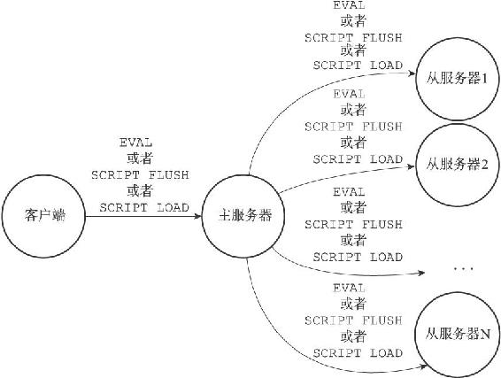
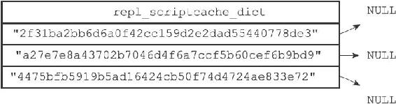
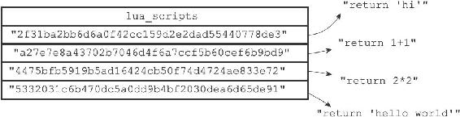
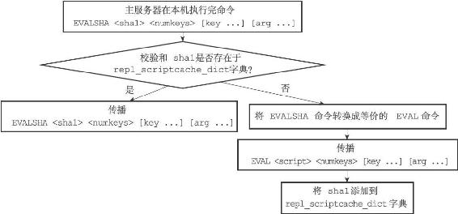
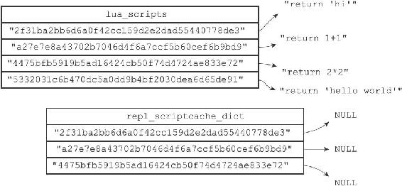
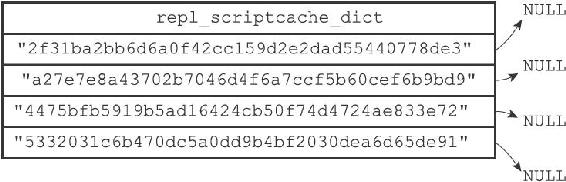

20.6 脚本复制

与其他普通Redis命令一样，当服务器运行在复制模式之下时，具有写性质的脚本命令也会被复制到从服务器，这些命令包括EVAL命令、EVALSHA命令、SCRIPT FLUSH命令，以及SCRIPT LOAD命令。

接下来的两个小节将分别介绍这四个命令的复制方法。

20.6.1 复制EVAL命令、SCRIPT FLUSH命令和SCRIPT LOAD命令

Redis复制EVAL、SCRIPT FLUSH、SCRIPT LOAD三个命令的方法和复制其他普通Redis命令的方法一样，当主服务器执行完以上三个命令的其中一个时，主服务器会直接将被执行的命令传播（propagate）给所有从服务器，如图20-9所示。

图20-9 将脚本命令传播给从服务器

1.EVAL

对于EVAL命令来说，在主服务器执行的Lua脚本同样会在所有从服务器中执行。

举个例子，如果客户端向主服务器执行以下命令：

---

>  
> redis> EVAL "return redis.call('SET', KEYS\[1\], ARGV\[1\])" 1 "msg" "hello world"  
> OK  

---

那么主服务器在执行这个EVAL命令之后，将向所有从服务器传播这条EVAL命令，从服务器会接收并执行这条EVAL命令，最终结果是，主从服务器双方都会将数据库"msg"键的值设置为"hello world"，并且将脚本：

---

>  
> "return redis.call('SET', KEYS\[1\], ARGV\[1\])"  

---

保存在脚本字典里面。

2.SCRIPT FLUSH

如果客户端向主服务器发送SCRIPT FLUSH命令，那么主服务器也会向所有从服务器传播SCRIPT FLUSH命令。

最终的结果是，主从服务器双方都会重置自己的Lua环境，并清空自己的脚本字典。

3.SCRIPT LOAD

如果客户端使用SCRIPT LOAD命令，向主服务器载入一个Lua脚本，那么主服务器将向所有从服务器传播相同的SCRIPT LOAD命令，使得所有从服务器也会载入相同的Lua脚本。

举个例子，如果客户端向主服务器发送命令：

---

>  
> redis> SCRIPT LOAD "return 'hello world'"  
> "5332031c6b470dc5a0dd9b4bf2030dea6d65de91"  

---

那么主服务器也会向所有从服务器传播同样的命令：

---

>  
> SCRIPT LOAD "return 'hello world'"  

---

最终的结果是，主从服务器双方都会载入脚本：

---

>  
> "return 'hello world'"  

---

20.6.2 复制EVALSHA命令

EVALSHA命令是所有与Lua脚本有关的命令中，复制操作最复杂的一个，因为主服务器与从服务器载入Lua脚本的情况可能有所不同，所以主服务器不能像复制EVAL命令、SCRIPT LOAD命令或者SCRIPT FLUSH命令那样，直接将EVALSHA命令传播给从服务器。对于一个在主服务器被成功执行的EVALSHA命令来说，相同的EVALSHA命令在从服务器执行时却可能会出现脚本未找到（not found）错误。

举个例子，假设现在有一个主服务器master，如果客户端向主服务器发送命令：

---

>  
> master> SCRIPT LOAD "return 'hello world'"  
> "5332031c6b470dc5a0dd9b4bf2030dea6d65de91"  

---

那么在执行这个SCRIPT LOAD命令之后，SHA1值为5332031c6b470dc5a0dd9b4bf2030dea6d65de91的脚本就存在于主服务器中了。

现在，假设一个从服务器slave1开始复制主服务器master，如果master不想办法将脚本：

---

>  
> "return 'hello world'"  

---

传送给slave1载入的话，那么当客户端向主服务器发送命令：

---

>  
> master> EVALSHA "5332031c6b470dc5a0dd9b4bf2030dea6d65de91" 0  
> "hello world"  

---

的时候，master将成功执行这个EVALSHA命令，而当master将这个命令传播给slave1执行的时候，slave1却会出现脚本未找到错误：

---

>  
> slave1> EVALSHA "5332031c6b470dc5a0dd9b4bf2030dea6d65de91" 0  
> (error) NOSCRIPT No matching script. Please use EVAL.  

---

更为复杂的是，因为多个从服务器之间载入Lua脚本的情况也可能各有不同，所以即使一个EVALSHA命令可以在某个从服务器成功执行，也不代表这个EVALSHA命令就一定可以在另一个从服务器成功执行。

举个例子，假设有主服务器master和从服务器slave1，并且slave1一直复制着master，所以master载入的所有Lua脚本，slave1也有载入（通过传播EVAL命令或者SCRIPT LOAD命令来实现）。

例如说，如果客户端向master发送命令：

---

>  
> master> SCRIPT LOAD "return 'hello world'"  
> "5332031c6b470dc5a0dd9b4bf2030dea6d65de91"  

---

那么这个命令也会被传播到slave1上面，所以master和slave1都会成功载入SHA1校验和为5332031c6b470dc5a0dd9b4bf2030dea6d65de91的Lua脚本。

如果这时，一个新的从服务器slave2开始复制主服务器master，如果master不想办法将脚本：

---

>  
> "return 'hello world'"  

---

传送给slave2的话，那么当客户端向主服务器发送命令：

---

>  
> master> EVALSHA "5332031c6b470dc5a0dd9b4bf2030dea6d65de91" 0  
> "hello world"  

---

的时候，master和slave1都将成功执行这个EVALSHA命令，而slave2却会发生脚本未找到错误。

为了防止以上假设的情况出现，Redis要求主服务器在传播EVALSHA命令的时候，必须确保EVALSHA命令要执行的脚本已经被所有从服务器载入过，如果不能确保这一点的话，主服务器会将EVALSHA命令转换成一个等价的EVAL命令，然后通过传播EVAL命令来代替EVALSHA命令。

传播EVALSHA命令，或者将EVALSHA命令转换成EVAL命令，都需要用到服务器状态的lua\_scripts字典和repl\_scriptcache\_dict字典，接下来的小节将分别介绍这两个字典的作用，并最终说明Redis复制EVALSHA命令的方法。

1.判断传播EVALSHA命令是否安全的方法

主服务器使用服务器状态的repl\_scriptcache\_dict字典记录自己已经将哪些脚本传播给了所有从服务器：

---

>  
> struct redisServer {  
> // ...  
> dict \*repl\_scriptcache\_dict;  
> // ...  
> };  

---

repl\_scriptcache\_dict字典的键是一个个Lua脚本的SHA1校验和，而字典的值则全部都是NULL，当一个校验和出现在repl\_scriptcache\_dict字典时，说明这个校验和对应的Lua脚本已经传播给了所有从服务器，主服务器可以直接向从服务器传播包含这个SHA1校验和的EVALSHA命令，而不必担心从服务器会出现脚本未找到错误。

图20-10 一个repl\_scriptcache\_dict字典示例

举个例子，如果主服务器repl\_scriptcache\_dict字典的当前状态如图20-10所示，那么主服务器可以向从服务器传播以下三个EVALSHA命令，并且从服务器在执行这些EVALSHA命令的时候不会出现脚本未找到错误：

---

>  
> EVALSHA "2f31ba2bb6d6a0f42cc159d2e2dad55440778de3" ...  
> EVALSHA "a27e7e8a43702b7046d4f6a7ccf5b60cef6b9bd9" ...  
> EVALSHA "4475bfb5919b5ad16424cb50f74d4724ae833e72" ...  

---

另一方面，如果一个脚本的SHA1校验和存在于lua\_scripts字典，但是却不存在于repl\_scriptcache\_dict字典，那么说明校验和对应的Lua脚本已经被主服务器载入，但是并没有传播给所有从服务器，如果我们尝试向从服务器传播包含这个SHA1校验和的EVALSHA命令，那么至少有一个从服务器会出现脚本未找到错误。

图20-11 lua\_scripts字典

举个例子，对于图20-11所示的lua\_scripts字典，以及图20-10所示的repl\_scriptcache\_dict字典来说，SHA1校验和为：

---

>  
> "5332031c6b470dc5a0dd9b4bf2030dea6d65de91"  

---

的脚本：

---

>  
> "return 'hello world'"  

---

虽然存在于lua\_scripts字典，但是repl\_scriptcache\_dict字典却并不包含校验和"5332031c6b470dc5a0dd9b4bf2030dea6d65de91"，这说明脚本：

---

>  
> "return 'hello world'"  

---

虽然已经载入到主服务器里面，但并未传播给所有从服务器，如果主服务器尝试向从服务器发送命令：

---

>  
> EVALSHA "5332031c6b470dc5a0dd9b4bf2030dea6d65de91" ...  

---

那么至少会有一个从服务器遇上脚本未找到错误。

2.清空repl\_scriptcache\_dict字典

每当主服务器添加一个新的从服务器时，主服务器都会清空自己的repl\_scriptcache\_dict字典，这是因为随着新从服务器的出现，repl\_scriptcache\_dict字典里面记录的脚本已经不再被所有从服务器载入过，所以主服务器会清空repl\_scriptcache\_dict字典，强制自己重新向所有从服务器传播脚本，从而确保新的从服务器不会出现脚本未找到错误。

3.EVALSHA命令转换成EVAL命令的方法

通过使用EVALSHA命令指定的SHA1校验和，以及lua\_scripts字典保存的Lua脚本，服务器总可以将一个EVALSHA命令：

---

>  
> EVALSHA <sha1> <numkeys> \[key ...\] \[arg ...\]  

---

转换成一个等价的EVAL命令：

---

>  
> EVAL <script> <numkeys> \[key ...\] \[arg ...\]  

---

具体的转换方法如下：

1）根据SHA1校验和sha1，在lua\_scripts字典中查找sha1对应的Lua脚本script。

2）将原来的EVALSHA命令请求改写成EVAL命令请求，并且将校验和sha1改成脚本script，至于numkeys、key、arg等参数则保持不变。

举个例子，对于图20-11所示的lua\_scripts字典，以及图20-10所示的repl\_scriptcache\_dict字典来说，我们总可以将命令：

---

>  
> EVALSHA "5332031c6b470dc5a0dd9b4bf2030dea6d65de91" 0  

---

改写成命令：

---

>  
> EVAL "return 'hello world'" 0  

---

其中脚本的内容：

---

>  
> "return 'hello world'"  

---

来源于lua\_scripts字典“5332031c6b470dc5a0dd9b4bf2030dea6d65de91”键的值。

如果一个SHA1值所对应的Lua脚本没有被所有从服务器载入过，那么主服务器可以将EVALSHA命令转换成等价的EVAL命令，然后通过传播等价的EVAL命令来代替原本想要传播的EVALSHA命令，以此来产生相同的脚本执行效果，并确保所有从服务器都不会出现脚本未找到错误。

另外，因为主服务器在传播完EVAL命令之后，会将被传播脚本的SHA1校验和（也即是原本EVALSHA命令指定的那个校验和）添加到repl\_scriptcache\_dict字典里面，如果之后EVALSHA命令再次指定这个SHA1校验和，主服务器就可以直接传播EVALSHA命令，而不必再次对EVALSHA命令进行转换。

4.传播EVALSHA命令的方法

当主服务器成功在本机执行完一个EVALSHA命令之后，它将根据EVALSHA命令指定的SHA1校验和是否存在于repl\_scriptcache\_dict字典来决定是向从服务器传播EVALSHA命令还是EVAL命令：

1）如果EVALSHA命令指定的SHA1校验和存在于repl\_scriptcache\_dict字典，那么主服务器直接向从服务器传播EVALSHA命令。

2）如果EVALSHA命令指定的SHA1校验和不存在于repl\_scriptcache\_dict字典，那么主服务器会将EVALSHA命令转换成等价的EVAL命令，然后传播这个等价的EVAL命令，并将EVALSHA命令指定的SHA1校验和添加到repl\_scriptcache\_dict字典里面。

图20-12展示了这个判断过程。

图20-12 主服务器判断传播EVAL还是EVALSHA的过程

举个例子，假设服务器当前lua\_scripts字典和repl\_scriptcache\_dict字典的状态如图20-13所示，如果客户端向主服务器发送命令：

---

>  
> EVALSHA "5332031c6b470dc5a0dd9b4bf2030dea6d65de91" 0  

---

那么主服务器在执行完这个EVALSHA命令之后，会将这个EVALSHA命令转换成等价的EVAL命令：

---

>  
> EVAL "return 'hello world'" 0  

---

图20-13 执行EVALSHA命令之前的lua\_scripts字典和repl\_scriptcache\_dict字典

并向所有从服务器传播这个EVAL命令。

除此之外，主服务器还会将SHA1校验和"5332031c6b470dc5a0dd9b4bf2030dea6d65de91"添加到repl\_scriptcache\_dict字典里，这样当客户端下次再发送命令：

---

>  
> EVALSHA "5332031c6b470dc5a0dd9b4bf2030dea6d65de91" 0  

---

的时候，主服务器就可以直接向从服务器传播这个EVALSHA命令，而无须将EVALSHA命令转换成EVAL命令再传播。

添加"5332031c6b470dc5a0dd9b4bf2030dea6d65de91"之后的repl\_scriptcac-he\_dict字典如图20-14所示。

图20-14 执行EVALSHA命令之后的repl\_scriptcache\_dict字典
