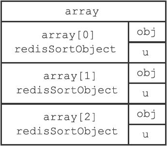
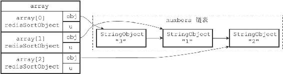
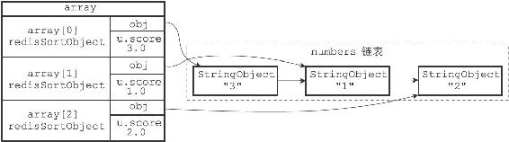
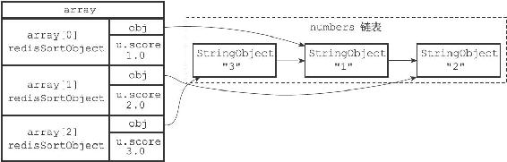

21.1 SORT<key>命令的实现

SORT命令的最简单执行形式为：

---

>  
> SORT <key>  

---

这个命令可以对一个包含数字值的键key进行排序。

以下示例展示了如何使用SORT命令对一个包含三个数字值的列表键进行排序：

---

>  
> redis> RPUSH numbers 3 1 2  
> (integer) 3  
> redis> SORT numbers  
> 1) "1"  
> 2) "2"  
> 3) "3"  

---

服务器执行SORT numbers命令的详细步骤如下：

1）创建一个和numbers列表长度相同的数组，该数组的每个项都是一个redis.h/redisSortObject结构，如图21-1所示。

图21-1 命令为排序numbers列表而创建的数组

2）遍历数组，将各个数组项的obj指针分别指向numbers列表的各个项，构成obj指针和列表项之间的一对一关系，如图21-2所示。

3）遍历数组，将各个obj指针所指向的列表项转换成一个double类型的浮点数，并将这个浮点数保存在相应数组项的u.score属性里面，如图21-3所示。

4）根据数组项u.score属性的值，对数组进行数字值排序，排序后的数组项按u.score属性的值从小到大排列，如图21-4所示。

5）遍历数组，将各个数组项的obj指针所指向的列表项作为排序结果返回给客户端，程序首先访问数组的索引0，返回u.score值为1.0的列表项"1"；然后访问数组的索引1，返回u.score值为2.0的列表项"2"；最后访问数组的索引2，返回u.score值为3.0的列表项"3"。

其他SORT<key>命令的执行步骤也和这里给出的SORT numbers命令的执行步骤类似。

图21-2 将obj指针指向列表的各个项

图21-3 设置数组项的u.score属性

图21-4 排序后的数组

以下是redisSortObject结构的完整定义：

---

>  
> typedef struct \_redisSortObject {  
> //   
> 被排序键的值  
> robj \*obj;  
> //   
> 权重  
> union {  
> //   
> 排序数字值时使用  
> double score;  
> //   
> 排序带有BY  
> 选项的字符串值时使用  
> robj \*cmpobj;  
> } u;  
> } redisSortObject;  

---

SORT命令为每个被排序的键都创建一个与键长度相同的数组，数组的每个项都是一个redisSortObject结构，根据SORT命令使用的选项不同，程序使用redisSortObject结构的方式也不同，稍后介绍SORT命令的各种选项时我们会看到这一点。
