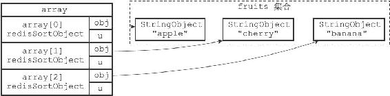
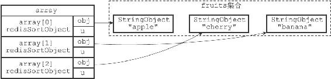

21.2 ALPHA选项的实现

通过使用ALPHA选项，SORT命令可以对包含字符串值的键进行排序：

---

>  
> SORT <key> ALPHA  

---

以下命令展示了如何使用SORT命令对一个包含三个字符串值的集合键进行排序：

---

>  
> redis> SADD fruits apple banana cherry  
> (integer) 3  
> \#   
> 元素在集合中是乱序存放的  
> redis> SMEMBERS fruits  
> 1) "apple"  
> 2) "cherry"  
> 3) "banana"  
> \#   
> 对fruits  
> 键进行字符串排序  
> redis> SORT fruits ALPHA  
> 1) "apple"  
> 2) "banana"  
> 3) "cherry"  

---

服务器执行SORT fruits ALPHA命令的详细步骤如下：

1）创建一个redisSortObject结构数组，数组的长度等于fruits集合的大小。

2）遍历数组，将各个数组项的obj指针分别指向fruits集合的各个元素，如图21-5所示。

3）根据obj指针所指向的集合元素，对数组进行字符串排序，排序后的数组项按集合元素的字符串值从小到大排列：因为"apple"、"banana"、"cherry"三个字符串的大小顺序为"apple"<"banana"<"cherry"，所以排序后数组的第一项指向"apple"元素，第二项指向"banana"元素，第三项指向"cherry"元素，如图21-6所示。

4）遍历数组，依次将数组项的obj指针所指向的元素返回给客户端。

其他SORT<key>ALPHA命令的执行步骤也和这里给出的SORT fruits ALPHA命令的执行步骤类似。

图21-5 将obj指针指向集合的各个元素

图21-6 按集合元素进行排序后的数组
