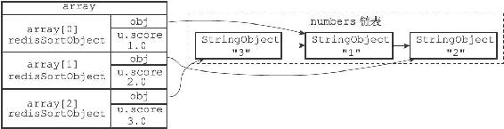
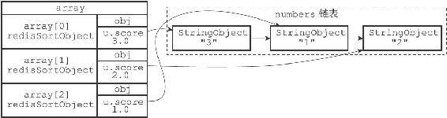

21.3 ASC选项和DESC选项的实现

在默认情况下，SORT命令执行升序排序，排序后的结果按值的大小从小到大排列，以下两个命令是完全等价的：

---

>  
> SORT <key>  
> SORT <key> ASC  

---

相反地，在执行SORT命令时使用DESC选项，可以让命令执行降序排序，让排序后的结果按值的大小从大到小排列：

---

>  
> SORT <key> DESC  

---

以下是两个对numbers列表进行升序排序的例子，第一个命令根据默认设置，对numbers列表进行升序排序，而第二个命令则通过显式地使用ASC选项，对numbers列表进行升序排序，两个命令产生的结果完全一样：

---

>  
> redis> RPUSH numbers 3 1 2  
> (integer) 3  
> redis> SORT numbers  
> 1) "1"  
> 2) "2"  
> 3) "3"  
> redis> SORT numbers ASC  
> 1) "1"  
> 2) "2"  
> 3) "3"  

---

与升序排序相反，以下是一个对numbers列表进行降序排序的例子：

---

>  
> redis> SORT numbers DESC  
> 1) "3"  
> 2) "2"  
> 3) "1"  

---

升序排序和降序排序都由相同的快速排序算法执行，它们之间的不同之处在于：

·在执行升序排序时，排序算法使用的对比函数产生升序对比结果。

·而在执行降序排序时，排序算法所使用的对比函数产生降序对比结果。

因为升序对比和降序对比的结果正好相反，所以它们会产生元素排列方式正好相反的两种排序结果。以numbers列表为例：

·图21-7展示了SORT命令在对numbers列表执行升序排序时所创建的数组。

·图21-8展示了SORT命令在对numbers列表执行降序排序时所创建的数组。

图21-7 执行升序排序的数组

图21-8 执行降序排序的数组

其他SORT <Key> DESC命令的执行步骤也和这里给出的步骤类似。
