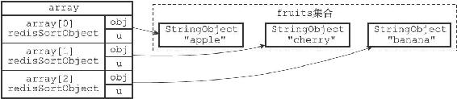
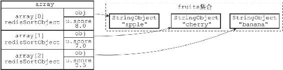
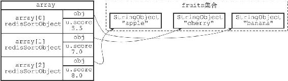

21.4 BY选项的实现

在默认情况下，SORT命令使用被排序键包含的元素作为排序的权重，元素本身决定了元素在排序之后所处的位置。

例如，在下面这个例子里面，排序fruits集合所使用的权重就是"apple"、"banana"、"cherry"三个元素本身：

---

>  
> redis> SADD fruits "apple" "banana" "cherry"  
> (integer) 3  
> redis> SORT fruits ALPHA  
> 1) "apple"  
> 2) "banana"  
> 3) "cherry"  

---

另一方面，通过使用BY选项，SORT命令可以指定某些字符串键，或者某个哈希键所包含的某些域（field）来作为元素的权重，对一个键进行排序。

例如，以下这个例子就使用苹果、香蕉、樱桃三种水果的价钱，对集合键fruits进行了排序：

---

>  
> redis> MSET apple-price 8 banana-price 5.5 cherry-price 7  
> OK  
> redis> SORT fruits BY \*-price  
> 1) "banana"  
> 2) "cherry"  
> 3) "apple"  

---

服务器执行SORT fruits BY\*-price命令的详细步骤如下：

1）创建一个redisSortObject结构数组，数组的长度等于fruits集合的大小。

2）遍历数组，将各个数组项的obj指针分别指向fruits集合的各个元素，如图21-9所示。

3）遍历数组，根据各个数组项的obj指针所指向的集合元素，以及BY选项所给定的模式\*-price，查找相应的权重键：

·对于"apple"元素，查找程序返回权重键"apple-price"。

·对于"banana"元素，查找程序返回权重键"banana-price"。

·对于"cherry"元素，查找程序返回权重键"cherry-price"。

图21-9 将obj指针指向集合的各个元素

4）将各个权重键的值转换成一个double类型的浮点数，然后保存在相应数组项的u.score属性里面，如图21-10所示：

·"apple"元素的权重键"apple-price"的值转换之后为8.0。

·"banana"元素的权重键"banana-price"的值转换之后为5.5。

·"cherry"元素的权重键"cherry-price"的值转换之后为7.0。

图21-10 根据权重键的值设置数组项的u.score属性

5）以数组项u.score属性的值为权重，对数组进行排序，得到一个按u.score属性的值从小到大排序的数组，如图21-11所示：

·权重为5.5的"banana"元素位于数组的索引0位置上。

·权重为7.0的"cherry"元素位于数组的索引1位置上。

·权重为8.0的"apple"元素位于数组的索引2位置上。

6）遍历数组，依次将数组项的obj指针所指向的集合元素返回给客户端。

其他SORT<key>BY<pattern>命令的执行步骤也和这里给出的步骤类似。

图21-11 根据u.score属性进行排序之后的数组
