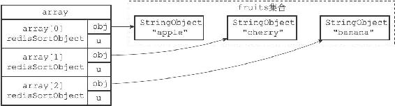
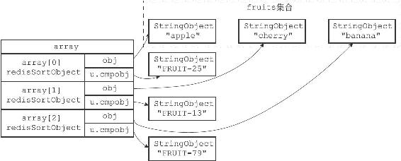
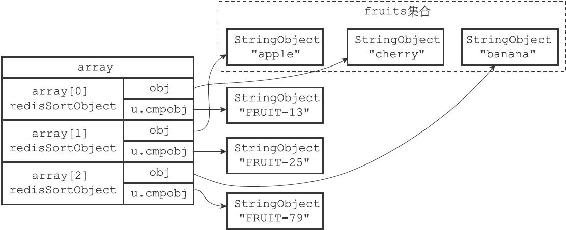

21.5 带有ALPHA选项的BY选项的实现

BY选项默认假设权重键保存的值为数字值，如果权重键保存的是字符串值的话，那么就需要在使用BY选项的同时，配合使用ALPHA选项。

举个例子，如果fruits集合包含的三种水果都有一个相应的字符串编号：

---

>  
> redis> SADD fruits "apple" "banana" "cherry"  
> (integer) 3  
> redis> MSET apple-id "FRUIT-25" banana-id "FRUIT-79" cherry-id "FRUIT-13"  
> OK  

---

那么我们可以使用水果的编号为权重，对fruits集合进行排序：

---

>  
> redis> SORT fruits BY \*-id ALPHA  
> 1)"cherry"  
> 2)"apple"  
> 3)"banana"  

---

服务器执行SORT fruits BY\*-id ALPHA命令的详细步骤如下：

1）创建一个redisSortObject结构数组，数组的长度等于fruits集合的大小。

2）遍历数组，将各个数组项的obj指针分别指向fruits集合的各个元素，如图21-12所示。

图21-12 将obj指针指向集合的各个元素

3）遍历数组，根据各个数组项的obj指针所指向的集合元素，以及BY选项所给定的模式\*-id，查找相应的权重键：

·对于"apple"元素，查找程序返回权重键"apple-id"。

·对于"banana"元素，查找程序返回权重键"banana-id"。

·对于"cherry"元素，查找程序返回权重键"cherry-id"。

4）将各个数组项的u.cmpobj指针分别指向相应的权重键（一个字符串对象），如图21-13所示。

5）以各个数组项的权重键的值为权重，对数组执行字符串排序，结果如图12-14所示：

·权重为"FRUIT-13"的"cherry"元素位于数组的索引0位置上。

·权重为"FRUIT-25"的"apple"元素位于数组的索引1位置上。

·权重为"FRUIT-79"的"banana"元素位于数组的索引2位置上。

6）遍历数组，依次将数组项的obj指针所指向的集合元素返回给客户端。

图21-13 将u.cmpobj指针指向权重键

图21-14 按u.cmpobj所指向的字符串对象进行排序之后的数组

其他SORT <key> BY <pattern>ALPHA命令的执行步骤也和这里给出的步骤类似。
