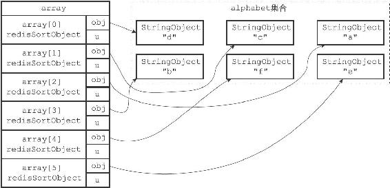
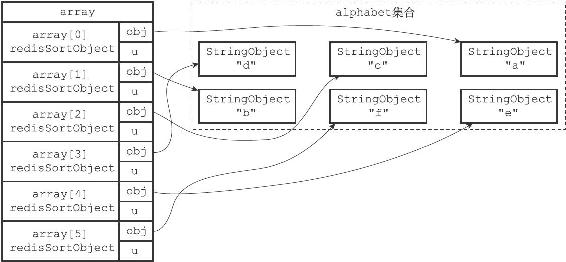

21.6 LIMIT选项的实现

在默认情况下，SORT命令总会将排序后的所有元素都返回给客户端：

---

>  
> redis> SADD alphabet a b c d e f  
> (integer) 6  
> \#   
> 集合中的元素是乱序存放的  
> redis> SMEMBERS alphabet  
> 1) "d"  
> 2) "c"  
> 3) "a"  
> 4) "b"  
> 5) "f"  
> 6) "e"  
> \#   
> 对集合进行排序，并返回所有排序后的元素  
> redis> SORT alphabet ALPHA  
> 1) "a"  
> 2) "b"  
> 3) "c"  
> 4) "d"  
> 5) "e"  
> 6) "f"  

---

但是，通过LIMIT选项，我们可以让SORT命令只返回其中一部分已排序的元素。

LIMIT选项的格式为LIMIT<offset><count>：

·offset参数表示要跳过的已排序元素数量。

·count参数表示跳过给定数量的已排序元素之后，要返回的已排序元素数量。

举个例子，以下代码首先对alphabet集合进行排序，接着跳过0个已排序元素，然后返回4个已排序元素：

---

>  
> redis> SORT alphabet ALPHA LIMIT 0 4  
> 1) "a"  
> 2) "b"  
> 3) "c"  
> 4) "d"  

---

与此类似，以下代码首先对alphabet集合进行排序，接着跳过2个已排序元素，然后返回3个已排序元素：

---

>  
> redis> SORT alphabet ALPHA LIMIT 2 3  
> 1) "c"  
> 2) "d"  
> 3) "e"  

---

服务器执行SORT alphabet ALPHA LIMIT 0 4命令的详细步骤如下：

1）创建一个redisSortObject结构数组，数组的长度等于alphabet集合的大小。

2）遍历数组，将各个数组项的obj指针分别指向alphabet集合的各个元素，如图21-15所示。

3）根据obj指针所指向的集合元素，对数组进行字符串排序，排序后的数组如图21-16所示。

4）根据选项LIMIT 0 4，将指针移动到数组的索引0上面，然后依次访问array\[0\]、array\[1\]、array\[2\]、array\[3\]这4个数组项，并将数组项的obj指针所指向的元素"a"、"b"、"c"、"d"返回给客户端。

服务器执行SORT alphabet ALPHA LIMIT 2 3命令时的第一至第三步都和执行SORT alphabet ALPHA LIMIT 0 4命令时的步骤一样，只是第四步有所不同，上面的第4步如下：

4）根据选项LIMIT 2 3，将指针移动到数组的索引2上面，然后依次访问array\[2\]、array\[3\]、array\[4\]这3个数组项，并将数组项的obj指针所指向的元素"c"、"d"、"e"返回给客户端。

SORT命令在执行其他带有LIMIT选项的排序操作时，执行的步骤也和这里给出的步骤类似。

图21-15 将obj指针指向集合的各个元素

图21-16 排序后的数组
