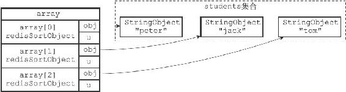
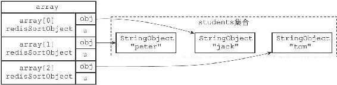

21.7 GET选项的实现

在默认情况下，SORT命令在对键进行排序之后，总是返回被排序键本身所包含的元素。

比如说，在以下这个对students集合进行排序的例子中，SORT命令返回的就是被排序之后的students集合的元素：

---

>  
> redis> SADD students "peter" "jack" "tom"  
> (integer) 3  
> redis> SORT students ALPHA  
> 1) "jack"  
> 2) "peter"  
> 3) "tom"  

---

但是，通过使用GET选项，我们可以让SORT命令在对键进行排序之后，根据被排序的元素，以及GET选项所指定的模式，查找并返回某些键的值。

比如说，在以下这个例子中，SORT命令首先对students集合进行排序，然后根据排序结果中的元素（学生的简称），查找并返回这些学生的全名：

---

>  
> \#   
> 设置peter  
> 、jack  
> 、tom  
> 的全名  
> redis> SET peter-name "Peter White"  
> OK  
> redis> SET jack-name "Jack Snow"  
> OK  
> redis> SET tom-name "Tom Smith"  
> OK  
> \# SORT  
> 命令首先对students  
> 集合进行排序，得到排序结果  
> \# 1) "jack"  
> \# 2) "peter"  
> \# 3) "tom"  
> \#   
> 然后根据这些结果，获取并返回键jack-name  
> 、peter-name  
> 和tom-name  
> 的值  
> redis> SORT students ALPHA GET \*-name  
> 1) "Jack Snow"  
> 2) "Peter White"  
> 3) "Tom Smith"  

---

服务器执行SORT students ALPHA GET\*-name命令的详细步骤如下：

1）创建一个redisSortObject结构数组，数组的长度等于students集合的大小。

2）遍历数组，将各个数组项的obj指针分别指向students集合的各个元素，如图21-17所示。

3）根据obj指针所指向的集合元素，对数组进行字符串排序，排序后的数组如图21-18所示：

·被排序到数组索引0位置的是"jack"元素。

·被排序到数组索引1位置的是"peter"元素。

·被排序到数组索引2位置的是"tom"元素。

4）遍历数组，根据数组项obj指针所指向的集合元素，以及GET选项所给定的\*-name模式，查找相应的键：

·对于"jack"元素和\*-name模式，查找程序返回键jack-name。

·对于"peter"元素和\*-name模式，查找程序返回键peter-name。

·对于"tom"元素和\*-name模式，查找程序返回键tom-name。

图21-17 排序之前的数组

图21-18 排序之后的数组

5）遍历查找程序返回的三个键，并向客户端返回它们的值：

·首先返回的是jack-name键的值"Jack Snow"。

·然后返回的是peter-name键的值"Peter White"。

·最后返回的是tom-name键的值"Tom Smith"。

因为一个SORT命令可以带有多个GET选项，所以随着GET选项的增多，命令要执行的查找操作也会增多。

举个例子，以下SORT命令对students集合进行了排序，并通过两个GET选项来获取被排序元素（一个学生）所对应的全名和出生日期：

---

>  
> \#   
> 为学生设置出生日期  
> redis> SET peter-birth 1995-6-7  
> OK  
> redis> SET tom-birth 1995-8-16  
> OK  
> redis> SET jack-birth 1995-5-24  
> OK  
> \#   
> 排序students  
> 集合，并获取相应的全名和出生日期  
> redis> SORT students ALPHA GET \*-name GET \*-birth  
> 1) "Jack Snow"  
> 2) "1995-5-24"  
> 3) "Peter White"  
> 4) "1995-6-7"  
> 5) "Tom Smith"  
> 6) "1995-8-16"  

---

服务器执行SORT students ALPHA GET\*-name GET\*-birth命令的前三个步骤，和执行SORT students ALPHA GET\*-name命令时的前三个步骤相同，但从第四步开始有所区别：

4）遍历数组，根据数组项obj指针所指向的集合元素，以及两个GET选项所给定的\*-name模式和\*-birth模式，查找相应的键：

·对于"jack"元素和\*-name模式，查找程序返回jack-name键。

·对于"jack"元素和\*-birth模式，查找程序返回jack-birth键。

·对于"peter"元素和\*-name模式，查找程序返回peter-name键。

·对于"peter"元素和\*-birth模式，查找程序返回peter-birth键。

·对于"tom"元素和\*-name模式，查找程序返回tom-name键。

·对于"tom"元素和\*-birth模式，查找程序返回tom-birth键。

5）遍历查找程序返回的六个键，并向客户端返回它们的值：

·首先返回jack-name键的值"Jack Snow"。

·其次返回jack-birth键的值"1995-5-24"。

·之后返回peter-name键的值"Peter White"。

·再之后返回peter-birth键的值"1995-6-7"。

·然后返回tom-name键的值"Tom Smith"。

·最后返回tom-birth键的值"1995-8-16"。

SORT命令在执行其他带有GET选项的排序操作时，执行的步骤也和这里给出的步骤类似。
