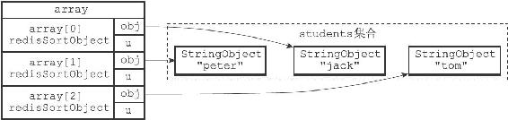

21.8 STORE选项的实现

在默认情况下，SORT命令只向客户端返回排序结果，而不保存排序结果：

---

>  
> redis> SADD students "peter" "jack" "tom"  
> (integer) 3  
> redis> SORT students ALPHA  
> 1) "jack"  
> 2) "peter"  
> 3) "tom"  

---

但是，通过使用STORE选项，我们可以将排序结果保存在指定的键里面，并在有需要时重用这个排序结果：

---

>  
> redis> SORT students ALPHA STORE sorted\_students  
> (integer) 3  
> redis> LRANGE sorted\_students 0-1  
> 1) "jack"  
> 2) "peter"  
> 3) "tom"  

---

服务器执行SORT students ALPHA STORE sorted\_students命令的详细步骤如下：

1）创建一个redisSortObject结构数组，数组的长度等于students集合的大小。

2）遍历数组，将各个数组项的obj指针分别指向students集合的各个元素。

3）根据obj指针所指向的集合元素，对数组进行字符串排序，排序后的数组如图21-19所示：

·被排序到数组索引0位置的是"jack"元素。

·被排序到数组索引1位置的是"peter"元素。

·被排序到数组索引2位置的是"tom"元素。

图21-19 排序之后的数组

4）检查sorted\_students键是否存在，如果存在的话，那么删除该键。

5）设置sorted\_students为空白的列表键。

6）遍历数组，将排序后的三个元素"jack"、"peter"和"tom"依次推入sorted\_students列表的末尾，相当于执行命令RPUSH sorted\_students"jack"、"peter"、"tom"。

7）遍历数组，向客户端返回"jack"、"peter"、"tom"三个元素。

SORT命令在执行其他带有STORE选项的排序操作时，执行的步骤也和这里给出的步骤类似。
