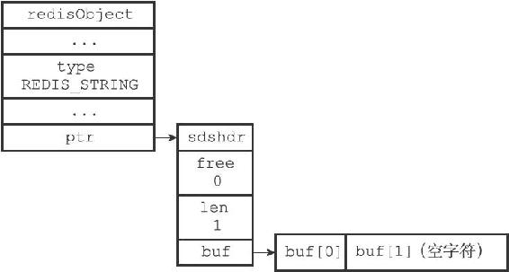
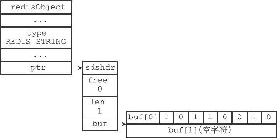
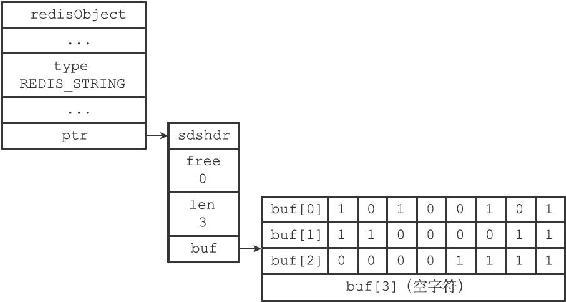

22.1 位数组的表示

Redis使用字符串对象来表示位数组，因为字符串对象使用的SDS数据结构是二进制安全的，所以程序可以直接使用SDS结构来保存位数组，并使用SDS结构的操作函数来处理位数组。

图22-1展示了用SDS表示的，一字节长的位数组：

·redisObject.type的值为REDIS\_STRING，表示这是一个字符串对象。

·sdshdr.len的值为1，表示这个SDS保存了一个一字节长的位数组。

·buf数组中的buf\[0\]字节保存了一字节长的位数组。

·buf数组中的buf\[1\]字节保存了SDS程序自动追加到值的末尾的空字符'\\0'。

图22-1 SDS表示的位数组

因为本章介绍的操作涉及二进制位，为了清晰地展示各个位的值，本章会对SDS中buf数组的展示方式进行一些修改，让各个字节的各个位都可以清楚地展现出来。比如说，本章会将前面图22-1展示的SDS值改成图22-2所示的样子。

图22-2 一字节长的位数组的SDS表示

现在，buf数组的每个字节都用一行来表示，每行的第一个格子buf\[i\]表示这是buf数组的哪个字节，而buf\[i\]之后的八个格子则分别代表这一字节中的八个位。

需要注意的是，buf数组保存位数组的顺序和我们平时书写位数组的顺序是完全相反的，例如，在图22-2的buf\[0\]字节中，各个位的值分别是1、0、1、1、0、0、1、0，这表示buf\[0\]字节保存的位数组为0100 1101。使用逆序来保存位数组可以简化SETBIT命令的实现，详细的情况稍后在介绍SETBIT命令的实现原理时会说到。

图22-3展示了另一个位数组示例：

·sdshdr.len属性的值为3，表示这个SDS保存了一个三字节长的位数组。

·位数组由buf数组中的buf\[0\]、buf\[1\]、buf\[2\]三个字节保存，和之前说明的一样，buf数组使用逆序来保存位数组：位数组1111 0000 1100 0011 1010 0101在buf数组中会被保存为1010 0101 1100 0011 0000 1111。

图22-3 三字节长的位数组的SDS表示
