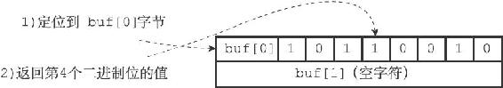
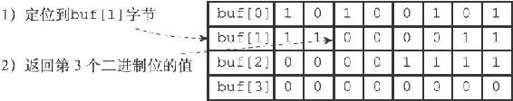

22.2 GETBIT命令的实现

GETBIT命令用于返回位数组bitarray在offset偏移量上的二进制位的值：

---

>  
> GETBIT <bitarray> <offset>  

---

GETBIT命令的执行过程如下：

1）计算byte= offset÷8」，byte值记录了offset偏移量指定的二进制位保存在位数组的哪个字节。

2）计算bit=（offset mod 8）+1，bit值记录了offset偏移量指定的二进制位是byte字节的第几个二进制位。

3）根据byte值和bit值，在位数组bitarray中定位offset偏移量指定的二进制位，并返回这个位的值。

举个例子，对于图22-2所示的位数组来说，命令：

---

>  
> GETBIT <bitarray> 3  

---

将执行以下操作：

1） 3÷8」的值为0。

2）（3 mod 8）+1的值为4。

3）定位到buf\[0\]字节上面，然后取出该字节上的第4个二进制位（从左向右数）的值。

4）向客户端返回二进制位的值1。

命令的执行过程如图22-4所示。

图22-4 查找并返回offset为3的二进制位的过程

再举一个例子，对于图22-3所示的位数组来说，命令：

---

>  
> GETBIT <bitarray> 10  

---

将执行以下操作：

1） 10÷8」的值为1。

2）（10 mod 8）+1的值为3。

3）定位到buf\[1\]字节上面，然后取出该字节上的第3个二进制位的值。

4）向客户端返回二进制位的值0。

命令的执行过程如图22-5所示。

图22-5 查找并返回offset为10的二进制位的过程

因为GETBIT命令执行的所有操作都可以在常数时间内完成，所以该命令的算法复杂度为O（1）。
