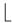
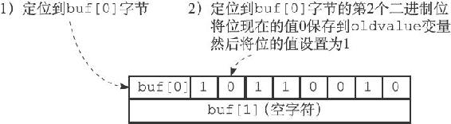
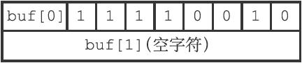
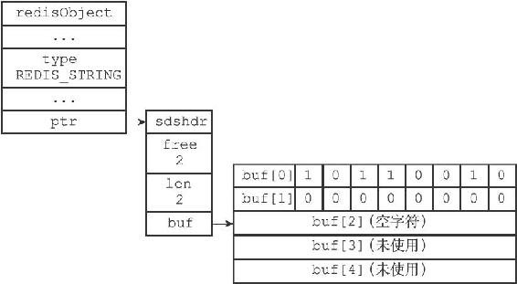
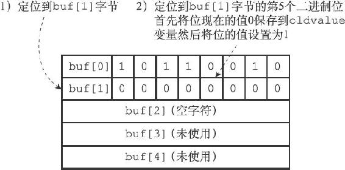
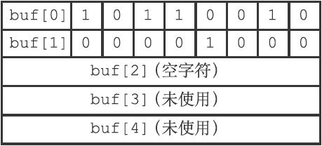
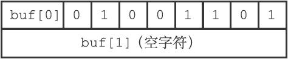
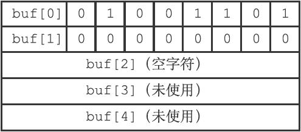
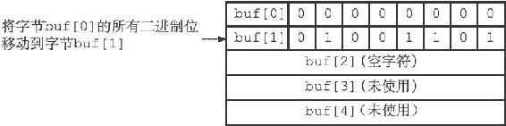
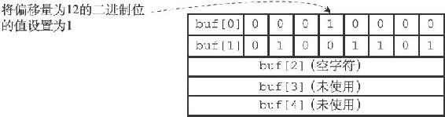

22.3 SETBIT命令的实现

SETBIT用于将位数组bitarray在offset偏移量上的二进制位的值设置为value，并向客户端返回二进制位被设置之前的旧值：

---

>  
> SETBIT <bitarray> <offset> <value>  

---

以下是SETBIT命令的执行过程：

1）计算len= offset÷8」+1，len值记录了保存offset偏移量指定的二进制位至少需要多少字节。

2）检查bitarray键保存的位数组（也即是SDS）的长度是否小于len，如果是的话，将SDS的长度扩展为len字节，并将所有新扩展空间的二进制位的值设置为0。

3）计算byte= offset÷8」，byte值记录了offset偏移量指定的二进制位保存在位数组的哪个字节。

4）计算bit=（offset mod 8）+1，bit值记录了offset偏移量指定的二进制位是byte字节的第几个二进制位。

5）根据byte值和bit值，在bitarray键保存的位数组中定位offset偏移量指定的二进制位，首先将指定二进制位现在值保存在oldvalue变量，然后将新值value设置为这个二进制位的值。

6）向客户端返回oldvalue变量的值。

因为SETBIT命令执行的所有操作都可以在常数时间内完成，所以该命令的时间复杂度为O（1）。

22.3.1 SETBIT命令的执行示例

让我们通过观察一些SETBIT命令的执行例子来熟悉SETBIT命令的运行过程。

首先，如果我们对图22-2所示的位数组执行命令：

---

>  
> SETBIT <bitarray> 1 1  

---

那么服务器将执行以下操作：

1）计算 1÷8」+1，得出值1，这表示保存偏移量为1的二进制位至少需要1字节长位数组。

2）检查位数组的长度，发现SDS的长度不小于1字节，无须执行扩展操作。

3）计算 1÷8」，得出值0，说明偏移量为1的二进制位位于buf\[0\]字节。

4）计算（1 mod 8）+1，得出值2，说明偏移量为1的二进制位是buf\[0\]字节的第2个二进制位。

5）定位到buf\[0\]字节的第2个二进制位上面，将二进制位现在的值0保存到oldvalue变量，然后将二进制位的值设置为1。

6）向客户端返回oldvalue变量的值0。

图22-6 SETBIT命令的执行过程

图22-6展示了SETBIT命令的执行过程，而图22-7则展示了SETBIT命令执行之后，位数组的样子。

图22-7 SETBIT命令执行之后的位数组

22.3.2 带扩展操作的SETBIT命令示例

前面展示的SETBIT例子无须对位数组进行扩展，现在，让我们来看一个需要对位数组进行扩展的例子。

假设我们对图22-2所示的位数组执行命令：

---

>  
> SETBIT <bitarray> 12 1  

---

那么服务器将执行以下操作：

1）计算 12÷8」+1，得出值2，这表示保存偏移量为12的二进制位至少需要2字节长的位数组。

2）对位数组的长度进行检查，得知位数组现在的长度为1字节，这比执行命令所需的最小长度2字节要小，所以程序会要求将位数组的长度扩展为2字节。不过，尽管程序只要求2字节长的位数组，但SDS的空间预分配策略会为SDS额外多分配2字节的未使用空间，再加上为保存空字符而额外分配的1字节，扩展之后buf数组的实际长度为5字节，如图22-8所示。

图22-8 扩展空间之后的位数组

3）计算 12÷8」，得出值1，说明偏移量为12的二进制位位于buf\[1\]字节中。

4）计算（12 mod 8）+1，得出值5，说明偏移量为12的二进制位是buf\[1\]字节的第5个二进制位。

5）定位到buf\[1\]字节的第5个二进制位，将二进制位现在的值0保存到oldvalue变量，然后将二进制位的值设置为1。

6）向客户端返回oldvalue变量的值0。

图22-9展示了SETBIT命令定位并设置指定二进制位的过程，而图22-10则展示了SETBIT命令执行之后，位数组的样子。

图22-9 SETBIT命令的执行过程

图22-10 执行SETBIT命令之后的位数组

注意，因为buf数组使用逆序来保存位数组，所以当程序对buf数组进行扩展之后，写入操作可以直接在新扩展的二进制位中完成，而不必改动位数组原来已有的二进制位。

相反地，如果buf数组使用和书写位数组时一样的顺序来保存位数组，那么在每次扩展buf数组之后，程序都需要将位数组已有的位进行移动，然后才能执行写入操作，这比SETBIT命令目前的实现方式要复杂，并且移位带来的CPU时间消耗也会影响命令的执行速度。

图22-11至图22-14模拟了程序在buf数组按书写顺序保存位数组的情况下，对位数组0100 1101执行命令SETBIT <bitarray> 12 1，将值改为0001 0000 0100 1101的整个过程。

图22-11 按书写顺序保存的位数组0100 1101

图22-12 扩展之后的位数组

图22-13 移动已有的二进制位

图22-14 设置指定二进制位的值
