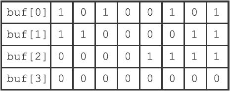
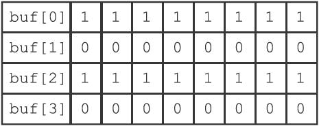
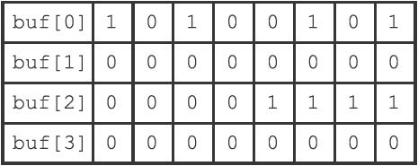

22.5 BITOP命令的实现

因为C语言直接支持对字节执行逻辑与（&）、逻辑或（|）、逻辑异或（^）和逻辑非（\~）操作，所以BITOP命令的AND、OR、XOR和NOT四个操作都是直接基于这些逻辑操作实现的：

·在执行BITOP AND命令时，程序用&操作计算出所有输入二进制位的逻辑与结果，然后保存在指定的键上面。

·在执行BITOP OR命令时，程序用|操作计算出所有输入二进制位的逻辑或结果，然后保存在指定的键上面。

·在执行BITOP XOR命令时，程序用^操作计算出所有输入二进制位的逻辑异或结果，然后保存在指定的键上面。

·在执行BITOP NOT命令时，程序用\~操作计算出输入二进制位的逻辑非结果，然后保存在指定的键上面。

举个例子，假设客户端执行命令：

---

>  
> BITOP AND result x y  

---

其中，键x保存的位数组如图22-18所示，而键y保存的位数组如图22-19所示，BITOP命令将执行以下操作：

图22-18 键x所保存的位数组

图22-19 键y所保存的位数组

1）创建一个空白的位数组value，用于保存AND操作的结果。

2）对两个位数组的第一个字节执行buf\[0\] & buf\[0\]操作，并将结果保存到value\[0\]字节。

3）对两个位数组的第二个字节执行buf\[1\] & buf\[1\]操作，并将结果保存到value\[1\]字节。

4）对两个位数组的第三个字节执行buf\[2\] & buf\[2\]操作，并将结果保存到value\[2\]字节。

5）经过前面的三次逻辑与操作，程序得到了图22-20所示的计算结果，并将它保存在键result上面。

图22-20 键x和键y执行BITOP AND命令产生的结果

BITOP OR、BITOP XOR、BITOP NOT命令的执行过程和这里列出的BITOP AND的执行过程类似。

因为BITOP AND、BITOP OR、BITOP XOR三个命令可以接受多个位数组作为输入，程序需要遍历输入的每个位数组的每个字节来进行计算，所以这些命令的复杂度为O（n2）；与此相反，因为BITOP NOT命令只接受一个位数组输入，所以它的复杂度为O（n）。
