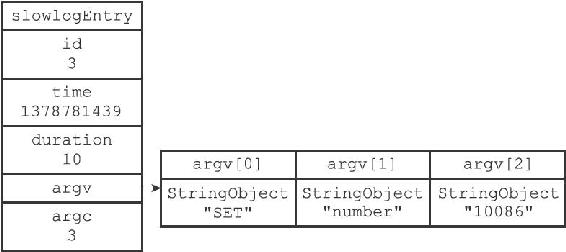
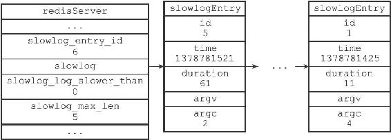

23.1 慢查询记录的保存

服务器状态中包含了几个和慢查询日志功能有关的属性：

---

>  
> struct redisServer {  
> // ...  
> //   
> 下一条慢查询日志的ID  
> long long slowlog\_entry\_id;  
> //   
> 保存了所有慢查询日志的链表  
> list \*slowlog;  
> //   
> 服务器配置slowlog-log-slower-than  
> 选项的值  
> long long slowlog\_log\_slower\_than;  
> //   
> 服务器配置slowlog-max-len  
> 选项的值  
> unsigned long slowlog\_max\_len;  
> // ...  
> };  

---

slowlog\_entry\_id属性的初始值为0，每当创建一条新的慢查询日志时，这个属性的值就会用作新日志的id值，之后程序会对这个属性的值增一。

例如，在创建第一条慢查询日志时，slowlog\_entry\_id的值0会成为第一条慢查询日志的ID，而之后服务器会对这个属性的值增一；当服务器再创建新的慢查询日志的时候，slowlog\_entry\_id的值1就会成为第二条慢查询日志的ID，然后服务器再次对这个属性的值增一，以此类推。

slowlog链表保存了服务器中的所有慢查询日志，链表中的每个节点都保存了一个slowlogEntry结构，每个slowlogEntry结构代表一条慢查询日志：

---

>  
> typedef struct slowlogEntry {  
> //   
> 唯一标识符  
> long long id;  
> //   
> 命令执行时的时间，格式为UNIX  
> 时间戳  
> time\_t time;  
> //   
> 执行命令消耗的时间，以微秒为单位  
> long long duration;  
> //   
> 命令与命令参数  
> robj \*\*argv;  
> //   
> 命令与命令参数的数量  
> int argc;  
> } slowlogEntry;  

---

举个例子，对于以下慢查询日志来说：

---

>  
> 1) (integer) 3  
> 2) (integer) 1378781439  
> 3) (integer) 10  
> 4) 1) "SET"  
> 2) "number"  
> 3) "10086"  

---

图23-1展示的就是该日志所对应的slowlogEntry结构。

图23-1 slowlogEntry结构示例

图23-2展示了服务器状态中和慢查询功能有关的属性：

图23-2 redisServer结构示例

·slowlog\_entry\_id的值为6，表示服务器下条慢查询日志的id值将为6。

·slowlog链表包含了id为5至1的慢查询日志，最新的5号日志排在链表的表头，而最旧的1号日志排在链表的表尾，这表明slowlog链表是使用插入到表头的方式来添加新日志的。

·slowlog\_log\_slower\_than记录了服务器配置slowlog-log-slower-than选项的值0，表示任何执行时间超过0微秒的命令都会被慢查询日志记录。

·slowlog-max-len属性记录了服务器配置slowlog-max-len选项的值5，表示服务器最多储存五条慢查询日志。

注意

因为版面空间不足，所以图23-2展示的各个slowlogEntry结构都省略了argv数组。
