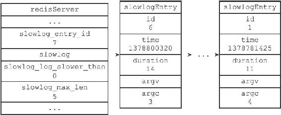
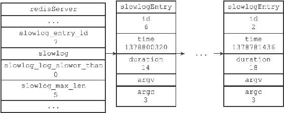

23.3 添加新日志

在每次执行命令的之前和之后，程序都会记录微秒格式的当前UNIX时间戳，这两个时间戳之间的差就是服务器执行命令所耗费的时长，服务器会将这个时长作为参数之一传给slowlogPushEntryIfNeeded函数，而slowlogPushEntryIfNeeded函数则负责检查是否需要为这次执行的命令创建慢查询日志，以下伪代码展示了这一过程：

---

>  
> \#   
> 记录执行命令前的时间  
> before = unixtime\_now\_in\_us()  
> \#   
> 执行命令  
> execute\_command(argv, argc, client)  
> \#   
> 记录执行命令后的时间  
> after = unixtime\_now\_in\_us()  
> \#   
> 检查是否需要创建新的慢查询日志  
> slowlogPushEntryIfNeeded(argv, argc, before-after)  

---

slowlogPushEntryIfNeeded函数的作用有两个：

1）检查命令的执行时长是否超过slowlog-log-slower-than选项所设置的时间，如果是的话，就为命令创建一个新的日志，并将新日志添加到slowlog链表的表头。

2）检查慢查询日志的长度是否超过slowlog-max-len选项所设置的长度，如果是的话，那么将多出来的日志从slowlog链表中删除掉。

以下是slowlogPushEntryIfNeeded函数的实现代码：

---

>  
> void slowlogPushEntryIfNeeded(robj \*\*argv, int argc, long long duration) {  
> //   
> 慢查询功能未开启，直接返回  
> if (server.slowlog\_log\_slower\_than < 0) return;  
> //   
> 如果执行时间超过服务器设置的上限，那么将命令添加到慢查询日志  
> if (duration >= server.slowlog\_log\_slower\_than)  
> //   
> 新日志添加到链表表头  
> listAddNodeHead(server.slowlog,slowlogCreateEntry(argv,argc,duration));  
> //   
> 如果日志数量过多，那么进行删除  
> while (listLength(server.slowlog) > server.slowlog\_max\_len)  
> listDelNode(server.slowlog,listLast(server.slowlog));  
> }  

---

函数中的大部分代码我们已经介绍过了，唯一需要说明的是slowlogCreateEntry函数：该函数根据传入的参数，创建一个新的慢查询日志，并将redisServer.slowlog\_entry\_id的值增1。

举个例子，假设服务器当前保存的慢查询日志如图23-2所示，如果我们执行以下命令：

---

>  
> redis> EXPIRE msg 10086  
> (integer) 1  

---

服务器在执行完这个EXPIRE命令之后，就会调用slowlogPushEntryIfNeeded函数，函数将为EXPIRE命令创建一条id为6的慢查询日志，并将这条新日志添加到slowlog链表的表头，如图23-3所示。

图23-3 EXPIRE命令执行之后的服务器状态

注意，除了slowlog链表发生了变化之外，slowlog\_entry\_id的值也从6变为7了。

之后，slowlogPushEntryIfNeeded函数发现，服务器设定的最大慢查询日志数目为5条，而服务器目前保存的慢查询日志数目为6条，于是服务器将id为1的慢查询日志删除，让服务器的慢查询日志数量回到设定好的5条。

删除操作执行之后的服务器状态如图23-4所示。

图23-4 删除id为1的慢查询日志之后的服务器状态
