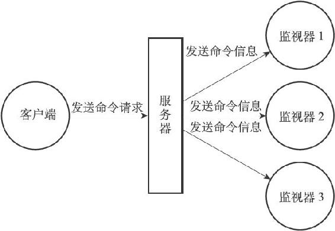

第24章 监视器

通过执行MONITOR命令，客户端可以将自己变为一个监视器，实时地接收并打印出服务器当前处理的命令请求的相关信息：

---

>  
> redis> MONITOR  
> OK  
> 1378822099.421623 \[0 127.0.0.1:56604\] "PING"  
> 1378822105.089572 \[0 127.0.0.1:56604\] "SET" "msg" "hello world"  
> 1378822109.036925 \[0 127.0.0.1:56604\] "SET" "number" "123"  
> 1378822140.649496 \[0 127.0.0.1:56604\] "SADD" "fruits" "Apple" "Banana" "Cherry"  
> 1378822154.117160 \[0 127.0.0.1:56604\] "EXPIRE" "msg" "10086"  
> 1378822257.329412 \[0 127.0.0.1:56604\] "KEYS" "\*"  
> 1378822258.690131 \[0 127.0.0.1:56604\] "DBSIZE"  

---

每当一个客户端向服务器发送一条命令请求时，服务器除了会处理这条命令请求之外，还会将关于这条命令请求的信息发送给所有监视器，如图24-1所示。

图24-1 命令的接收和信息的发送
