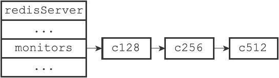
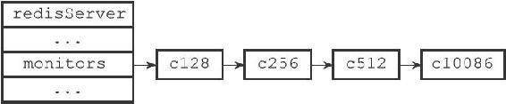

24.1 成为监视器

发送MONITOR命令可以让一个普通客户端变为一个监视器，该命令的实现原理可以用以下伪代码来实现：

---

>  
> def MONITOR():  
> \#   
> 打开客户端的监视器标志  
> client.flags |= REDIS\_MONITOR  
> \#   
> 将客户端添加到服务器状态的monitors  
> 链表的末尾  
> server.monitors.append(client)  
> \#   
> 向客户端返回OK  
> send\_reply("OK")  

---

举个例子，如果客户端c10086向服务器发送MONITOR命令，那么这个客户端的REDIS\_MONITOR标志会被打开，并且这个客户端本身会被添加到monitors链表的表尾。

假设客户端c10086发送MONITOR命令之前，monitors链表的状态如图24-2所示，那么在服务器执行客户端c10086发送的MONITOR命令之后，monitors链表将被更新为图24-3所示的状态。

图24-2 客户端c10086执行MONITOR命令之前的monitors链表

图24-3 客户端c10086执行MONITOR命令之后的monitors链表
