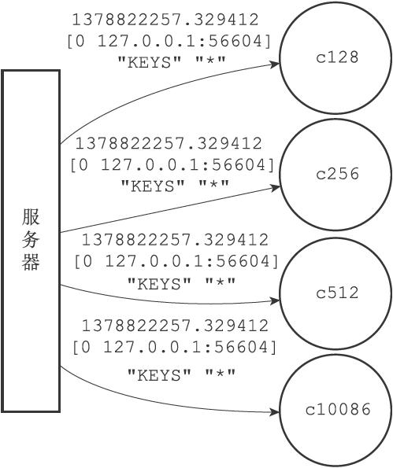

24.2 向监视器发送命令信息

服务器在每次处理命令请求之前，都会调用replicationFeedMonitors函数，由这个函数将被处理的命令请求的相关信息发送给各个监视器。

以下是replicationFeedMonitors函数的伪代码定义，函数首先根据传入的参数创建信息，然后将信息发送给所有监视器：

---

>  
> def replicationFeedMonitors(client, monitors, dbid, argv, argc):  
> \#   
> 根据执行命令的客户端、当前数据库的号码、命令参数、命令参数个数等参数  
> \#   
> 创建要发送给各个监视器的信息  
> msg = create\_message(client, dbid, argv, argc)  
> \#   
> 遍历所有监视器  
> for monitor in monitors:  
> \#   
> 将信息发送给监视器  
> send\_message(monitor, msg)  

---

举个例子，假设服务器在时间1378822257.329412，根据IP为127.0.0.1、端口号为56604的客户端发送的命令请求，对0号数据库执行命令KEYS\*，那么服务器将创建以下信息：

---

>  
> 1378822257.329412 \[0 127.0.0.1:56604\] "KEYS" "\*"  

---

如果服务器monitors链表的当前状态如图24-3所示，那么服务器会分别将信息发送给c128、c256、c512和c10086四个监视器，如图24-4所示。

图24-4 服务器将信息发送给各个监视器
