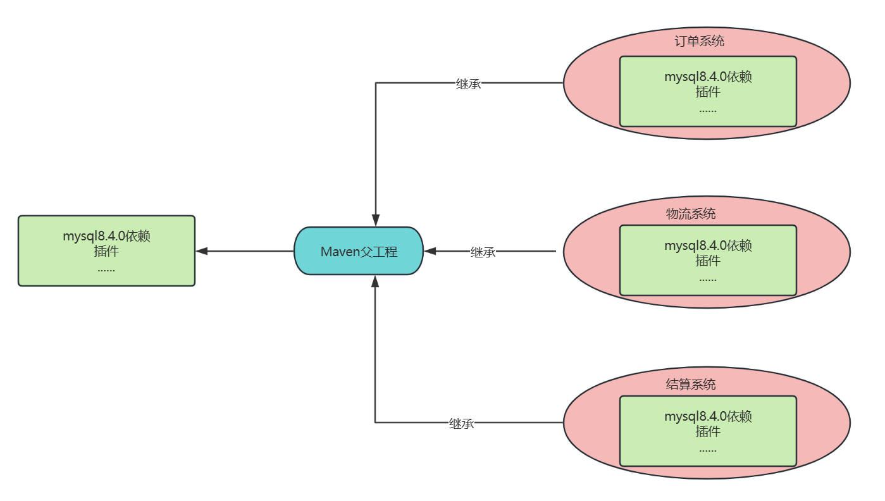
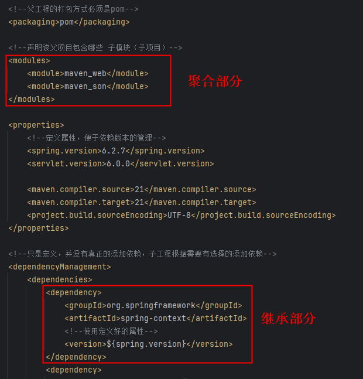
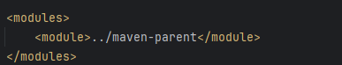

# Maven的继承和聚合


## 什么是Maven的继承

Maven 的**依赖传递机制**可以一定程度上简化 POM 的配置，但这**仅限于存在依赖关系的项目或模块**中。

当一个项目的多个模块都依赖于相同版本的 jar 包，且这些模块之间不存在依赖关系，这就导致同**一个依赖需要在多个模块中重复声明**，这显然是不可取的，大量的前人经验告诉我们，**重复往往意味着更多的劳动和更高的潜在风险**。


在 Java 面向对象中，我们可以建立一种类的父子结构，然后在父类中声明一些字段和方法供子类继承，这样就可以一定程度上消除重复，做到 “一处声明，多处使用”。在 Maven 的世界中，也有类似的机制，它就是 POM 继承。


Maven 在设计时，借鉴了 Java 面向对象中的继承思想，提出了 POM 继承思想。当一个项目包含多个模块时，可以在该项目中再创建一个**父模块，并在其 POM 中声明依赖，其他模块的 POM 可通过继承父模块的 POM 来获得对相关依赖的声明**。


如图所示：



## packaging必须是pom

**父工程的 **`packaging`** 必须设为 **`pom`**，因为它本身不包含代码或需要构建产物（如 JAR/WAR），而是作为管理角色，用于统一配置（依赖、插件等）和聚合子模块（**`<modules>`**）。**  

简单来说：  

+ **不打包代码**：父工程只做管理，不编译、不生成 JAR/WAR。  
+ **核心作用**：通过 `<modules>` 管理子模块，通过 `<dependencyManagement>` 统一依赖版本。  
+ **Maven 规范**：`packaging=pom` 是 Maven 识别父工程的标志，确保配置正确继承。

如果误设为 `jar`，Maven 会尝试编译父工程（通常无代码），导致构建失败或逻辑混乱。

## 子工程继承父工程的什么

| **元素**                                                 | **描述**                                                     |
| -------------------------------------------------------- | ------------------------------------------------------------ |
| <font style="color:#DF2A3F;">groupId</font>              | <font style="color:#DF2A3F;">项目组 ID，项目坐标的核心元素</font> |
| <font style="color:#DF2A3F;">version</font>              | <font style="color:#DF2A3F;">项目版本，项目坐标的核心元素</font> |
| description                                              | 项目的描述信息                                               |
| organization                                             | 项目的组织信息                                               |
| inceptionYear                                            | 项目的创始年份                                               |
| url                                                      | 项目的 URL 地址                                              |
| developers                                               | 项目的开发者信息                                             |
| contributors                                             | 项目的贡献者信息                                             |
| distributionManagement                                   | 项目的部署配置                                               |
| issueManagement                                          | 项目的缺陷跟踪系统信息                                       |
| ciManagement                                             | 项目的持续集成系统信息                                       |
| scm                                                      | 项目的版本控制系统信息                                       |
| mailingLists                                             | 项目的邮件列表信息                                           |
| <font style="color:#DF2A3F;">properties</font>           | <font style="color:#DF2A3F;">自定义的 Maven 属性</font>      |
| <font style="color:#DF2A3F;">dependencies</font>         | <font style="color:#DF2A3F;">项目的依赖配置</font>           |
| <font style="color:#DF2A3F;">dependencyManagement</font> | <font style="color:#DF2A3F;">项目的依赖管理配置</font>       |
| repositories                                             | 项目的仓库配置                                               |
| <font style="color:#DF2A3F;">build</font>                | <font style="color:#DF2A3F;">包括项目的源码目录配置、输出目录配置、插件配置、插件管理配置等</font> |
| reporting                                                | 包括项目的报告输出目录配置、报告插件配置等                   |


## 父工程示例

```xml
<?xml version="1.0" encoding="UTF-8"?>
<project xmlns="http://maven.apache.org/POM/4.0.0"
         xmlns:xsi="http://www.w3.org/2001/XMLSchema-instance"
         xsi:schemaLocation="http://maven.apache.org/POM/4.0.0 http://maven.apache.org/xsd/maven-4.0.0.xsd">
    <modelVersion>4.0.0</modelVersion>

    <groupId>com.jkweilai</groupId>
    <artifactId>maven-parent</artifactId>
    <version>1.0-SNAPSHOT</version>
    <!--父工程的打包方式必须是pom-->
    <packaging>pom</packaging>

    <!--声明该父项目包含哪些 子模块（子项目）：聚合子项目-->
    <modules>
        <module>maven_web</module>
        <module>maven_son</module>
    </modules>

    <properties>
        <!--定义属性，集中管理版本号。便于维护。-->
        <spring.version>6.2.7</spring.version>
        <servlet.version>6.0.0</servlet.version>

        <maven.compiler.source>21</maven.compiler.source>
        <maven.compiler.target>21</maven.compiler.target>
        <project.build.sourceEncoding>UTF-8</project.build.sourceEncoding>
    </properties>

    <!--只是定义，并没有真正的添加依赖，子工程根据需要有选择的添加依赖-->
    <dependencyManagement>
        <dependencies>
            <dependency>
                <groupId>org.springframework</groupId>
                <artifactId>spring-context</artifactId>
                <!--使用定义好的属性-->
                <version>${spring.version}</version>
            </dependency>
            <dependency>
                <groupId>jakarta.servlet</groupId>
                <artifactId>jakarta.servlet-api</artifactId>
                <version>${servlet.version}</version>
                <scope>provided</scope>
            </dependency>
        </dependencies>
    </dependencyManagement>

    <build>
        <!--只用于声明插件配置，不会实际执行插件-->
        <pluginManagement>
            <plugins>
                <plugin>
                    <groupId>org.eclipse.jetty</groupId>
                    <artifactId>jetty-maven-plugin</artifactId>
                    <version>11.0.25</version>
                    <configuration>
                        <httpConnector>
                            <port>8080</port>
                        </httpConnector>
                        <webApp>
                            <contextPath>/</contextPath>
                        </webApp>
                    </configuration>
                </plugin>
            </plugins>
        </pluginManagement>
    </build>

</project>
```

## 子工程示例

```xml
<?xml version="1.0" encoding="UTF-8"?>
<project xmlns="http://maven.apache.org/POM/4.0.0"
         xmlns:xsi="http://www.w3.org/2001/XMLSchema-instance"
         xsi:schemaLocation="http://maven.apache.org/POM/4.0.0 http://maven.apache.org/xsd/maven-4.0.0.xsd">
    <modelVersion>4.0.0</modelVersion>
    <parent>
        <groupId>com.jkweilai</groupId>
        <artifactId>maven-parent</artifactId>
        <version>1.0-SNAPSHOT</version>
    </parent>

    <!--可以省略groupId和version，与父工程保持一致-->
    <artifactId>maven_web</artifactId>

    <packaging>war</packaging>

    <!--需要什么依赖添加什么依赖，可以省略版本号，版本由父工程统一管理-->
    <dependencies>
        <dependency>
            <groupId>org.springframework</groupId>
            <artifactId>spring-context</artifactId>
        </dependency>
        <dependency>
            <groupId>jakarta.servlet</groupId>
            <artifactId>jakarta.servlet-api</artifactId>
        </dependency>
    </dependencies>

    <!--使用jetty插件-->
    <build>
        <plugins>
            <plugin>
                <groupId>org.eclipse.jetty</groupId>
                <artifactId>jetty-maven-plugin</artifactId>
                <version>11.0.25</version>
                <configuration>
                    <!--子工程可以自定义端口号，不写就使用父工程的-->
                    <httpConnector>
                        <port>8081</port>
                    </httpConnector>
                    <webApp>
                        <contextPath>/</contextPath>
                    </webApp>
                </configuration>
            </plugin>
        </plugins>
    </build>

</project>
```


**<font style="color:#DF2A3F;">总结：通过继承可以实现子工程沿用父工程的配置。大大减少重复设置。 </font>**

## 什么是Maven的聚合

使用 Maven 聚合功能对项目进行构建时，需要在该项目中额外创建一个的聚合模块，然后通过这个模块构建整个项目的所有模块。聚合模块仅仅是帮助聚合其他模块的工具，其本身并无任何实质内容，对于一个`**纯聚合模块**`中只有一个 POM 文件，不包含 src 等目录。聚合模块的打包方式`packaging`也是 `pom`，可以在其 POM 中通过 `modules` 下的 `module` 子元素来添加需要聚合的模块的目录路径，以下是一个`**纯聚合模块**`的`pom`：

```xml
<?xml version="1.0" encoding="UTF-8"?>
<project xmlns="http://maven.apache.org/POM/4.0.0"
         xmlns:xsi="http://www.w3.org/2001/XMLSchema-instance"
         xsi:schemaLocation="http://maven.apache.org/POM/4.0.0 http://maven.apache.org/xsd/maven-4.0.0.xsd">
    <modelVersion>4.0.0</modelVersion>

    <groupId>com.jkweilai</groupId>
    <artifactId>maven_aggregation</artifactId>
    <version>1.0-SNAPSHOT</version>
    <packaging>pom</packaging>

    <modules>
        <module>../maven-parent</module>
    </modules>

</project>
```


什么是`**纯聚合项目**`，什么是`**非纯聚合项目**`？

+ 纯聚合项目：项目中只有一个`pom.xml`，其他的都没有，并且在`pom.xml`文件中只编写了`<modules></modules>`标签，如下：


+ 非纯聚合项目：一个项目中既有`**聚合部分**`，又有`**继承部分**`，聚合和继承混合，例如之前的`maven-parent`项目，它的`pom.xml`文件中既有聚合部分又有继承部分，如下：




现代的开发方式一般都是`**纯聚合**`+`**非纯聚合**`**的混合开发方式。**

## 聚合项目的作用

一键构建：通过聚合项目POM的`<modules>`配置，可以一次性构建所有子模块（不用挨个进目录执行命令）

对于之前的这几个项目：`maven_aggregation`、`maven-parent`、`maven_son`、`maven_web`，其中：

+ `maven_aggregation`是一个纯聚合项目
+ `maven-parent`是一个既有聚合又有继承的项目
+ `maven_son`是`maven-parent`的子项目
+ `maven_web`是`maven-parent`的子项目

在`maven_aggregation`中：



在`maven-parent`中：


这个时候执行`maven_aggregation`项目的`install`时：


所有被管理的子项目会按照顺序执行各自的`install`：


