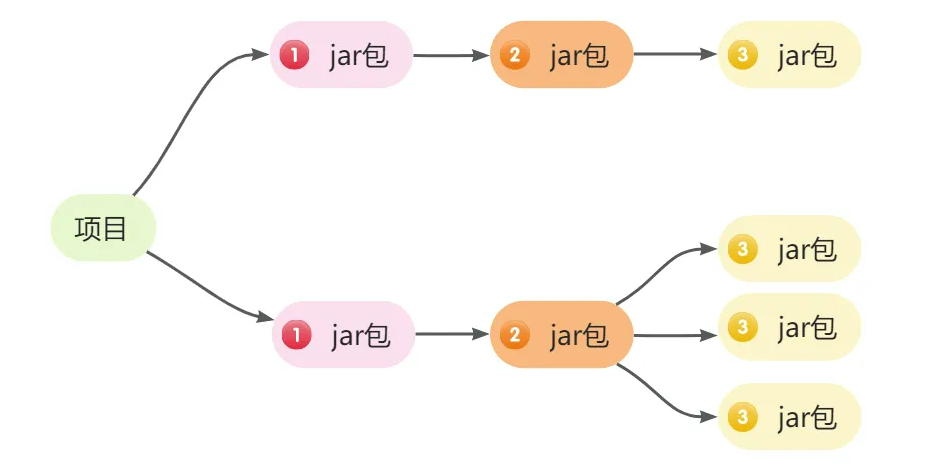
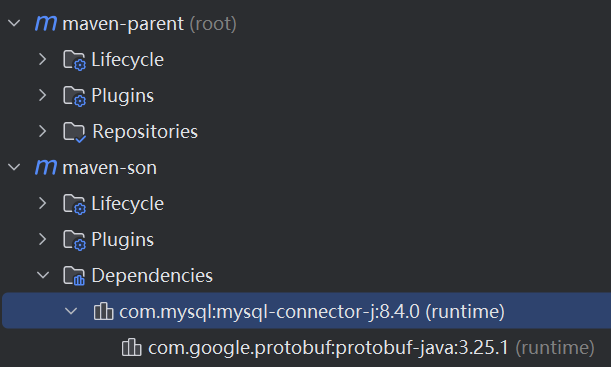
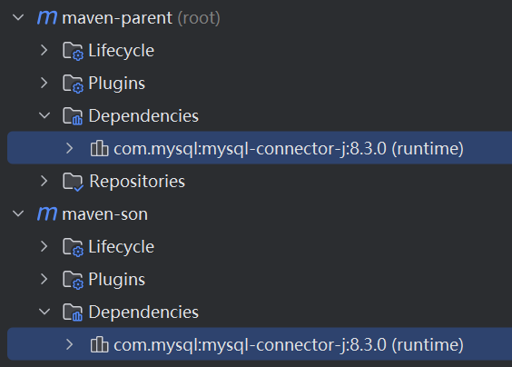
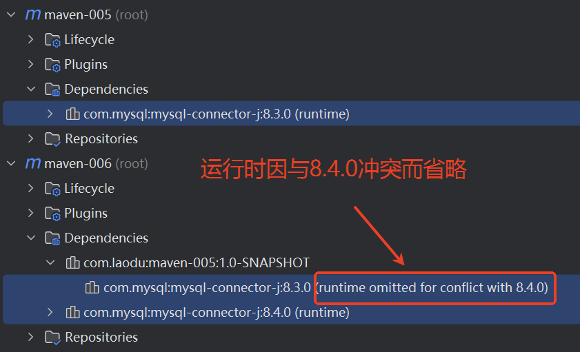
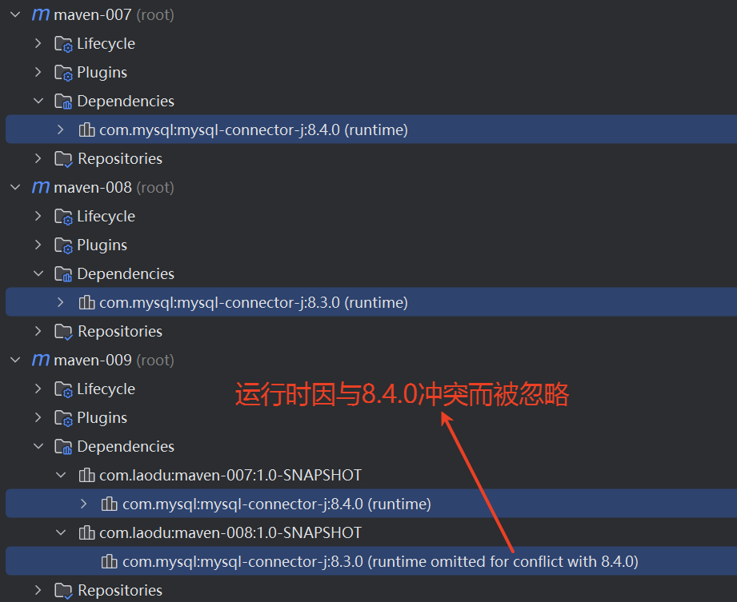
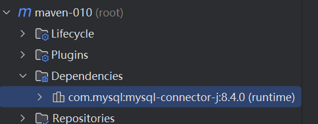
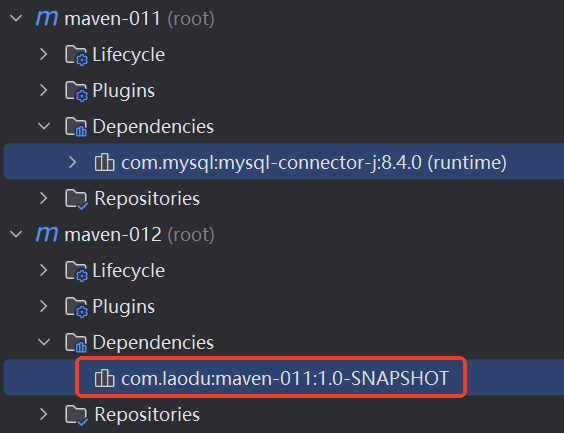
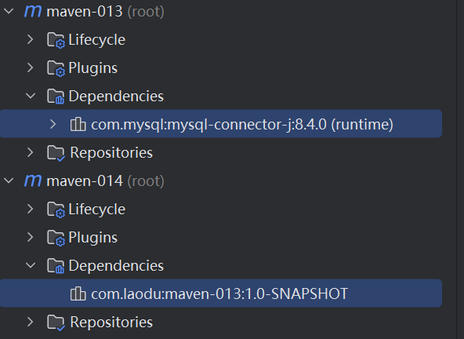

# Maven 的依赖管理

在JAVA开发中,项目的依赖管理是一项重要任务。通过合理管理项目的依赖关系，我们可以有效的管理第三方库，模块的引用及版本控制。而Maven作为一个强大的构建工具和依赖管理工具，为我们提供了便捷的方式来管理项目的依赖。

## 什么是依赖范围

Maven的依赖构件包含一个依赖范围的属性。这个属性描述的是三套classpath的控制，即编译、测试、运行。说白了就是添加的jar包起作用的范围。  maven提供了以下几种依赖范围：compile，test，provided，runtime，system，import。

### compile

默认范围（不设置 scope 时，默认就是它），在编译、测试、运行时都需要，会打包。

```xml
<dependency>
  <groupId>org.springframework</groupId>
  <artifactId>spring-context</artifactId>
  <version>6.2.6</version>
  <scope>compile</scope>
</dependency>
```

### test

仅用于测试，在编译和运行测试代码时可用，不会打包。

```xml
<dependency>
    <groupId>org.junit.jupiter</groupId>
    <artifactId>junit-jupiter-api</artifactId>
    <version>5.12.2</version>
    <scope>test</scope>
</dependency>
```

### provided

已由环境提供，编译和测试时需要，但运行时由 JDK 或容器提供，不会打包。

```xml
<dependency>
    <groupId>jakarta.servlet</groupId>
    <artifactId>jakarta.servlet-api</artifactId>
    <version>6.1.0</version>
    <scope>provided</scope>
</dependency>
```

### runtime

测试和运行时需要，但编译时不需要（如 JDBC 驱动）。

```xml
<dependency>
    <groupId>com.mysql</groupId>
    <artifactId>mysql-connector-j</artifactId>
    <version>8.4.0</version>
    <scope>runtime</scope>
</dependency>
```

### system

与 provided 类似，但你必须通过 systemPath 显式指定本地系统路径上的 JAR。（建议谨慎使用，因为别人机器上的 jar 包可能不在这个目录下。）

```xml
<dependency>
  <groupId>com.jkweilai</groupId>
  <artifactId>maven_001</artifactId>
  <version>1.0-SNAPSHOT</version>
  <scope>system</scope>
  <systemPath>D:/repository/com/jkweilai/maven_001/1.0-SNAPSHOT/maven_001-1.0-SNAPSHOT.jar</systemPath>
</dependency>
```

### import

仅用于 `<dependencyManagement>`，表示从另一个 POM 中导入依赖管理配置。

以下配置的作用是：将 `spring-boot-dependencies-2.7.0.pom`文件中 `dependencyManagement` 定义的依赖版本管理，全部导入到当前项目的 `dependencyManagement` 节点中

```xml
<dependencyManagement>
    <dependencies>
        <dependency>
            <groupId>org.springframework.boot</groupId>
            <artifactId>spring-boot-dependencies</artifactId>
            <version>2.7.0</version>
            <type>pom</type>
            <scope>import</scope>
        </dependency>
    </dependencies>
</dependencyManagement>
```

然后你声明一个实际依赖（不写版本号）：

```xml
<dependencies>
    <dependency>
        <groupId>org.springframework.boot</groupId>
        <artifactId>spring-boot-starter-web</artifactId>
        <!-- 版本由dependencyManagement决定 -->
    </dependency>
</dependencies>
```


| **scope**       | **编译**           | **测试** | **运行** | **示例**                                                     |
| --------------- | ------------------ | -------- | -------- | ------------------------------------------------------------ |
| compile（默认） | 是                 | 是       | 是       | spring-context                                               |
| provided        | 是                 | 是       |          | servlet-api                                                  |
| system          | 是                 | 是       |          | 非maven仓库的本地jar包                                       |
| runtime         |                    | 是       | 是       | jdbc驱动                                                     |
| test            | 编译测试代码时有用 | 是       |          | junit                                                        |
| import          |                    |          |          | <font style="color:rgb(64, 64, 64);">把另一个POM文件中的依赖版本定义"复制"到当前POM中</font> |


## 什么是依赖传递

依赖具有传递性。不过在引入依赖时只需要引入直接依赖即可。间接依赖Maven会自动引入。



## 依赖范围对依赖传递的影响

`scope`对依赖传递也有影响。不同的 `scope`依赖传递效果不同。

### 主要依赖范围及其传递影响

1. **<font style="color:rgb(15, 17, 21);">compile</font>**<font style="color:rgb(15, 17, 21);">：</font>**<font style="color:rgb(15, 17, 21);">传递</font>**<font style="color:rgb(15, 17, 21);">。会向依赖你的项目传递。（这个 jar 包在编译和运行的时候都需要，自然需要传递）</font>
2. **<font style="color:rgb(15, 17, 21);">runtime</font>**<font style="color:rgb(15, 17, 21);">：</font>**<font style="color:rgb(15, 17, 21);">传递</font>**<font style="color:rgb(15, 17, 21);">。会向依赖你的项目传递。（这个 jar 包在运行时需要，自然也需要传递）</font>
3. **<font style="color:rgb(15, 17, 21);">test</font>**<font style="color:rgb(15, 17, 21);">：</font>**<font style="color:rgb(15, 17, 21);">不传递</font>**<font style="color:rgb(15, 17, 21);">。永远不会传递给其他项目。（这个 jar 包既然只是在测试阶段起作用，传递也没有意义。）</font>
4. **<font style="color:rgb(15, 17, 21);">provided</font>**<font style="color:rgb(15, 17, 21);">：</font>**<font style="color:rgb(15, 17, 21);">不传递</font>**<font style="color:rgb(15, 17, 21);">。永远不会传递给其他项目。（这个 jar 包既然由容器提供了，传递也没有意义。）</font>
5. **<font style="color:rgb(15, 17, 21);">system</font>**<font style="color:rgb(15, 17, 21);">：</font>**<font style="color:rgb(15, 17, 21);">不传递</font>**<font style="color:rgb(15, 17, 21);">。由于与本地路径强绑定，永远不会传递给其他项目。</font>
6. **<font style="color:rgb(15, 17, 21);">import</font>**<font style="color:rgb(15, 17, 21);">：</font>**<font style="color:rgb(15, 17, 21);">不涉及传递</font>**<font style="color:rgb(15, 17, 21);">。它本身不是真正的依赖，只是导入依赖管理列表，因此不参与传递性依赖机制。</font>

### 编写程序测试

创建`maven-003`工程和`maven-004`工程

`maven-003`工程的`pom.xml`：

```xml
<?xml version="1.0" encoding="UTF-8"?>
<project xmlns="http://maven.apache.org/POM/4.0.0"
         xmlns:xsi="http://www.w3.org/2001/XMLSchema-instance"
         xsi:schemaLocation="http://maven.apache.org/POM/4.0.0 http://maven.apache.org/xsd/maven-4.0.0.xsd">
    <modelVersion>4.0.0</modelVersion>

    <groupId>com.jkweilai</groupId>
    <artifactId>maven-003</artifactId>
    <version>1.0-SNAPSHOT</version>
    <packaging>jar</packaging>

    <dependencies>
        <!--compile:编译 测试 运行 都有效-->
        <dependency>
            <groupId>org.springframework</groupId>
            <artifactId>spring-context</artifactId>
            <version>6.2.7</version>
            <scope>compile</scope>
        </dependency>
        <!--runtime：测试 运行 有效-->
        <dependency>
            <groupId>com.mysql</groupId>
            <artifactId>mysql-connector-j</artifactId>
            <version>8.3.0</version>
            <scope>runtime</scope>
        </dependency>
        <!--test：测试 有效-->
        <dependency>
            <groupId>org.junit.jupiter</groupId>
            <artifactId>junit-jupiter-api</artifactId>
            <version>5.12.2</version>
            <scope>test</scope>
        </dependency>
        <!--provided：编译 测试 有效-->
        <dependency>
            <groupId>jakarta.servlet</groupId>
            <artifactId>jakarta.servlet-api</artifactId>
            <version>6.0.0</version>
            <scope>provided</scope>
        </dependency>
    </dependencies>

    <properties>
        <maven.compiler.source>21</maven.compiler.source>
        <maven.compiler.target>21</maven.compiler.target>
        <project.build.sourceEncoding>UTF-8</project.build.sourceEncoding>
    </properties>

</project>
```


`maven-004`工程的`pom.xml`文件：

```xml
<?xml version="1.0" encoding="UTF-8"?>
<project xmlns="http://maven.apache.org/POM/4.0.0"
         xmlns:xsi="http://www.w3.org/2001/XMLSchema-instance"
         xsi:schemaLocation="http://maven.apache.org/POM/4.0.0 http://maven.apache.org/xsd/maven-4.0.0.xsd">
    <modelVersion>4.0.0</modelVersion>

    <groupId>com.jkweilai</groupId>
    <artifactId>maven-004</artifactId>
    <version>1.0-SNAPSHOT</version>
    <packaging>jar</packaging>

    <dependencies>
        <dependency>
            <groupId>com.jkweilai</groupId>
            <artifactId>maven-003</artifactId>
            <version>1.0-SNAPSHOT</version>
        </dependency>
    </dependencies>

    <properties>
        <maven.compiler.source>21</maven.compiler.source>
        <maven.compiler.target>21</maven.compiler.target>
        <project.build.sourceEncoding>UTF-8</project.build.sourceEncoding>
    </properties>

</project>
```


观察依赖范围对依赖传递的影响，可以清楚的看到，只有`compile`和`runtime`支持传递：


## Maven是如何解决依赖冲突的

### 什么是依赖冲突

项目中引入了 `a.jar`和 `b.jar`，结果 `a.jar`关联依赖了一个 `my.jar 1.0`，`b.jar`依赖了一个 `my.jar 1.1`。`my.jar 1.0`和 `my.jar 1.1`冲突了。

### 依赖冲突的解决方案

Maven可以通过以下途径解决依赖冲突。

#### 版本锁定

<font style="color:rgb(15, 17, 21);">在 Maven 的父工程中，</font>`<font style="color:rgb(15, 17, 21);background-color:rgb(235, 238, 242);"><dependencyManagement></font>`<font style="color:rgb(15, 17, 21);"> </font><font style="color:rgb(15, 17, 21);">的核心作用是进行</font>**<font style="color:rgb(15, 17, 21);">依赖版本的统一锁定</font>**<font style="color:rgb(15, 17, 21);">。它可以集中管理所有子项目共用的依赖及其版本号，从而确保整个项目体系使用的依赖是一致的。</font>

<font style="color:rgb(15, 17, 21);">需要明确的是，</font>`<font style="color:rgb(15, 17, 21);background-color:rgb(235, 238, 242);"><dependencyManagement></font>`<font style="color:rgb(15, 17, 21);"> </font><font style="color:rgb(15, 17, 21);">仅仅是一个</font>**<font style="color:rgb(15, 17, 21);">声明</font>**<font style="color:rgb(15, 17, 21);">，它本身并不会实际引入这些依赖。</font>

<font style="color:rgb(15, 17, 21);">只有当子项目中</font>**<font style="color:rgb(15, 17, 21);">显式地声明</font>**<font style="color:rgb(15, 17, 21);">了某个依赖时，该依赖才会被真正引入。此时：</font>

+ **<font style="color:rgb(15, 17, 21);">如果子项目没有指定版本号</font>**<font style="color:rgb(15, 17, 21);">，Maven 会自动使用父工程在</font><font style="color:rgb(15, 17, 21);"> </font>`<font style="color:rgb(15, 17, 21);background-color:rgb(235, 238, 242);"><dependencyManagement></font>`<font style="color:rgb(15, 17, 21);"> </font><font style="color:rgb(15, 17, 21);">中锁定的版本。</font>
+ **<font style="color:rgb(15, 17, 21);">如果子项目明确指定了版本号</font>**<font style="color:rgb(15, 17, 21);">，则会以子项目自己指定的版本为准，</font>**<font style="color:rgb(15, 17, 21);">覆盖</font>**<font style="color:rgb(15, 17, 21);">掉父工程中锁定的版本。</font>

<font style="color:rgb(15, 17, 21);"></font>

1. 子工程使用父工程锁定的版本号 

`maven-parent`工程中的`pom.xml`文件：

```xml
<?xml version="1.0" encoding="UTF-8"?>
<project xmlns="http://maven.apache.org/POM/4.0.0"
         xmlns:xsi="http://www.w3.org/2001/XMLSchema-instance"
         xsi:schemaLocation="http://maven.apache.org/POM/4.0.0 http://maven.apache.org/xsd/maven-4.0.0.xsd">
    <modelVersion>4.0.0</modelVersion>

    <groupId>com.jkweilai</groupId>
    <artifactId>maven-parent</artifactId>
    <version>1.0-SNAPSHOT</version>
    <packaging>pom</packaging>

    <modules>
        <module>maven-son</module>
    </modules>

    <properties>
        <!--统一版本号-->
        <mysql.version>8.3.0</mysql.version>
        <maven.compiler.source>21</maven.compiler.source>
        <maven.compiler.target>21</maven.compiler.target>
        <project.build.sourceEncoding>UTF-8</project.build.sourceEncoding>
    </properties>

    <!--依赖管理：只声明依赖，但不会将依赖实际的引入项目中。-->
    <dependencyManagement>
        <dependencies>
            <dependency>
                <groupId>com.mysql</groupId>
                <artifactId>mysql-connector-j</artifactId>
                <!--使用之前统一声明的版本号-->
                <version>${mysql.version}</version>
                <scope>runtime</scope>
            </dependency>
        </dependencies>
    </dependencyManagement>

</project>
```

`maven-son`工程的`pom.xml`文件：（**<font style="color:#DF2A3F;">注意：maven-son 工程需要创建到 maven-parent 工程内</font>**）

```xml
<?xml version="1.0" encoding="UTF-8"?>
<project xmlns="http://maven.apache.org/POM/4.0.0"
         xmlns:xsi="http://www.w3.org/2001/XMLSchema-instance"
         xsi:schemaLocation="http://maven.apache.org/POM/4.0.0 http://maven.apache.org/xsd/maven-4.0.0.xsd">
    <modelVersion>4.0.0</modelVersion>
    <!--继承父工程-->
    <parent>
        <groupId>com.jkweilai</groupId>
        <artifactId>maven-parent</artifactId>
        <version>1.0-SNAPSHOT</version>
    </parent>

    <artifactId>maven-son</artifactId>

    <dependencies>
        <!--实际引入依赖时，不需要声明版本号，版本号由父工程统一管理-->
        <dependency>
            <groupId>com.mysql</groupId>
            <artifactId>mysql-connector-j</artifactId>
        </dependency>
    </dependencies>

    <properties>
        <maven.compiler.source>21</maven.compiler.source>
        <maven.compiler.target>21</maven.compiler.target>
        <project.build.sourceEncoding>UTF-8</project.build.sourceEncoding>
    </properties>

</project>
```


通过下图可以看出，子工程使用了父工程中锁定的版本号：


2. 子工程如果不想使用父工程中锁定的版本号，可以在子工程中指定具体的版本号：

在`maven-son`子工程的`pom.xml`文件中指定版本号：

```xml
<?xml version="1.0" encoding="UTF-8"?>
<project xmlns="http://maven.apache.org/POM/4.0.0"
         xmlns:xsi="http://www.w3.org/2001/XMLSchema-instance"
         xsi:schemaLocation="http://maven.apache.org/POM/4.0.0 http://maven.apache.org/xsd/maven-4.0.0.xsd">
    <modelVersion>4.0.0</modelVersion>
    <!--继承父工程-->
    <parent>
        <groupId>com.jkweilai</groupId>
        <artifactId>maven-parent</artifactId>
        <version>1.0-SNAPSHOT</version>
    </parent>

    <artifactId>maven-son</artifactId>

    <dependencies>
        <!--子工程定义了具体的版本号，则不再使用父工程中锁定的版本号。-->
        <dependency>
            <groupId>com.mysql</groupId>
            <artifactId>mysql-connector-j</artifactId>
            <version>8.4.0</version>
        </dependency>
    </dependencies>

    <properties>
        <maven.compiler.source>21</maven.compiler.source>
        <maven.compiler.target>21</maven.compiler.target>
        <project.build.sourceEncoding>UTF-8</project.build.sourceEncoding>
    </properties>

</project>
```


通过下图可以看出，子工程不再使用父工程锁定的版本号：




3. 父工程不使用`<dependencyManagement>`标签，则父工程也会引入这个 jar 包。

`maven-parent`父工程中不再使用`<dependencyManagement>`：

```xml
<?xml version="1.0" encoding="UTF-8"?>
<project xmlns="http://maven.apache.org/POM/4.0.0"
         xmlns:xsi="http://www.w3.org/2001/XMLSchema-instance"
         xsi:schemaLocation="http://maven.apache.org/POM/4.0.0 http://maven.apache.org/xsd/maven-4.0.0.xsd">
    <modelVersion>4.0.0</modelVersion>

    <groupId>com.jkweilai</groupId>
    <artifactId>maven-parent</artifactId>
    <version>1.0-SNAPSHOT</version>
    <packaging>pom</packaging>

    <modules>
        <module>maven-son</module>
    </modules>

    <properties>
        <!--统一版本号-->
        <mysql.version>8.3.0</mysql.version>
        <maven.compiler.source>21</maven.compiler.source>
        <maven.compiler.target>21</maven.compiler.target>
        <project.build.sourceEncoding>UTF-8</project.build.sourceEncoding>
    </properties>

    <dependencies>
        <dependency>
            <groupId>com.mysql</groupId>
            <artifactId>mysql-connector-j</artifactId>
            <!--使用之前统一声明的版本号-->
            <version>${mysql.version}</version>
            <scope>runtime</scope>
        </dependency>
    </dependencies>

</project>
```


`maven-son`子工程不做任何引入，只是继承父工程：

```xml
<?xml version="1.0" encoding="UTF-8"?>
<project xmlns="http://maven.apache.org/POM/4.0.0"
         xmlns:xsi="http://www.w3.org/2001/XMLSchema-instance"
         xsi:schemaLocation="http://maven.apache.org/POM/4.0.0 http://maven.apache.org/xsd/maven-4.0.0.xsd">
    <modelVersion>4.0.0</modelVersion>
    <!--继承父工程-->
    <parent>
        <groupId>com.jkweilai</groupId>
        <artifactId>maven-parent</artifactId>
        <version>1.0-SNAPSHOT</version>
    </parent>

    <artifactId>maven-son</artifactId>

    <properties>
        <maven.compiler.source>21</maven.compiler.source>
        <maven.compiler.target>21</maven.compiler.target>
        <project.build.sourceEncoding>UTF-8</project.build.sourceEncoding>
    </properties>

</project>
```


通过下图可以看出：



#### 短路径优先（就近原则）

 引入路径短者优先，顾名思义，当一个间接依赖存在多条引入路径时，引入路径短的会被使用。如图  


`maven-005`的`pom.xml`：

```xml
<?xml version="1.0" encoding="UTF-8"?>
<project xmlns="http://maven.apache.org/POM/4.0.0"
         xmlns:xsi="http://www.w3.org/2001/XMLSchema-instance"
         xsi:schemaLocation="http://maven.apache.org/POM/4.0.0 http://maven.apache.org/xsd/maven-4.0.0.xsd">
    <modelVersion>4.0.0</modelVersion>

    <groupId>com.jkweilai</groupId>
    <artifactId>maven-005</artifactId>
    <version>1.0-SNAPSHOT</version>

    <dependencies>
        <dependency>
            <groupId>com.mysql</groupId>
            <artifactId>mysql-connector-j</artifactId>
            <version>8.3.0</version>
            <scope>runtime</scope>
        </dependency>
    </dependencies>

    <properties>
        <maven.compiler.source>21</maven.compiler.source>
        <maven.compiler.target>21</maven.compiler.target>
        <project.build.sourceEncoding>UTF-8</project.build.sourceEncoding>
    </properties>

</project>
```

`maven-006`的`pom.xml`：

```xml
<?xml version="1.0" encoding="UTF-8"?>
<project xmlns="http://maven.apache.org/POM/4.0.0"
         xmlns:xsi="http://www.w3.org/2001/XMLSchema-instance"
         xsi:schemaLocation="http://maven.apache.org/POM/4.0.0 http://maven.apache.org/xsd/maven-4.0.0.xsd">
    <modelVersion>4.0.0</modelVersion>

    <groupId>com.jkweilai</groupId>
    <artifactId>maven-006</artifactId>
    <version>1.0-SNAPSHOT</version>

    <dependencies>
        <dependency>
            <groupId>com.jkweilai</groupId>
            <artifactId>maven-005</artifactId>
            <version>1.0-SNAPSHOT</version>
        </dependency>
        <dependency>
            <groupId>com.mysql</groupId>
            <artifactId>mysql-connector-j</artifactId>
            <version>8.4.0</version>
            <scope>runtime</scope>
        </dependency>
    </dependencies>

    <properties>
        <maven.compiler.source>21</maven.compiler.source>
        <maven.compiler.target>21</maven.compiler.target>
        <project.build.sourceEncoding>UTF-8</project.build.sourceEncoding>
    </properties>

</project>
```


结果如下图所示：




#### 声明优先

如果存在短路径，则优先选择短路径，如果路径相同的情况下，先声明者优先，POM 文件中依赖声明的顺序决定了间接依赖会不会被使用，顺序靠前的优先使用。如图。 


`maven-007`的`pom.xml`文件：

```xml
<?xml version="1.0" encoding="UTF-8"?>
<project xmlns="http://maven.apache.org/POM/4.0.0"
         xmlns:xsi="http://www.w3.org/2001/XMLSchema-instance"
         xsi:schemaLocation="http://maven.apache.org/POM/4.0.0 http://maven.apache.org/xsd/maven-4.0.0.xsd">
    <modelVersion>4.0.0</modelVersion>

    <groupId>com.jkweilai</groupId>
    <artifactId>maven-007</artifactId>
    <version>1.0-SNAPSHOT</version>

    <dependencies>
        <dependency>
            <groupId>com.mysql</groupId>
            <artifactId>mysql-connector-j</artifactId>
            <version>8.4.0</version>
            <scope>runtime</scope>
        </dependency>
    </dependencies>

    <properties>
        <maven.compiler.source>21</maven.compiler.source>
        <maven.compiler.target>21</maven.compiler.target>
        <project.build.sourceEncoding>UTF-8</project.build.sourceEncoding>
    </properties>

</project>
```

`maven-008`的`pom.xml`文件：

```xml
<?xml version="1.0" encoding="UTF-8"?>
<project xmlns="http://maven.apache.org/POM/4.0.0"
         xmlns:xsi="http://www.w3.org/2001/XMLSchema-instance"
         xsi:schemaLocation="http://maven.apache.org/POM/4.0.0 http://maven.apache.org/xsd/maven-4.0.0.xsd">
    <modelVersion>4.0.0</modelVersion>

    <groupId>com.jkweilai</groupId>
    <artifactId>maven-008</artifactId>
    <version>1.0-SNAPSHOT</version>

    <dependencies>
        <dependency>
            <groupId>com.mysql</groupId>
            <artifactId>mysql-connector-j</artifactId>
            <version>8.3.0</version>
            <scope>runtime</scope>
        </dependency>
    </dependencies>

    <properties>
        <maven.compiler.source>21</maven.compiler.source>
        <maven.compiler.target>21</maven.compiler.target>
        <project.build.sourceEncoding>UTF-8</project.build.sourceEncoding>
    </properties>

</project>
```

`maven-009`的`pom.xml`文件：

```xml
<?xml version="1.0" encoding="UTF-8"?>
<project xmlns="http://maven.apache.org/POM/4.0.0"
         xmlns:xsi="http://www.w3.org/2001/XMLSchema-instance"
         xsi:schemaLocation="http://maven.apache.org/POM/4.0.0 http://maven.apache.org/xsd/maven-4.0.0.xsd">
    <modelVersion>4.0.0</modelVersion>

    <groupId>com.jkweilai</groupId>
    <artifactId>maven-009</artifactId>
    <version>1.0-SNAPSHOT</version>

    <dependencies>
        <dependency>
            <groupId>com.jkweilai</groupId>
            <artifactId>maven-007</artifactId>
            <version>1.0-SNAPSHOT</version>
        </dependency>
        <dependency>
            <groupId>com.jkweilai</groupId>
            <artifactId>maven-008</artifactId>
            <version>1.0-SNAPSHOT</version>
        </dependency>
    </dependencies>

    <properties>
        <maven.compiler.source>21</maven.compiler.source>
        <maven.compiler.target>21</maven.compiler.target>
        <project.build.sourceEncoding>UTF-8</project.build.sourceEncoding>
    </properties>

</project>
```


效果如下图所示：



#### 特殊优先（后来者居上）

同一个pom.xml文件中进行了多次依赖不同版本的jar包，后面的覆盖前面的配置。这种情况比较少见，因为没有人这么傻：

`maven-010`的`pom.xml`：

```xml
<?xml version="1.0" encoding="UTF-8"?>
<project xmlns="http://maven.apache.org/POM/4.0.0"
         xmlns:xsi="http://www.w3.org/2001/XMLSchema-instance"
         xsi:schemaLocation="http://maven.apache.org/POM/4.0.0 http://maven.apache.org/xsd/maven-4.0.0.xsd">
    <modelVersion>4.0.0</modelVersion>

    <groupId>com.jkweilai</groupId>
    <artifactId>maven-010</artifactId>
    <version>1.0-SNAPSHOT</version>

    <dependencies>
        <dependency>
            <groupId>com.mysql</groupId>
            <artifactId>mysql-connector-j</artifactId>
            <version>8.3.0</version>
            <scope>runtime</scope>
        </dependency>
        <dependency>
            <groupId>com.mysql</groupId>
            <artifactId>mysql-connector-j</artifactId>
            <version>8.4.0</version>
            <scope>runtime</scope>
        </dependency>
    </dependencies>

    <properties>
        <maven.compiler.source>21</maven.compiler.source>
        <maven.compiler.target>21</maven.compiler.target>
        <project.build.sourceEncoding>UTF-8</project.build.sourceEncoding>
    </properties>

</project>
```


效果如下：



#### 可选依赖

maven项目有权利决定自己的直接依赖或者间接依赖是否继续传递给其它的maven项目。如果不想传递，添加以下配置：

```xml
<optional>true</optional>
```


`maven-011`项目的`pom.xml`:

```xml
<?xml version="1.0" encoding="UTF-8"?>
<project xmlns="http://maven.apache.org/POM/4.0.0"
         xmlns:xsi="http://www.w3.org/2001/XMLSchema-instance"
         xsi:schemaLocation="http://maven.apache.org/POM/4.0.0 http://maven.apache.org/xsd/maven-4.0.0.xsd">
    <modelVersion>4.0.0</modelVersion>

    <groupId>com.jkweilai</groupId>
    <artifactId>maven-011</artifactId>
    <version>1.0-SNAPSHOT</version>

    <dependencies>
        <dependency>
            <groupId>com.mysql</groupId>
            <artifactId>mysql-connector-j</artifactId>
            <version>8.4.0</version>
            <scope>runtime</scope>
            <!--设置mysql驱动不再继续传递给其它项目-->
            <optional>true</optional>
        </dependency>
    </dependencies>

    <properties>
        <maven.compiler.source>21</maven.compiler.source>
        <maven.compiler.target>21</maven.compiler.target>
        <project.build.sourceEncoding>UTF-8</project.build.sourceEncoding>
    </properties>

</project>
```


`maven-012`项目的`pom.xml`文件：

```xml
<?xml version="1.0" encoding="UTF-8"?>
<project xmlns="http://maven.apache.org/POM/4.0.0"
         xmlns:xsi="http://www.w3.org/2001/XMLSchema-instance"
         xsi:schemaLocation="http://maven.apache.org/POM/4.0.0 http://maven.apache.org/xsd/maven-4.0.0.xsd">
    <modelVersion>4.0.0</modelVersion>

    <groupId>com.jkweilai</groupId>
    <artifactId>maven-012</artifactId>
    <version>1.0-SNAPSHOT</version>

    <dependencies>
        <dependency>
            <groupId>com.jkweilai</groupId>
            <artifactId>maven-011</artifactId>
            <version>1.0-SNAPSHOT</version>
        </dependency>
    </dependencies>

    <properties>
        <maven.compiler.source>21</maven.compiler.source>
        <maven.compiler.target>21</maven.compiler.target>
        <project.build.sourceEncoding>UTF-8</project.build.sourceEncoding>
    </properties>

</project>
```


效果如下：



#### 排除依赖

当前的maven项目有权利将某个传递过来的依赖排除掉。使用`<exclusions>`配置。


`maven-013`项目的`pom.xml`：

```xml
<?xml version="1.0" encoding="UTF-8"?>
<project xmlns="http://maven.apache.org/POM/4.0.0"
         xmlns:xsi="http://www.w3.org/2001/XMLSchema-instance"
         xsi:schemaLocation="http://maven.apache.org/POM/4.0.0 http://maven.apache.org/xsd/maven-4.0.0.xsd">
    <modelVersion>4.0.0</modelVersion>

    <groupId>com.jkweilai</groupId>
    <artifactId>maven-013</artifactId>
    <version>1.0-SNAPSHOT</version>

    <dependencies>
        <dependency>
            <groupId>com.mysql</groupId>
            <artifactId>mysql-connector-j</artifactId>
            <version>8.4.0</version>
            <scope>runtime</scope>
        </dependency>
    </dependencies>

    <properties>
        <maven.compiler.source>21</maven.compiler.source>
        <maven.compiler.target>21</maven.compiler.target>
        <project.build.sourceEncoding>UTF-8</project.build.sourceEncoding>
    </properties>

</project>
```


`maven-014`项目的`pom.xml`文件：

```xml
<?xml version="1.0" encoding="UTF-8"?>
<project xmlns="http://maven.apache.org/POM/4.0.0"
         xmlns:xsi="http://www.w3.org/2001/XMLSchema-instance"
         xsi:schemaLocation="http://maven.apache.org/POM/4.0.0 http://maven.apache.org/xsd/maven-4.0.0.xsd">
    <modelVersion>4.0.0</modelVersion>

    <groupId>com.jkweilai</groupId>
    <artifactId>maven-014</artifactId>
    <version>1.0-SNAPSHOT</version>

    <dependencies>
        <dependency>
            <groupId>com.jkweilai</groupId>
            <artifactId>maven-013</artifactId>
            <version>1.0-SNAPSHOT</version>
            <exclusions>
                <exclusion>
                    <groupId>com.mysql</groupId>
                    <artifactId>mysql-connector-j</artifactId>
                </exclusion>
            </exclusions>
        </dependency>
    </dependencies>

    <properties>
        <maven.compiler.source>21</maven.compiler.source>
        <maven.compiler.target>21</maven.compiler.target>
        <project.build.sourceEncoding>UTF-8</project.build.sourceEncoding>
    </properties>

</project>
```


效果如下：




**可选依赖和排除依赖的区别：**

1. 可选依赖是：我不给。
2. 排除依赖是：我不要。
3. 可选依赖的优先级高于排除依赖，若对于同一个间接依赖同时使用排除依赖和可选依赖进行设置，那么可选依赖的取值必须为 false，否则排除依赖无法生效。

## 刷新依赖的几种方式

在IDEA中有时候会出现刷新延时的情况，那么需要进行手工刷新依赖：

1. 点击M刷新按钮。
2. 点Maven窗口的Reload All Maven Projects。
3. Build--->ReBuild Project 重新构建项目的同时刷新所有依赖。
4. 点击本项目的pom.xml文件--->右键--->Maven--->Sync Project 同步项目。
5. 打开pom.xml文件，全选，拷贝，删除，关闭，打开，粘贴。这属于物理刷新pom.xml文件 。

##  资源文件的指定

默认放在`java`目录下的 `.properties`文件以及 `.xml`文件，编译的时候不会自动放到 target 目录下，需要进行以下配置。

```xml
<build>
    <resources>
        <resource>
            <!--指定java目录下的所有路径下的所有文件-->
            <directory>src/main/java</directory>
            <includes>
                <include>**/*.xml</include>
                <include>**/*.properties</include>
            </includes>
        </resource>
        <resource>
            <!--指定resources目录下的所有路径下的所有文件-->
            <directory>src/main/resources</directory>
            <includes>
                <include>**/*.xml</include>
                <include>**/*.properties</include>
            </includes>
        </resource>
    </resources>
</build>
```

