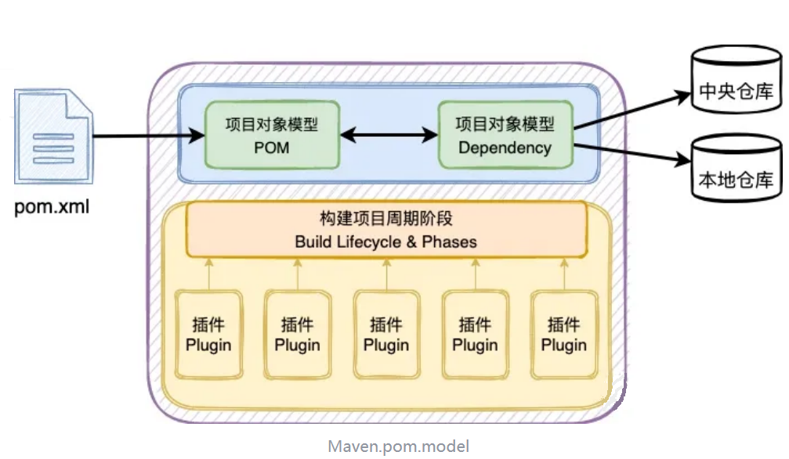

# Maven Introduction

---

## maven是什么

1. Maven 是**自动化构建工具**。
2. Maven 由 **Apache** 软件基金会组织维护。
3. Maven 这个单词的本意是：专家，内行。
4. 类似 Maven 自动化构建工具还有：Gant,  Gradle。
5. Maven的两大核心功能：**依赖管理**（蓝色）、**项目构建**（黄色）。



---

## 依赖管理

1. **依赖（Dependency）** 是 Maven 项目中声明的外部库（如 JAR 文件），通过 `pom.xml` 中的 `<dependency>`标签定义，构建时会自动从仓库下载并引入到项目中。

2. **GAV坐标**：项目的唯一名称，创建项目时定义GAV名称，引用项目时使用GAV名称。相当于项目的身份证号。

   3. `groupId`：组织名称，一般是公司域名的倒写
   4. `artifactId`：项目名
   5. `version`：版本号
      1. 1.0-SNAPSHOT（开发时的临时版本号）
      2. 5.2.5.RELEASE（发布版本）

        ```xml
        <groupId>com.jkweilai</groupId>
        <artifactId>maven_project</artifactId>	  
        <version>1.0.0</version>
        ```

6. **仓库**的种类

   7. 本地仓库：默认存放在自己电脑的`~\.m2\repository`中。也可以通过Maven的配置文件`MAVEN_HOME/conf/settings.xml`修改本地仓库所在的目录。
   8. 远程仓库
      1. 私服：一种特殊的远程仓库，在局域网内的仓库服务，比如公司的共享环境。
      2. 中央仓库：全世界范围内的开发人员提供服务。
         1. Maven官方的中央仓库地址：<https://repo.maven.apache.org/maven2>
         2. GAV坐标查询网站：<http://mvnrepository.com>

   

---

## 项目构建

1. 清理：删除以前的编译结果。
2. 编译：将Java源程序编译为字节码文件。
3. 测试：针对项目中的关键点进行测试，确保项目在迭代开发过程中关键点的正确性。
4. 报告：在每一次测试后以标准的格式记录和展示测试结果。
5. 打包：将一个包含诸多文件的工程封装为一个压缩文件用于安装或部署。
   1. Java 工程对应 jar 包
   2. Web 工程对应 war 包。
3. 安装：在 Maven 环境下特指将 jar 包安装到本地仓库中。
4. 部署：将 jar 包部署到私服上。

---

## 目录结构

Maven工程的目录结构遵循：工程与测试分开，代码与配置分开。

```plain
maven_project
|-----src
    |--------main
        |------java
        |------resources
    |--------test
        |------java
        |------resources
|-----pom.xml
```

---

## POM

POM(Project Object Model)项目对象模型，它是Maven的核心组件。它是Maven中的基本工作单元。它是一个xml文件，以pom.xml驻留在项目的根目录中。👉[pom.xml案例](../details/pom-example.md)

1. `<parent>`：父工程的引用，里边是父工程的GAV
2. `<modules>`：聚合工程，用来声明本模块的子模块
3. `<packaging>`：打包方式，比如jar或者war
4. `<properties>`：集中管理版本号（把版本号变成变量）
5. `<dependencyManagement>`：统一管理依赖的版本，并不会真的导入（如果多个内容的版本一样，就使用properites里边定义的版本变量）
6. `<dependencies>`：引入依赖，如果有上边的dependencyManagement，就可以省略version
7. `<plugins>`：插件。项目构建的环节使用的插件，可以在这里自定义。
8. `<resources>`：配置文件，可以在这里手动引入。

---

## 生命周期与插件

1. 名词解释：Maven 的构建过程由**生命周期（Lifecycle）**驱动，它是一组**预定义的、有序的阶段（Phases）**，用于标准化项目的构建流程（如编译、测试、打包）。但需要注意的是：**生命周期本身只定义阶段顺序，不包含任何具体逻辑！**真正干活的是**插件（Plugins）**。

2. 三大生命周期

   |      `default`       |   `clean`    |     `site`     |
   | :------------------: | :----------: | :------------: |
   | 构建和部署的完整过程 | 清理构建产物 | 生成文档和报告 |
   |      `validate`      | `pre-clean`  |   `pre-site`   |
   |      `compile`       |   `clean`    |     `site`     |
   |        `test`        | `post-clean` |  `post-site`   |
   |      `package`       |              | `site-deploy`  |
   |       `verify`       |              |                |
   |      `install`       |              |                |
   |       `deploy`       |              |                |

3. 插件的绑定
   1. 默认插件：每一个上述的阶段（Phase）都一一对应一个内置的插件。
   2. 自定义插件：可以在pom.xml里边的`<build>`的`<plugins>`中自定义。
   3. 如果没有插件，这个阶段会被跳过。


